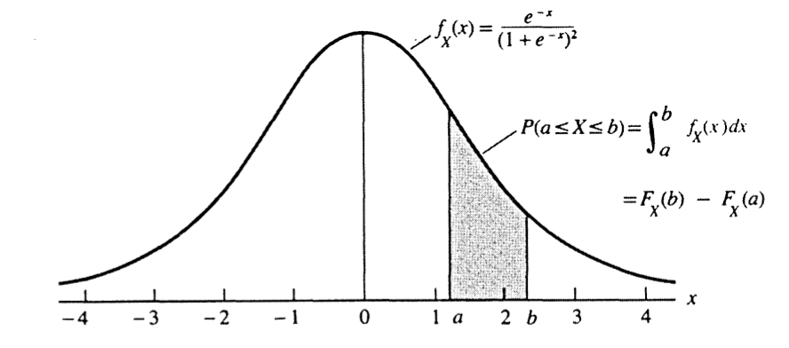

# 概率论基础 {#probability-theory}

本章从样本空间与事件出发，建立概率空间，随后讨论条件概率、Bayes 公式、独立性、随机变量、分布函数以及概率质量函数和概率密度函数。这一顺序与原课件第 1 章保持一致。

## 样本空间与事件 {#sample-space-events}

::: {.definition}
**样本空间**  一个试验所有可能结果组成的集合称为该试验的**样本空间**，记为 $S$。
:::

样本空间可以是可数的，也可以是不可数的。

- 抛掷一枚硬币时，$S=\{\mathrm{H},\mathrm{T}\}$。
- 若把反应时间记录到最接近的整数秒，则 $S=\{0,1,2,\ldots\}$。
- 若反应时间连续记录，则可取 $S=(0,\infty)$。

::: {.definition}
**事件**  样本空间 $S$ 的任意子集称为一个**事件**，其中包括 $S$ 本身。若试验结果属于事件 $A$，就称事件 $A$ 发生。
:::

对事件 $A,B\subseteq S$，包含与相等可写为

$$
A\subseteq B\iff (x\in A\Rightarrow x\in B),
$$

$$
A=B\iff A\subseteq B\ \text{且}\ B\subseteq A.
$$

### 集合运算

并、交和补分别定义为

$$
A\cup B=\{x:x\in A\ \text{或}\ x\in B\},
$$

$$
A\cap B=\{x:x\in A\ \text{且}\ x\in B\},
$$

$$
A^{\mathrm c}=\{x:x\notin A\}.
$$

对集合序列 $A_1,A_2,\ldots$，这些运算可推广为

$$
\bigcup_{i=1}^{\infty}A_i
=\{x\in S:x\in A_i\ \text{对某个}\ i\ \text{成立}\},
$$

$$
\bigcap_{i=1}^{\infty}A_i
=\{x\in S:x\in A_i\ \text{对所有}\ i\ \text{成立}\}.
$$

::: {.example}
**无限并与无限交** 令 $S=(0,1]$，并定义 $A_i=[1/i,1]$。则

$$
\bigcup_{i=1}^{\infty}A_i=(0,1],
\qquad
\bigcap_{i=1}^{\infty}A_i=\{1\}.
$$
:::

### 互斥事件与划分

::: {.definition}
**互斥**  若 $A\cap B=\varnothing$，则称事件 $A$ 与 $B$ 互斥。若对任意 $i\ne j$ 都有 $A_i\cap A_j=\varnothing$，则称 $A_1,A_2,\ldots$ 两两互斥。
:::

集合 $A_i=[i,i+1)$（$i=0,1,2,\ldots$）两两互斥，而且

$$
\bigcup_{i=0}^{\infty}A_i=[0,\infty).
$$

::: {.definition}
**划分**  若 $A_1,A_2,\ldots$ 两两互斥，并且 $\bigcup_{i=1}^{\infty}A_i=S$，则称这些集合构成样本空间 $S$ 的一个划分。
:::

划分把样本空间分成互不重叠的部分，是后续全概率公式和 Bayes 公式的基础。

## $\sigma$-代数与概率测度 {#sigma-algebra-probability}

::: {.definition}
**$\sigma$-代数**  样本空间 $S$ 的一族子集 $\mathcal B$ 若满足以下条件，就称为 $S$ 上的一个 $\sigma$-代数：

1. $\varnothing\in\mathcal B$；
2. 若 $A\in\mathcal B$，则 $A^{\mathrm c}\in\mathcal B$；
3. 若 $A_1,A_2,\ldots\in\mathcal B$，则 $\bigcup_{i=1}^{\infty}A_i\in\mathcal B$。
:::

由 $S=\varnothing^{\mathrm c}$ 可知 $S\in\mathcal B$。结合 De Morgan 律，$\mathcal B$ 也对可数交封闭：

$$
\left(\bigcup_{i=1}^{\infty}A_i^{\mathrm c}\right)^{\mathrm c}
=\bigcap_{i=1}^{\infty}A_i\in\mathcal B.
$$

::: {.example}
**有限样本空间** 若 $S=\{1,2,3\}$，可取 $\mathcal B$ 为 $S$ 的幂集：

$$
\mathcal B=
\{\varnothing,\{1\},\{2\},\{3\},\{1,2\},\{1,3\},\{2,3\},\{1,2,3\}\}.
$$

这里共有 $2^3=8$ 个集合。一般地，含 $n$ 个元素的有限集合有 $2^n$ 个子集。
:::

::: {.example}
**实直线上的 Borel 集** 当 $S=\mathbb R$ 时，通常要求 $\mathcal B$ 包含所有区间 $[a,b]$、$(a,b]$、$(a,b)$、$[a,b)$，以及由这些集合经过可数次并、交和取补得到的集合。
:::

::: {.definition}
**概率函数** 给定样本空间 $S$ 及其上的 $\sigma$-代数 $\mathcal B$，若函数 $P:\mathcal B\to[0,1]$ 满足

1. 对所有 $A\in\mathcal B$，$P(A)\ge 0$；
2. $P(S)=1$；
3. 若 $A_1,A_2,\ldots$ 两两互斥，则

$$
P\left(\bigcup_{i=1}^{\infty}A_i\right)
=\sum_{i=1}^{\infty}P(A_i),
$$

则称 $P$ 为概率函数。这三条性质称为 Kolmogorov 公理。
:::

::: {.theorem}
**离散样本空间上的概率** 设 $S=\{s_1,\ldots,s_n\}$，并给定非负数 $p_1,\ldots,p_n$，使得 $\sum_{i=1}^n p_i=1$。定义

$$
P(A)=\sum_{\{i:s_i\in A\}}p_i,
$$

则 $P$ 是 $S$ 上的概率函数。该结论同样适用于可数样本空间 $S=\{s_1,s_2,\ldots\}$。
:::

## 条件概率与 Bayes 公式 {#conditional-probability}

::: {.definition}
**条件概率** 在概率空间 $(S,\mathcal B,P)$ 中，若 $B\in\mathcal B$ 且 $P(B)>0$，则

$$
P(A\mid B)=\frac{P(A\cap B)}{P(B)},\qquad A\in\mathcal B.
$$
:::

条件概率的定义立即给出乘法公式

$$
P(A\cap B)=P(A\mid B)P(B).
$$

::: {.exercise}
**原课件 Problem 1.41** 证明 $P(\cdot\mid B):\mathcal B\to\mathbb R$ 满足 Kolmogorov 公理。
:::

::: {.example}
**连续抽到四张 A** 从一副充分洗匀的 52 张扑克牌顶部依次发出四张牌。已知前 $i$ 张都是 A，求四张牌全为 A 的条件概率，其中 $i=1,2,3$。

原课件给出的计算式为

$$
P(\text{四张均为 A}\mid\text{前 }i\text{ 张均为 A})
=\frac{\binom{52}{i}}
{\binom{4}{i}\binom{52}{4}}.
$$

当 $i=1,2,3$ 时，数值约为 $0.000048$、$0.00082$ 和 $0.02041$。第一个数值与原课件中的小数存在一位数量级差异，已记录在迁移说明中。
:::

原课件还列出了“三名死囚”条件概率问题，但没有给出完整题干，因此本阶段不补写缺失条件。

::: {.theorem}
**Bayes 公式** 若 $A_1,A_2,\ldots$ 构成样本空间的一个划分，则

$$
P(A_i\mid B)=
\frac{P(B\mid A_i)P(A_i)}
{\sum_{j=1}^{\infty}P(B\mid A_j)P(A_j)}.
$$
:::

::: {.example}
**编码信息传输** 已知发送点号和划号的概率分别为

$$
P(\text{发送点号})=\frac37,
\qquad
P(\text{发送划号})=\frac47,
$$

并且两种误传概率均为 $1/8$。收到点号后，实际发送点号的概率为

$$
\begin{aligned}
P(\text{发送点号}\mid\text{收到点号})
&=\frac{(7/8)(3/7)}{(7/8)(3/7)+(1/8)(4/7)}\\
&=\frac{21}{25}.
\end{aligned}
$$
:::

## 独立性 {#independence}

::: {.definition}
**两个事件独立** 若

$$
P(A\cap B)=P(A)P(B),
$$

则称事件 $A$ 与 $B$ 独立。当 $P(B)>0$ 时，这等价于 $P(A\mid B)=P(A)$。
:::

::: {.example}
**四次掷骰至少出现一个 6** 若连续投掷相互独立，则

$$
\begin{aligned}
P(\text{四次中至少出现一个 6})
&=1-P(\text{四次均不出现 6})\\
&=1-\left(\frac56\right)^4\\
&\approx0.518.
\end{aligned}
$$
:::

原课件在此处列出“生日问题”作为后续示例，但未给出计算过程，本阶段保留主题而不补写新内容。

::: {.theorem}
**补事件的独立性** 若 $A$ 与 $B$ 独立，则以下三对事件也分别独立：$A$ 与 $B^{\mathrm c}$、$A^{\mathrm c}$ 与 $B$、$A^{\mathrm c}$ 与 $B^{\mathrm c}$。
:::

### 两两独立与相互独立

::: {.example}
**两个骰子** 令 $A$ 表示出现对子，$B$ 表示点数和在 7 到 10 之间，$C$ 表示点数和为 2、7 或 8。原课件给出

$$
P(A)=\frac16,\qquad P(B)=\frac12,\qquad P(C)=\frac13,
$$

以及

$$
P(A\cap B\cap C)=\frac1{36}=P(A)P(B)P(C).
$$

但 $P(A\cap B)\ne P(A)P(B)$，且 $P(B\cap C)\ne P(B)P(C)$。因此只验证三者交集的乘法关系，不足以推出两两独立。
:::

反过来，两两独立也未必能推出三个事件相互独立。原课件使用九个等概率三元组构造事件 $A_i$，使得

$$
P(A_i)=\frac13,
\qquad
P(A_i\cap A_j)=\frac19\quad(i\ne j),
$$

但

$$
P(A_1\cap A_2\cap A_3)=\frac19
\ne P(A_1)P(A_2)P(A_3).
$$

::: {.definition}
**相互独立** 事件 $A_1,\ldots,A_n$ 相互独立，是指对任意子集 $\{i_1,\ldots,i_k\}$，都有

$$
P\left(\bigcap_{j=1}^{k}A_{i_j}\right)
=\prod_{j=1}^{k}P(A_{i_j}).
$$
:::

原课件进一步通过无限二进制序列构造一列相互独立、概率均为 $1/2$ 的事件 $B_1,B_2,\ldots$。对任意 $1\le i_1<\cdots<i_k$，有

$$
P(B_{i_1}\cap\cdots\cap B_{i_k})
=\frac1{2^k}
=\prod_{j=1}^{k}P(B_{i_j}).
$$

这一构造说明足够丰富的概率空间可以容纳无限多个相互独立事件。

## 随机变量 {#random-variables}

::: {.definition}
**随机变量** 设 $(S,\mathcal B)$ 为可测空间。若函数 $X:S\to\mathbb R$ 满足：对任意实数 $a$，

$$
X^{-1}(( -\infty,a])\in\mathcal B,
$$

则称 $X$ 为实值随机变量。
:::

若 $S=\{s_1,\ldots,s_n\}$，随机变量 $X$ 的取值集合为 $\mathcal X=\{x_1,\ldots,x_m\}$，则 $X$ 在 $\mathcal X$ 上诱导的概率为

$$
P_X(X=x_i)=P\bigl(\{s_j\in S:X(s_j)=x_i\}\bigr).
$$

在有限离散样本空间上，任意实值函数都是随机变量。

::: {.example}
**三次抛硬币** 连续抛掷一枚公平硬币三次，以 $X$ 表示正面出现次数：

| $s$ | HHH | HHT | HTH | THH | TTH | THT | HTT | TTT |
|:---:|:---:|:---:|:---:|:---:|:---:|:---:|:---:|:---:|
| $X(s)$ | 3 | 2 | 2 | 2 | 1 | 1 | 1 | 0 |

于是 $\mathcal X=\{0,1,2,3\}$，并且

| $x$ | 0 | 1 | 2 | 3 |
|:---:|:---:|:---:|:---:|:---:|
| $P(X=x)$ | $1/8$ | $3/8$ | $3/8$ | $1/8$ |
:::

下面的代码来自原项目对应的 R Markdown 示例，用相同的八个样本点检查概率质量分布。

```{r ch01-three-toss-pmf, fig.cap="三次抛硬币时正面次数的经验概率质量图"}
# 使用原课件列出的八个等可能样本点及其正面次数。
heads_tails <- data.frame(
  outcome = c("HHH", "HHT", "HTH", "THH", "TTH", "THT", "HTT", "TTT"),
  X = c(3, 2, 2, 2, 1, 1, 1, 0)
)

# 每个样本点的概率均为 1/8；按 X 分组后得到各取值的概率。
pmf <- aggregate(
  rep(1 / 8, nrow(heads_tails)),
  by = list(X = heads_tails$X),
  FUN = sum
)
names(pmf)[2] <- "probability"

# 输出概率表，并绘制与原课件表格相对应的概率质量图。
pmf
plot(
  pmf$X,
  pmf$probability,
  type = "h",
  lwd = 8,
  lend = "butt",
  xlab = "正面出现次数 X",
  ylab = "P(X = x)",
  xaxt = "n",
  ylim = c(0, 0.45),
  family = course_plot_family()
)
axis(1, at = 0:3)
points(pmf$X, pmf$probability, pch = 16)
```

## 分布函数 {#distribution-functions}

::: {.definition}
**累积分布函数** 随机变量 $X$ 的累积分布函数（cdf）定义为

$$
F_X(x)=P(X\le x),\qquad x\in\mathbb R.
$$
:::

在例 1.8 中，

| $x$ 的范围 | $F_X(x)$ |
|:---|:---:|
| $(-\infty,0)$ | $0$ |
| $[0,1)$ | $1/8$ |
| $[1,2)$ | $1/2$ |
| $[2,3)$ | $7/8$ |
| $[3,\infty)$ | $1$ |

::: {.theorem}
**cdf 的刻画** 函数 $F$ 是某个随机变量的 cdf，当且仅当：

1. $\lim_{x\to-\infty}F(x)=0$ 且 $\lim_{x\to\infty}F(x)=1$；
2. $F$ 单调不减；
3. $F$ 右连续，即对任意 $x_0$，$\lim_{x\downarrow x_0}F(x)=F(x_0)$。
:::

Logistic 分布的 cdf

$$
F_X(x)=\frac{1}{1+e^{-x}}
$$

满足上述三个条件。下面把原 `chap-1.R` 的绘图代码改写为 knitr 代码块；只移除了手工图形设备管理，函数和绘图含义保持不变。

```{r ch01-logistic-cdf, fig.cap="Logistic 累积分布函数与原课件中的阶跃参照线"}
# 定义原脚本中的 Logistic 累积分布函数。
logistic_cdf <- function(x) {
  1 / (1 + exp(-x))
}

# 定义原脚本用于比较的阶跃函数：x < 0 时为 0，否则为 1。
step_reference <- function(x) {
  as.numeric(x >= 0)
}

# 在与原脚本相同的区间和步长上计算并绘图。
x <- seq(-10, 10, by = 0.01)
plot(
  x,
  logistic_cdf(x),
  type = "l",
  xlab = "x",
  ylab = expression(F[X](x)),
  family = course_plot_family()
)
lines(x, step_reference(x), col = "blue")
```

## 概率质量函数与概率密度函数 {#pmf-pdf}

::: {.definition}
**概率质量函数** 离散随机变量 $X$ 的概率质量函数（pmf）为

$$
f_X(x)=P(X=x).
$$
:::

::: {.definition}
**概率密度函数** 连续随机变量 $X$ 的概率密度函数（pdf）是满足

$$
F_X(x)=\int_{-\infty}^{x}f_X(t)\,\mathrm dt
$$

的函数 $f_X$。
:::

对 Logistic 分布，

$$
f_X(x)=\frac{\mathrm d}{\mathrm dx}F_X(x)
=\frac{e^{-x}}{(1+e^{-x})^2}
=F_X(x)\{1-F_X(x)\}.
$$

因此区间概率既可以由 cdf 的差得到，也可以由密度积分得到：

$$
\begin{aligned}
P(a<X<b)
&=F_X(b)-F_X(a)\\
&=\int_a^b f_X(x)\,\mathrm dx.
\end{aligned}
$$

```{r ch01-logistic-density-figure, echo=FALSE, fig.cap="Logistic 密度曲线下的区间概率。来源：原课件第 1 章配图。"}

```

## 本章小结 {#chapter-one-summary}

本章从样本空间和事件建立概率空间，并用条件概率、Bayes 公式与独立性描述事件之间的关系；随后把随机变量视为从样本空间到实数的可测函数，并通过 cdf、pmf 和 pdf 描述其分布。这些概念构成后续随机变量变换、期望和统计推断的基础。
