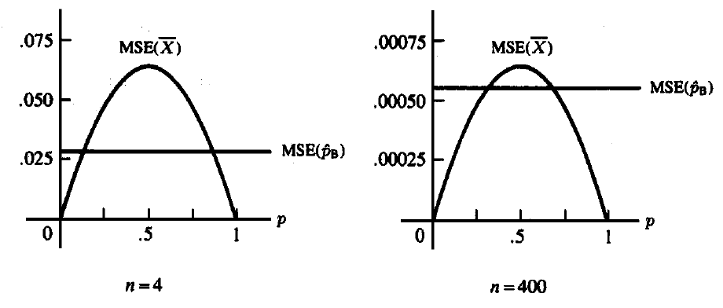

# 点估计 {#point-estimation}

本章对应原课件 *chap-7.tex* 及三个 LaTeX 子文件，讨论矩估计、最大似然、Bayes 估计、EM 算法，以及用 MSE、无偏性、Cramér--Rao 下界、Rao--Blackwell 定理和损失函数评价估计量。原课件图形已保留；相关旧 R 示例按最小必要修改转为稳定的 knitr 代码。

## 点估计量与估计值 {#point-estimator-definition}

::: {.definition}
样本的任意函数

$$W=W(X_1,\ldots,X_n)$$

都可称为参数的**点估计量**。把观测值代入所得的数值 $W(\mathbf x)$ 称为**估计值**。
:::

“任意统计量都可以作为点估计量”只说明形式上的资格；一个估计量是否值得采用，还要由偏差、方差、风险或其他最优性标准判断。

## 矩估计法 {#method-of-moments}

设总体含 $k$ 个未知参数 $\boldsymbol\theta=(\theta_1,\ldots,\theta_k)$，定义样本原点矩与总体原点矩

$$
m_j=\frac1n\sum_{i=1}^nX_i^j,\qquad
\mu_j(\boldsymbol\theta)=E_{\boldsymbol\theta}(X^j),\qquad j=1,\ldots,k.
$$

矩估计通过求解

$$m_j=\mu_j(\boldsymbol\theta),\qquad j=1,\ldots,k$$

得到 $\hat\theta_1,\ldots,\hat\theta_k$。

::: {.example .source-numbered}
**例 7.2.2（二项分布的矩估计）** 若 $X_i\overset{\mathrm{iid}}\sim\operatorname{Bin}(k,p)$，且 $k,p$ 都未知，求 $k,p$ 的矩估计。
:::

<details class="course-details solution-details">
<summary><strong>查看详细解答</strong></summary>

总体前两阶信息为

$$E(X)=kp,\qquad E(X^2)=kp(1-p)+k^2p^2.$$

记 $v_n=n^{-1}\sum_i(X_i-\bar X)^2$，矩估计为

$$
\hat k_{\mathrm{MOM}}=\frac{\bar X^2}{\bar X-v_n},qquad
\hat p_{\mathrm{MOM}}=\frac{\bar X}{\hat k_{\mathrm{MOM}}}.
$$

若 $\bar X-v_n\le0$，方程在允许的参数空间中没有内部解；而 $k$ 是整数时还需结合参数约束选择相邻整数。这是矩估计可能产生不可行结果的例子。

</details>

## 最大似然估计及不变性 {#maximum-likelihood-estimation}

设样本联合似然为

$$L(\boldsymbol\theta\mid\mathbf x)=\prod_{i=1}^nf(x_i\mid\boldsymbol\theta).$$

::: {.definition}
对固定样本点 $\mathbf x$，若参数值 $\hat{\boldsymbol\theta}(\mathbf x)$ 使
$L(\boldsymbol\theta\mid\mathbf x)$ 在参数空间上达到最大，则称它为 $\boldsymbol\theta$ 的**最大似然估计量**（MLE）。
:::

通常最大化对数似然
$\ell(\boldsymbol\theta)=\log L(\boldsymbol\theta)$ 更稳定。内部极值候选点满足得分方程

$$\nabla_{\boldsymbol\theta}\ell(\boldsymbol\theta)=\mathbf0,$$

但还必须检查边界、参数约束以及极值是否存在。

::: {.theorem .source-numbered}
**定理 7.2.10（MLE 不变性）** 若 $\hat\theta$ 是 $\theta$ 的 MLE，则 $\tau(\hat\theta)$ 是 $\tau(\theta)$ 的 MLE；当 $\tau$ 非一一对应时，应把具有同一函数值的参数点一起取上确界。
:::

<details class="course-details proof-details">
<summary><strong>展开证明</strong></summary>

令 $\eta=\tau(\theta)$，并定义剖面似然

$$L^*(\eta\mid\mathbf x)=\sup_{\theta:\,\tau(\theta)=\eta}L(\theta\mid\mathbf x).$$

若 $\hat\theta$ 最大化原似然，则对任意 $\eta$，

$$L^*(\eta\mid\mathbf x)\le L(\hat\theta\mid\mathbf x)
\le L^*\{\tau(\hat\theta)\mid\mathbf x\}.$$

最后一个不等号成立是因为 $\hat\theta$ 属于集合
$\{\theta:\tau(\theta)=\tau(\hat\theta)\}$。因此 $L^*$ 在
$\hat\eta=\tau(\hat\theta)$ 处达到最大。一一映射情形是直接特例。

</details>

原始 R 示例用指数尺度模型展示似然峰值，但直接计算似然会数值下溢。下面保留同一模型、样本生成方式和参数搜索，只改用对数似然。

```{r chap07-exponential-mle, fig.cap='指数尺度参数的对数似然与最大似然估计', fig.width=8, fig.height=4.5}
set.seed(7301)
theta_true <- 1.1
n <- 300
x <- rexp(n, rate = 1 / theta_true)
theta_grid <- seq(0.7, 1.5, length.out = 200)
loglik <- -n * log(theta_grid) - sum(x) / theta_grid
theta_hat <- mean(x)
plot(theta_grid, loglik, type = "l", lwd = 2,
     xlab = "尺度参数 theta", ylab = "对数似然")
abline(v = theta_hat, col = "#C43C39", lty = 2, lwd = 2)
legend("bottomright", sprintf("MLE = %.3f", theta_hat),
       col = "#C43C39", lty = 2, lwd = 2, bty = "n")
```

## Gamma 双参数最大似然 {#gamma-mle}

对形状--尺度参数化

$$
f(y;\alpha,\beta)=\frac{y^{\alpha-1}e^{-y/\beta}}
{\Gamma(\alpha)\beta^\alpha},\qquad y>0,
$$

对数似然为

$$
\ell(\alpha,\beta)=-n\log\Gamma(\alpha)-n\alpha\log\beta
+(\alpha-1)\sum_i\log y_i-\frac{\sum_i y_i}{\beta}.
$$

得分方程给出 $\hat\beta=\bar y/\hat\alpha$，而 $\hat\alpha$ 满足

$$
\log\hat\alpha-\psi(\hat\alpha)
=\log\bar y-\frac1n\sum_i\log y_i,
$$

其中 $\psi$ 是 digamma 函数。该方程通常用一维求根或联合数值优化求解。

## Bayes 估计与 Beta--Binomial 共轭 {#bayes-estimation}

若 $\mathbf X\sim f(\mathbf x\mid\theta)$，先验为 $\pi(\theta)$，则

$$
\pi(\theta\mid\mathbf x)
=\frac{f(\mathbf x\mid\theta)\pi(\theta)}{m(\mathbf x)},qquad
m(\mathbf x)=\int f(\mathbf x\mid\theta)\pi(\theta)\,d\theta.
$$

::: {.example .source-numbered}
**例 7.2.14（Beta--Binomial Bayes 估计）** 若 $X_i\sim\operatorname{Bernoulli}(p)$，$Y=\sum_iX_i$，并取
$p\sim\operatorname{Beta}(\alpha,\beta)$，求后验分布以及平方误差损失下的 Bayes 估计量。
:::

<details class="course-details solution-details">
<summary><strong>查看详细解答</strong></summary>

忽略与 $p$ 无关的因子，似然与先验的乘积为

$$p^y(1-p)^{n-y}p^{\alpha-1}(1-p)^{\beta-1}
=p^{y+\alpha-1}(1-p)^{n-y+\beta-1},$$

这正是 Beta 核，因此

$$
p\mid Y=y\sim\operatorname{Beta}(y+\alpha,n-y+\beta).
$$

在平方误差损失下，Bayes 估计量是后验均值

$$
\hat p_B=\frac{y+\alpha}{n+\alpha+\beta}
=\frac n{n+\alpha+\beta}\frac yn
+\frac{\alpha+\beta}{n+\alpha+\beta}\frac\alpha{\alpha+\beta}.
$$

它把样本比例向先验均值作加权收缩。

</details>

## EM 算法：潜变量与基本步骤 {#em-algorithm}

设 $\mathbf X$ 是观测数据，$\mathbf Z$ 是缺失或潜在数据，完整数据为
$\mathbf Y=(\mathbf X,\mathbf Z)$。在第 $t$ 次迭代，定义

$$
\begin{aligned}
Q(\boldsymbol\theta\mid\boldsymbol\theta^{(t)})
&=E_{\mathbf Z\mid\mathbf X,\boldsymbol\theta^{(t)}}
\{\log f_{\mathbf Y}(\mathbf Y\mid\boldsymbol\theta)\mid\mathbf X=\mathbf x\}\\
&=\int\log f_{\mathbf Y}(\mathbf y\mid\boldsymbol\theta)
f_{\mathbf Z\mid\mathbf X}(\mathbf z\mid\mathbf x,\boldsymbol\theta^{(t)})\,d\mathbf z.
\end{aligned}
$$

EM 的循环为：

1. **E 步：**计算 $Q(\boldsymbol\theta\mid\boldsymbol\theta^{(t)})$；
2. **M 步：**令 $\boldsymbol\theta^{(t+1)}$ 最大化该 $Q$ 函数；
3. 重复迭代，直到参数变化或目标函数变化小于给定容差。

EM 使用的是完整数据**对数似然的条件期望**。在通常正则条件下，观测数据似然不会下降；收敛点可能是局部极值或鞍点，因此初值和诊断仍然重要。

## 缺失响应线性回归的 EM 形式 {#em-missing-response}

考虑

$$
\mathbf Y=\mathbf W\boldsymbol\beta+\boldsymbol\varepsilon,qquad
\boldsymbol\varepsilon\sim N(\mathbf0,\sigma^2\mathbf I_n),
$$

其中部分响应缺失，$\sigma^2$ 暂视为已知。E 步中的目标函数为

$$
\begin{aligned}
Q(\boldsymbol\beta\mid\boldsymbol\beta^{(t)})
&=-\frac n2\log(2\pi\sigma^2)\\
&\quad-\frac1{2\sigma^2}
E\{(\mathbf Y-\mathbf W\boldsymbol\beta)^\top
(\mathbf Y-\mathbf W\boldsymbol\beta)\mid\mathbf x,\boldsymbol\beta^{(t)}\}.
\end{aligned}
$$

M 步给出

$$
\boldsymbol\beta^{(t+1)}
=(\mathbf W^\top\mathbf W)^{-1}\mathbf W^\top
E(\mathbf Y\mid\mathbf x,\boldsymbol\beta^{(t)}),
$$

其中

$$
E(Y_j\mid\mathbf x,\boldsymbol\beta^{(t)})=
\begin{cases}
y_j,&Y_j\text{ 已观测},\\
\mathbf w_j^\top\boldsymbol\beta^{(t)},&Y_j\text{ 缺失}.
\end{cases}
$$

在这个只缺失响应、设计矩阵固定且缺失机制可忽略的简单模型中，缺失响应本身不增加 $\boldsymbol\beta$ 的观测信息；EM 表达主要用于展示完整数据迭代结构。

## 均方误差、偏差与正态方差估计 {#mse-bias-normal}

::: {.definition}
估计量 $W$ 对参数 $\theta$ 的均方误差为

$$
\operatorname{MSE}_\theta(W)=E_\theta(W-\theta)^2
=\operatorname{Var}_\theta(W)+\{E_\theta(W)-\theta\}^2.
$$

若 $E_\theta(W)=\theta$ 对所有 $\theta$ 成立，则 $W$ 无偏。
:::

若 $X_i\sim N(\mu,\sigma^2)$，则 $\bar X$ 与
$S^2=(n-1)^{-1}\sum_i(X_i-\bar X)^2$ 都无偏，且

$$
\operatorname{MSE}(\bar X)=\frac{\sigma^2}{n},qquad
\operatorname{MSE}(S^2)=\frac{2\sigma^4}{n-1}.
$$

正态模型下 $\sigma^2$ 的 MLE 为
$\hat\sigma^2_{\mathrm{MLE}}=(n-1)S^2/n$。它有偏，但

$$
\operatorname{MSE}(\hat\sigma^2_{\mathrm{MLE}})
=\sigma^4\frac{2n-1}{n^2}
<\frac{2\sigma^4}{n-1}.
$$

这说明无偏性并不自动等同于最小 MSE；对尺度参数使用平方误差时还应注意单位变换对损失的影响。

## 二项 Bayes 估计量的 MSE {#binomial-bayes-mse}

样本比例 $\hat p=Y/n$ 的 MSE 为 $p(1-p)/n$。Beta 先验下
$\hat p_B=(Y+\alpha)/(n+\alpha+\beta)$ 的 MSE 为

$$
\frac{np(1-p)}{(n+\alpha+\beta)^2}
+\left(\frac{np+\alpha}{n+\alpha+\beta}-p\right)^2.
$$

若缺少明确先验信息，原课件选择
$\alpha=\beta=\sqrt{n/4}$，使其 MSE 与 $p$ 无关：

$$
\hat p_B=\frac{Y+\sqrt{n/4}}{n+\sqrt n},qquad
\operatorname{MSE}(\hat p_B)=\frac{n}{4(n+\sqrt n)^2}.
$$

```{r chap07-source-mse-bayes, echo=FALSE, out.width='72%', fig.cap='原课件中样本比例与 Bayes 估计量的 MSE 比较（n=4 与 n=400）'}

```

## 最佳无偏估计与 UMVUE {#umvue-definition}

::: {.definition}
若 $W^*$ 对 $\tau(\theta)$ 无偏，并且对任意其他无偏估计量 $W$ 都有

$$\operatorname{Var}_\theta(W^*)\le\operatorname{Var}_\theta(W)
\quad\text{对所有 }\theta,$$

则称 $W^*$ 是 $\tau(\theta)$ 的**一致最小方差无偏估计量**（UMVUE）。
:::

在无偏估计量类中，MSE 等于方差，因此可以用方差作统一比较；但寻找 UMVUE 往往需要信息下界或充分完备统计量。

## Cramér--Rao 下界 {#cramer-rao-bound}

::: {.theorem .source-numbered}
**定理 7.3.9（Cramér--Rao 下界）** 在支撑集不随 $\theta$ 改变、可交换微分与积分且方差有限等正则条件下，任意估计量 $W$ 满足

$$
\operatorname{Var}_\theta(W)\ge
\frac{\{dE_\theta(W)/d\theta\}^2}{I_n(\theta)},
\qquad
I_n(\theta)=E_\theta\left[\left\{\frac\partial{\partial\theta}
\log f(\mathbf X\mid\theta)\right\}^2\right].
$$
:::

<details class="course-details proof-details">
<summary><strong>展开证明</strong></summary>

记得分为

$$U(\mathbf X;\theta)=\frac{\partial}{\partial\theta}\log f(\mathbf X\mid\theta).$$

由正则条件与密度积分为 1，

$$
E_\theta U=\int \frac{\partial f(\mathbf x\mid\theta)}{\partial\theta}\,d\mathbf x
=\frac{d}{d\theta}\int f(\mathbf x\mid\theta)\,d\mathbf x=0.
$$

同样交换微分与积分可得

$$
\begin{aligned}
\operatorname{Cov}_\theta(W,U)
&=E_\theta(WU)\\
&=\int W(\mathbf x)\frac{\partial f(\mathbf x\mid\theta)}{\partial\theta}\,d\mathbf x\\
&=\frac{d}{d\theta}E_\theta(W).
\end{aligned}
$$

Cauchy--Schwarz 不等式给出

$$
\left\{\frac{d}{d\theta}E_\theta(W)\right\}^2
\le \operatorname{Var}_\theta(W)\operatorname{Var}_\theta(U)
=\operatorname{Var}_\theta(W)I_n(\theta).
$$

移项即得结论。等号成立当且仅当 $W-E_\theta(W)$ 与得分 $U$ 线性相关，这也解释了后面的达到条件。

</details>

对 iid 样本，$I_n(\theta)=nI_1(\theta)$。在正则条件下，得分均值为 0，并有

$$
I_1(\theta)=-E_\theta\left\{\frac{\partial^2}{\partial\theta^2}
\log f(X\mid\theta)\right\}.
$$

::: {.example .source-numbered}
**例 7.3.12（Poisson 模型达到信息下界）** 若 $X_i\sim\operatorname{Poisson}(\lambda)$，求 Fisher 信息，并判断 $\bar X$ 是否达到 Cramér--Rao 下界。
:::

<details class="course-details solution-details">
<summary><strong>查看详细解答</strong></summary>

单个观测的对数密度与得分为

$$\ell(\lambda)=X\log\lambda-\lambda-\log(X!),\qquad
U(\lambda)=\frac X\lambda-1.$$

因此

$$I_1(\lambda)=E_\lambda\{U(\lambda)^2\}
=\frac{\operatorname{Var}(X)}{\lambda^2}=\frac1\lambda.$$

于是任何 $\lambda$ 的无偏估计量都满足

$$\operatorname{Var}_\lambda(W)\ge\lambda/n.$$

样本均值的方差恰为 $\lambda/n$，因而达到下界并是 UMVUE。

</details>

## 非正则均匀模型 {#irregular-uniform-model}

::: {.example .source-numbered}
**例 7.3.13（参数相关支撑）** 设 $X_i\sim U(0,\theta)$。说明常规 Cramér--Rao 下界为何不能直接使用，并构造一个基于样本最大值的无偏估计量。
:::

<details class="course-details solution-details">
<summary><strong>查看详细解答</strong></summary>

若 $X_i\sim U(0,\theta)$，支撑集随 $\theta$ 改变，不能忽略积分上限的导数，因此常规 Cramér--Rao 结论不适用。

令 $Y=X_{(n)}$，则

$$f_Y(y\mid\theta)=ny^{n-1}\theta^{-n},\qquad0<y<\theta,$$

并且

$$E_\theta(Y)=\frac n{n+1}\theta,qquad
\operatorname{Var}_\theta\left(\frac{n+1}{n}Y\right)
=\frac{\theta^2}{n(n+2)}.
$$

所以 $(n+1)Y/n$ 是 $\theta$ 的无偏估计量。它看似“突破”错误套用所得的下界，实际原因正是正则条件失败：

$$
\frac d{d\theta}\int_0^\theta h(x)f(x\mid\theta)\,dx
\ne\int_0^\theta h(x)\frac\partial{\partial\theta}f(x\mid\theta)\,dx.
$$

</details>

## 正态方差下界与达到条件 {#normal-variance-bound}

若 $X_i\sim N(\mu,\sigma^2)$，对 $\sigma^2$ 的无偏估计量，信息下界为
$2\sigma^4/n$。样本方差满足
$\operatorname{Var}(S^2)=2\sigma^4/(n-1)$，故不达到这一有限样本下界。

::: {.theorem}
若正则条件成立，$W$ 是 $\tau(\theta)$ 的无偏估计量，则 $W$ 达到 Cramér--Rao 下界，当且仅当存在只依赖 $\theta$ 的 $a(\theta)$ 使

$$
a(\theta)\{W(\mathbf x)-\tau(\theta)\}
=\frac\partial{\partial\theta}\log L(\theta\mid\mathbf x).
$$
:::

当正态均值 $\mu$ 已知时，

$$
\frac\partial{\partial\sigma^2}\log L
=\frac n{2\sigma^4}
\left\{\frac1n\sum_i(x_i-\mu)^2-\sigma^2\right\},
$$

所以 $n^{-1}\sum_i(X_i-\mu)^2$ 达到下界。若 $\mu$ 未知，该统计量不可计算，需转而使用充分性与完备性工具。

## Rao--Blackwell 与 Lehmann--Scheffé {#rao-blackwell-lehmann-scheffe}

::: {.theorem .source-numbered}
**定理 7.3.17（Rao--Blackwell 定理）** 若 $W$ 是 $\tau(\theta)$ 的无偏估计量，$T$ 对 $\theta$ 充分，则

$$\Phi(T)=E(W\mid T)$$

仍然无偏，且
$\operatorname{Var}_\theta\{\Phi(T)\}\le\operatorname{Var}_\theta(W)$。
:::

<details class="course-details proof-details">
<summary><strong>展开证明</strong></summary>

充分性保证 $W\mid T$ 的条件分布不含未知参数，因此 $\Phi(T)=E(W\mid T)$ 是可由样本计算的统计量。由全期望公式，

$$E_\theta\{\Phi(T)\}=E_\theta\{E_\theta(W\mid T)\}=E_\theta(W)=\tau(\theta),$$

所以 $\Phi(T)$ 仍然无偏。再由全方差公式，

$$
\operatorname{Var}_\theta(W)
=E_\theta\{\operatorname{Var}_\theta(W\mid T)\}
+\operatorname{Var}_\theta\{E_\theta(W\mid T)\}
\ge \operatorname{Var}_\theta\{\Phi(T)\}.
$$

等号成立当且仅当条件方差几乎处处为 0，即 $W$ 本来就是 $T$ 的函数。

</details>

::: {.theorem .source-numbered}
**定理 7.3.23（Lehmann--Scheffé 定理）** 若 $T$ 完备且充分，任何只依赖 $T$ 的无偏估计量 $\phi(T)$ 都是其期望的唯一 UMVUE。
:::

<details class="course-details proof-details">
<summary><strong>展开证明</strong></summary>

设 $W$ 是同一参数函数的任意无偏估计量。Rao--Blackwell 定理表明
$W^*=E(W\mid T)$ 仍无偏且方差不大于 $W$。另一方面，$W^*$ 与 $\phi(T)$ 都是 $T$ 的函数，并且

$$E_\theta\{W^*-\phi(T)\}=0\qquad\text{对所有 }\theta.$$

由 $T$ 的完备性，$W^*=\phi(T)$ 几乎处处。因此 $\phi(T)$ 的方差不大于任意无偏估计量的方差，是 UMVUE。若另有 UMVUE $V$，对其 Rao--Blackwell 化并重复上述论证，也得到 $V=\phi(T)$ 几乎处处，故唯一性成立。

</details>

最佳无偏估计量在几乎处处意义下唯一。等价刻画是：一个无偏估计量为 UMVUE，当且仅当它与每一个期望恒为 0 的无偏估计量不相关。

对 $U(0,\theta)$ 样本，$Y=X_{(n)}$ 完备充分，因此
$(n+1)Y/n$ 是 $\theta$ 的唯一 UMVUE。

## 二项模型中的 Rao--Blackwell 化 {#binomial-umvue-example}

::: {.example .source-numbered}
**例 7.3.24（二项模型的 UMVUE）** 设 $X_i\sim\operatorname{Bin}(k,\theta)$，$k$ 已知。求单次观测恰有一次成功的概率 $\tau(\theta)=k\theta(1-\theta)^{k-1}$ 的 UMVUE。
:::

<details class="course-details solution-details">
<summary><strong>查看详细解答</strong></summary>

设 $X_i\sim\operatorname{Bin}(k,\theta)$，$k$ 已知，目标为估计单次
$\operatorname{Bin}(k,\theta)$ 恰有一次成功的概率

$$\tau(\theta)=k\theta(1-\theta)^{k-1}.$$

$h(X_1)=I(X_1=1)$ 是无偏估计量，而
$T=\sum_iX_i\sim\operatorname{Bin}(nk,\theta)$ 完备充分。故 UMVUE 为

$$
\begin{aligned}
\phi(t)&=E\{h(X_1)\mid T=t\}
=P(X_1=1\mid T=t)\\
&=\frac{k\theta(1-\theta)^{k-1}
\binom{k(n-1)}{t-1}\theta^{t-1}(1-\theta)^{k(n-1)-t+1}}
{\binom{kn}{t}\theta^t(1-\theta)^{kn-t}}\\
&=k\frac{\binom{k(n-1)}{t-1}}{\binom{kn}{t}}.
\end{aligned}
$$

参数 $\theta$ 在条件化后消失，体现了充分统计量的数据约简作用。

</details>

## 损失函数与风险 {#loss-and-risk}

常用损失包括绝对误差 $L(\theta,a)=|a-\theta|$ 和平方误差
$L(\theta,a)=(a-\theta)^2$。估计规则 $\delta$ 的风险为

$$
R(\theta,\delta)=E_\theta L\{\theta,\delta(\mathbf X)\}
=\int_{\mathcal X}L\{\theta,\delta(\mathbf x)\}f(\mathbf x\mid\theta)\,d\mathbf x.
$$

若 $R(\theta,\delta_1)<R(\theta,\delta_2)$ 对所有 $\theta$ 成立，则
$\delta_1$ 一致优于 $\delta_2$。

::: {.example}
在正态模型中用平方误差估计 $\sigma^2$，考虑
$\delta_b=bS^2$。其风险为

$$
R((\mu,\sigma^2),\delta_b)
=\left\{\frac{2b^2}{n-1}+(b-1)^2\right\}\sigma^4.
$$

对 $b$ 求导得到 $b=(n-1)/(n+1)$。因此

$$\tilde S^2=\frac{n-1}{n+1}S^2
=\frac1{n+1}\sum_i(X_i-\bar X)^2$$

在 $\{bS^2:b\ge0\}$ 这一估计量类中风险最小。
:::

## Bayes 风险与两类 Bayes 规则 {#bayes-risk-rules}

先验 $\pi(\theta)$ 下的平均风险为

$$r(\pi,\delta)=\int_\Theta R(\theta,\delta)\pi(\theta)\,d\theta.$$

利用
$f(\mathbf x\mid\theta)\pi(\theta)=\pi(\theta\mid\mathbf x)m(\mathbf x)$，可写成

$$
r(\pi,\delta)=\int_{\mathcal X}
\left[\int_\Theta L\{\theta,\delta(\mathbf x)\}
\pi(\theta\mid\mathbf x)\,d\theta\right]m(\mathbf x)\,d\mathbf x.
$$

因此逐个 $\mathbf x$ 最小化后验期望损失即可得到 Bayes 规则：

- 平方误差损失下，$\delta^\pi(\mathbf x)=E(\theta\mid\mathbf x)$；
- 绝对误差损失下，$\delta^\pi(\mathbf x)$ 是后验分布的任一中位数。

## 正态--正态 Bayes 估计 {#normal-bayes-estimator}

若 $X_i\sim N(\theta,\sigma^2)$，先验
$\theta\sim N(\mu,\tau^2)$，且 $\sigma^2,\mu,\tau^2$ 已知，则

$$
E(\theta\mid\bar x)
=\frac{\tau^2}{\tau^2+\sigma^2/n}\bar x
+\frac{\sigma^2/n}{\tau^2+\sigma^2/n}\mu,
$$

$$
\operatorname{Var}(\theta\mid\bar x)
=\frac{\tau^2\sigma^2/n}{\tau^2+\sigma^2/n}.
$$

后验为正态分布，其均值与中位数相同，因此平方误差和绝对误差下的 Bayes 估计量在本例中一致，都是上述后验均值。

## Rao--Blackwell 化的模拟比较 {#rao-blackwell-simulation}

设 $X_1,\ldots,X_n\overset{\mathrm{iid}}\sim\operatorname{Bernoulli}(p)$，目标是估计 $p^2$。最直接的无偏估计量是

$$W=X_1X_2,\qquad E_p(W)=p^2.$$

令 $T=\sum_{i=1}^nX_i$。因为 $T$ 是 $p$ 的完备充分统计量，在给定 $T=t$ 时，$n$ 个位置中恰有 $t$ 个 1，于是

$$
E(W\mid T=t)
=P(X_1=X_2=1\mid T=t)
=\frac{\binom{t}{2}}{\binom{n}{2}}
=\frac{t(t-1)}{n(n-1)}.
$$

因此

$$W^*=\frac{T(T-1)}{n(n-1)}$$

不仅仍然无偏，而且是 $p^2$ 的 UMVUE。下面的重复抽样实验把 Rao--Blackwell 定理中的“方差不增”变成可直接观察的曲线。

```{r chap07-rao-blackwell-variance, fig.cap='原始无偏估计量与 Rao--Blackwell 化估计量的模拟方差（n=20）', fig.width=8, fig.height=4.7}
set.seed(7307)
n_rb <- 20
b_rb <- 20000
p_grid <- seq(0.05, 0.95, by = 0.05)
variance_result <- t(vapply(p_grid, function(p) {
  x <- matrix(rbinom(b_rb * n_rb, size = 1, prob = p), nrow = b_rb)
  total <- rowSums(x)
  raw <- x[, 1] * x[, 2]
  improved <- total * (total - 1) / (n_rb * (n_rb - 1))
  c(raw = var(raw), Rao_Blackwell = var(improved))
}, numeric(2)))

matplot(p_grid, variance_result, type = "l", lty = 1, lwd = 2.5,
        col = c("#C43C39", "#1F77B4"),
        xlab = expression(p), ylab = "模拟方差",
        family = course_plot_family())
legend("topleft", c(expression(W == X[1] * X[2]),
                    expression(W^"*" == T * (T - 1) / (n * (n - 1)))),
       col = c("#C43C39", "#1F77B4"), lty = 1, lwd = 2.5, bty = "n")
```

蓝线在整个参数范围内都不高于红线。这里的改进不是来自偏差--方差交换：两个估计量都无偏，差异完全来自利用充分统计量汇总了样本中与 $p$ 有关的信息。

## 贯穿案例：产品缺陷率的点估计 {#defect-rate-point-estimation}

考虑一个贯穿第 7--9 章的教学案例：从生产线上独立抽检 $n=200$ 件产品，发现 $y=16$ 件缺陷品。记真实缺陷率为 $p$，企业的质量标准为 $p_0=0.05$。

频率学派的最大似然估计为

$$\hat p_{\mathrm{MLE}}=\frac{16}{200}=0.08.$$

若历史经验用 $p\sim\operatorname{Beta}(2,38)$ 表示，其先验均值为 $0.05$，则后验分布与平方误差损失下的 Bayes 估计为

$$
p\mid y\sim\operatorname{Beta}(18,222),\qquad
\hat p_B=E(p\mid y)=\frac{18}{240}=0.075.
$$

```{r chap07-defect-rate-estimates}
n_defect <- 200
y_defect <- 16
knitr::kable(
  data.frame(
    `估计方法` = c("MLE", "Bayes 后验均值"),
    `估计值` = c(y_defect / n_defect,
                 (2 + y_defect) / (2 + 38 + n_defect)),
    check.names = FALSE
  ),
  digits = 3
)
```

Bayes 估计略向历史标准 $0.05$ 收缩，但两种估计都只是对未知参数的点概括。下一章将问“数据是否足以说明缺陷率超过标准”，第 9 章再讨论估计的不确定范围。

## 本章小结 {#point-estimation-summary}

- 矩估计匹配样本矩与总体矩；最大似然选择最能支持观测样本的参数。
- Bayes 估计把先验与似然合并，EM 用潜变量的完整数据对数似然迭代优化。
- MSE 在偏差与方差之间权衡；无偏约束下可研究 UMVUE。
- Cramér--Rao 下界依赖正则条件，Rao--Blackwell 与完备充分统计量提供更普遍的改进路径。
- 损失与风险明确了“最佳”的决策含义；不同损失可能产生不同的 Bayes 规则。

原课件本章参考：Casella, G. and Berger, R. L. (2002), *Statistical Inference*, 2nd ed., Chapter 7；Dempster, A. P., Laird, N. M. and Rubin, D. B. (1977), “Maximum Likelihood from Incomplete Data via the EM Algorithm,” *Journal of the Royal Statistical Society, Series B*, 39, 1--38。
