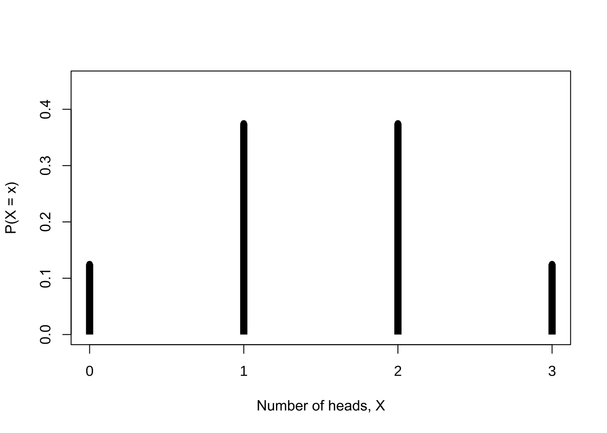
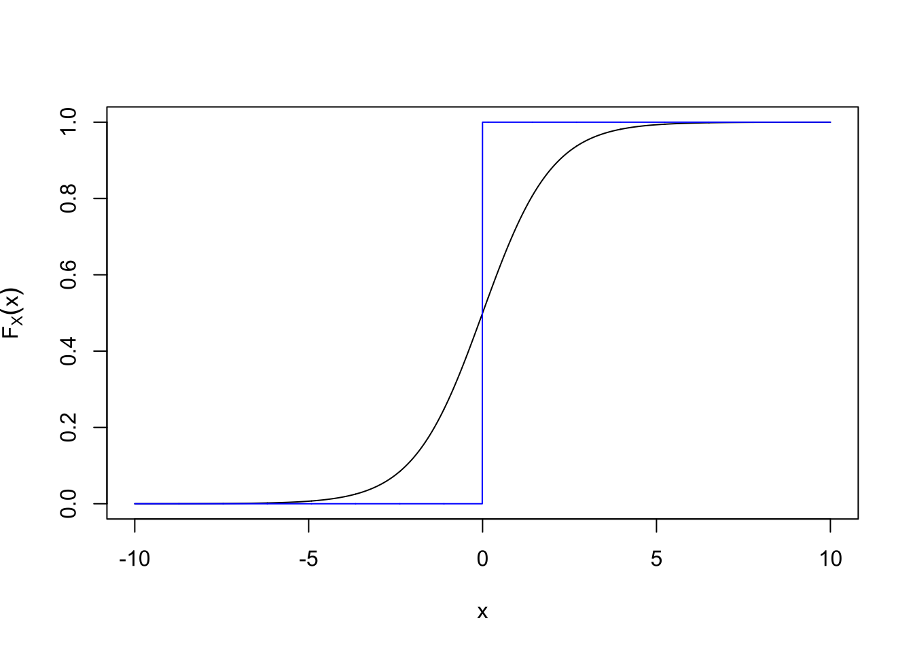

# Foundations of Probability {#probability-theory}

This chapter begins with sample spaces and events, constructs a probability space, and then develops conditional probability, Bayes' formula, independence, random variables, distribution functions, probability mass functions, and probability density functions. The sequence follows the six source files in the original Chapter 1 slides.

## Sample Spaces and Events {#sample-space-events}

::: {.definition}
**Sample space.** The set of all possible outcomes of an experiment is its **sample space**, denoted by $S$.
:::

A sample space may be countable or uncountable.

- For one coin toss, $S=\{\mathrm{H},\mathrm{T}\}$.
- If reaction time is recorded to the nearest whole second, $S=\{0,1,2,\ldots\}$.
- If reaction time is recorded continuously, one may take $S=(0,\infty)$.

::: {.definition}
**Event.** Any subset of the sample space $S$, including $S$ itself, is an **event**. Event $A$ occurs when the experimental outcome belongs to $A$.
:::

For events $A,B\subseteq S$, containment and equality are expressed as

$$
A\subseteq B\iff (x\in A\Rightarrow x\in B),
$$

$$
A=B\iff A\subseteq B\ \text{and}\ B\subseteq A.
$$

### Set operations

Union, intersection, and complement are defined by

$$
A\cup B=\{x:x\in A\ \text{or}\ x\in B\},
$$

$$
A\cap B=\{x:x\in A\ \text{and}\ x\in B\},
$$

$$
A^{\mathrm c}=\{x:x\notin A\}.
$$

For a sequence $A_1,A_2,\ldots$, these operations extend to

$$
\bigcup_{i=1}^{\infty}A_i
=\{x\in S:x\in A_i\ \text{for at least one}\ i\},
$$

$$
\bigcap_{i=1}^{\infty}A_i
=\{x\in S:x\in A_i\ \text{for every}\ i\}.
$$

::: {.example}
**Infinite unions and intersections.** Let $S=(0,1]$ and define $A_i=[1/i,1]$. Then

$$
\bigcup_{i=1}^{\infty}A_i=(0,1],
\qquad
\bigcap_{i=1}^{\infty}A_i=\{1\}.
$$
:::

### Mutually exclusive events and partitions

::: {.definition}
**Mutually exclusive events.** Events $A$ and $B$ are mutually exclusive if $A\cap B=\varnothing$. A collection $A_1,A_2,\ldots$ is pairwise mutually exclusive if $A_i\cap A_j=\varnothing$ whenever $i\ne j$.
:::

The sets $A_i=[i,i+1)$ for $i=0,1,2,\ldots$ are pairwise mutually exclusive and satisfy

$$
\bigcup_{i=0}^{\infty}A_i=[0,\infty).
$$

::: {.definition}
**Partition.** If $A_1,A_2,\ldots$ are pairwise mutually exclusive and $\bigcup_{i=1}^{\infty}A_i=S$, then they form a partition of $S$.
:::

A partition decomposes the sample space into non-overlapping pieces. It is the foundation of the law of total probability and Bayes' formula.

## $\sigma$-Algebras and Probability Measures {#sigma-algebra-probability}

::: {.definition}
**$\sigma$-algebra.** A collection $\mathcal B$ of subsets of $S$ is a $\sigma$-algebra on $S$ if

1. $\varnothing\in\mathcal B$;
2. $A\in\mathcal B$ implies $A^{\mathrm c}\in\mathcal B$;
3. $A_1,A_2,\ldots\in\mathcal B$ implies $\bigcup_{i=1}^{\infty}A_i\in\mathcal B$.
:::

Because $S=\varnothing^{\mathrm c}$, we have $S\in\mathcal B$. By De Morgan's laws, $\mathcal B$ is also closed under countable intersections:

$$
\left(\bigcup_{i=1}^{\infty}A_i^{\mathrm c}\right)^{\mathrm c}
=\bigcap_{i=1}^{\infty}A_i\in\mathcal B.
$$

::: {.example}
**A finite sample space.** If $S=\{1,2,3\}$, one possible $\mathcal B$ is the power set of $S$:

$$
\mathcal B=
\{\varnothing,\{1\},\{2\},\{3\},\{1,2\},\{1,3\},\{2,3\},\{1,2,3\}\}.
$$

It contains $2^3=8$ sets. In general, a finite set with $n$ elements has $2^n$ subsets.
:::

::: {.example}
**Borel sets on the real line.** When $S=\mathbb R$, $\mathcal B$ is normally required to contain every interval $[a,b]$, $(a,b]$, $(a,b)$, and $[a,b)$, together with sets formed from them by countable unions, intersections, and complements.
:::

::: {.definition}
**Probability function.** Given a sample space $S$ and a $\sigma$-algebra $\mathcal B$, a function $P:\mathcal B\to[0,1]$ is a probability function if

1. $P(A)\ge 0$ for every $A\in\mathcal B$;
2. $P(S)=1$;
3. if $A_1,A_2,\ldots$ are pairwise mutually exclusive, then

$$
P\left(\bigcup_{i=1}^{\infty}A_i\right)
=\sum_{i=1}^{\infty}P(A_i).
$$

These three properties are the Kolmogorov axioms.
:::

::: {.theorem}
**Probabilities on a discrete sample space.** Let $S=\{s_1,\ldots,s_n\}$ and let nonnegative numbers $p_1,\ldots,p_n$ satisfy $\sum_{i=1}^n p_i=1$. Define

$$
P(A)=\sum_{\{i:s_i\in A\}}p_i.
$$

Then $P$ is a probability function on $S$. The same conclusion applies to a countable sample space $S=\{s_1,s_2,\ldots\}$.
:::

## Conditional Probability and Bayes' Formula {#conditional-probability}

::: {.definition}
**Conditional probability.** In a probability space $(S,\mathcal B,P)$, if $B\in\mathcal B$ and $P(B)>0$, then

$$
P(A\mid B)=\frac{P(A\cap B)}{P(B)},\qquad A\in\mathcal B.
$$
:::

The definition immediately gives the multiplication rule

$$
P(A\cap B)=P(A\mid B)P(B).
$$

::: {.exercise}
**Problem 1.41 in the source slides.** Prove that $P(\mathord\cdot\mid B):\mathcal B\to\mathbb R$ satisfies the Kolmogorov axioms.
:::

::: {.example}
**Dealing four aces in succession.** Four cards are dealt from the top of a well-shuffled 52-card deck. Given that the first $i$ cards are aces, find the conditional probability that all four cards are aces for $i=1,2,3$.

The source slides give

$$
P(\text{all four cards are aces}\mid\text{the first }i\text{ are aces})
=\frac{\binom{52}{i}}
{\binom{4}{i}\binom{52}{4}}.
$$

For $i=1,2,3$, the values are approximately $0.000048$, $0.00082$, and $0.02041$. The first value differs by one order of magnitude from the decimal printed in the source; the discrepancy is recorded in the migration notes.
:::

The source also lists a conditional-probability problem involving three prisoners, but it does not include the complete problem statement. The missing conditions have therefore not been invented here.

::: {.theorem}
**Bayes' formula.** If $A_1,A_2,\ldots$ form a partition of the sample space, then

$$
P(A_i\mid B)=
\frac{P(B\mid A_i)P(A_i)}
{\sum_{j=1}^{\infty}P(B\mid A_j)P(A_j)}.
$$
:::

::: {.example}
**Transmitting coded information.** Suppose dots and dashes are transmitted with probabilities

$$
P(\text{dot sent})=\frac37,
\qquad
P(\text{dash sent})=\frac47,
$$

and either symbol is mistransmitted with probability $1/8$. Given that a dot is received, the probability that a dot was sent is

$$
\begin{aligned}
P(\text{dot sent}\mid\text{dot received})
&=\frac{(7/8)(3/7)}{(7/8)(3/7)+(1/8)(4/7)}\\
&=\frac{21}{25}.
\end{aligned}
$$
:::

## Independence {#independence}

::: {.definition}
**Independence of two events.** Events $A$ and $B$ are independent if

$$
P(A\cap B)=P(A)P(B).
$$

When $P(B)>0$, this is equivalent to $P(A\mid B)=P(A)$.
:::

::: {.example}
**At least one six in four rolls.** If the rolls are independent, then

$$
\begin{aligned}
P(\text{at least one six in four rolls})
&=1-P(\text{no six in four rolls})\\
&=1-\left(\frac56\right)^4\\
&\approx0.518.
\end{aligned}
$$
:::

The source names the birthday problem as the next example but gives no calculation. The topic is retained without adding unsupported content.

::: {.theorem}
**Independence of complements.** If $A$ and $B$ are independent, then each of the following pairs is independent: $A$ and $B^{\mathrm c}$, $A^{\mathrm c}$ and $B$, and $A^{\mathrm c}$ and $B^{\mathrm c}$.
:::

### Pairwise and mutual independence

::: {.example}
**Two dice.** Let $A$ denote a double, $B$ a total between 7 and 10, and $C$ a total of 2, 7, or 8. The source gives

$$
P(A)=\frac16,\qquad P(B)=\frac12,\qquad P(C)=\frac13,
$$

and

$$
P(A\cap B\cap C)=\frac1{36}=P(A)P(B)P(C).
$$

However, $P(A\cap B)\ne P(A)P(B)$ and $P(B\cap C)\ne P(B)P(C)$. Thus, checking only the product relationship for the intersection of all three events does not establish pairwise independence.
:::

Conversely, pairwise independence does not imply mutual independence. The source constructs events $A_i$ from nine equally likely triples so that

$$
P(A_i)=\frac13,
\qquad
P(A_i\cap A_j)=\frac19\quad(i\ne j),
$$

but

$$
P(A_1\cap A_2\cap A_3)=\frac19
\ne P(A_1)P(A_2)P(A_3).
$$

::: {.definition}
**Mutual independence.** Events $A_1,\ldots,A_n$ are mutually independent if, for every subset $\{i_1,\ldots,i_k\}$,

$$
P\left(\bigcap_{j=1}^{k}A_{i_j}\right)
=\prod_{j=1}^{k}P(A_{i_j}).
$$
:::

The source further uses infinite binary sequences to construct mutually independent events $B_1,B_2,\ldots$, each with probability $1/2$. For any $1\le i_1<\cdots<i_k$,

$$
P(B_{i_1}\cap\cdots\cap B_{i_k})
=\frac1{2^k}
=\prod_{j=1}^{k}P(B_{i_j}).
$$

This construction shows that a sufficiently rich probability space can support infinitely many mutually independent events.

## Random Variables {#random-variables}

::: {.definition}
**Random variable.** Let $(S,\mathcal B)$ be a measurable space. A function $X:S\to\mathbb R$ is a real-valued random variable if, for every real number $a$,

$$
X^{-1}(( -\infty,a])\in\mathcal B.
$$
:::

If $S=\{s_1,\ldots,s_n\}$ and the range of $X$ is $\mathcal X=\{x_1,\ldots,x_m\}$, then the probability induced by $X$ on $\mathcal X$ is

$$
P_X(X=x_i)=P\bigl(\{s_j\in S:X(s_j)=x_i\}\bigr).
$$

On a finite discrete sample space, every real-valued function is a random variable.

::: {.example}
**Three coin tosses.** Toss a fair coin three times and let $X$ be the number of heads:

| $s$ | HHH | HHT | HTH | THH | TTH | THT | HTT | TTT |
|:---:|:---:|:---:|:---:|:---:|:---:|:---:|:---:|:---:|
| $X(s)$ | 3 | 2 | 2 | 2 | 1 | 1 | 1 | 0 |

Thus $\mathcal X=\{0,1,2,3\}$ and

| $x$ | 0 | 1 | 2 | 3 |
|:---:|:---:|:---:|:---:|:---:|
| $P(X=x)$ | $1/8$ | $3/8$ | $3/8$ | $1/8$ |
:::

The following source-derived code checks the probability mass distribution using the same eight sample points.


``` r
# Use the eight equally likely outcomes and head counts listed in the source.
heads_tails <- data.frame(
  outcome = c("HHH", "HHT", "HTH", "THH", "TTH", "THT", "HTT", "TTT"),
  X = c(3, 2, 2, 2, 1, 1, 1, 0)
)

# Give every outcome probability 1/8, then aggregate by the value of X.
pmf <- aggregate(
  rep(1 / 8, nrow(heads_tails)),
  by = list(X = heads_tails$X),
  FUN = sum
)
names(pmf)[2] <- "probability"

# Display the table and draw the probability mass plot represented by it.
pmf
```

```
##   X probability
## 1 0       0.125
## 2 1       0.375
## 3 2       0.375
## 4 3       0.125
```

``` r
plot(
  pmf$X,
  pmf$probability,
  type = "h",
  lwd = 8,
  lend = "butt",
  xlab = "Number of heads, X",
  ylab = "P(X = x)",
  xaxt = "n",
  ylim = c(0, 0.45),
  family = course_plot_family()
)
axis(1, at = 0:3)
points(pmf$X, pmf$probability, pch = 16)
```

<div class="figure" style="text-align: center">

<p class="caption">(\#fig:en-ch01-three-toss-pmf)Probability mass for the number of heads in three tosses</p>
</div>

## Distribution Functions {#distribution-functions}

::: {.definition}
**Cumulative distribution function.** The cumulative distribution function (cdf) of a random variable $X$ is

$$
F_X(x)=P(X\le x),\qquad x\in\mathbb R.
$$
:::

For the preceding coin-toss example,

| Range of $x$ | $F_X(x)$ |
|:---|:---:|
| $(-\infty,0)$ | $0$ |
| $[0,1)$ | $1/8$ |
| $[1,2)$ | $1/2$ |
| $[2,3)$ | $7/8$ |
| $[3,\infty)$ | $1$ |

::: {.theorem}
**Characterization of a cdf.** A function $F$ is the cdf of a random variable if and only if

1. $\lim_{x\to-\infty}F(x)=0$ and $\lim_{x\to\infty}F(x)=1$;
2. $F$ is nondecreasing;
3. $F$ is right-continuous: $\lim_{x\downarrow x_0}F(x)=F(x_0)$ for every $x_0$.
:::

The logistic cdf

$$
F_X(x)=\frac{1}{1+e^{-x}}
$$

satisfies all three conditions. The following chunk adapts the original `chap-1.R` plot for knitr. Only manual graphics-device management has been removed; the functions, plotting interval, and meaning are unchanged.


``` r
# Define the logistic cumulative distribution function from the source script.
logistic_cdf <- function(x) {
  1 / (1 + exp(-x))
}

# Define the source comparison function: zero below 0 and one otherwise.
step_reference <- function(x) {
  as.numeric(x >= 0)
}

# Evaluate and plot both functions over the source interval and step size.
x <- seq(-10, 10, by = 0.01)
plot(
  x,
  logistic_cdf(x),
  type = "l",
  xlab = "x",
  ylab = expression(F[X](x)),
  family = course_plot_family()
)
lines(x, step_reference(x), col = "blue")
```

<div class="figure" style="text-align: center">

<p class="caption">(\#fig:en-ch01-logistic-cdf)The logistic cdf and the step-function reference in the source slides</p>
</div>

## Probability Mass and Density Functions {#pmf-pdf}

::: {.definition}
**Probability mass function.** The probability mass function (pmf) of a discrete random variable $X$ is

$$
f_X(x)=P(X=x).
$$
:::

::: {.definition}
**Probability density function.** A probability density function (pdf) of a continuous random variable $X$ is a function $f_X$ satisfying

$$
F_X(x)=\int_{-\infty}^{x}f_X(t)\,\mathrm dt.
$$
:::

For the logistic distribution,

$$
f_X(x)=\frac{\mathrm d}{\mathrm dx}F_X(x)
=\frac{e^{-x}}{(1+e^{-x})^2}
=F_X(x)\{1-F_X(x)\}.
$$

An interval probability can therefore be obtained either from a difference of cdf values or from an integral of the density:

$$
\begin{aligned}
P(a<X<b)
&=F_X(b)-F_X(a)\\
&=\int_a^b f_X(x)\,\mathrm dx.
\end{aligned}
$$

<div class="figure" style="text-align: center">

<p class="caption">(\#fig:en-ch01-logistic-density-figure)Interval probability under the logistic density. Source: the original Chapter 1 slides.</p>
</div>

## Chapter Summary {#chapter-one-summary}

This chapter built a probability space from sample spaces and events and used conditional probability, Bayes' formula, and independence to describe relationships among events. It then treated a random variable as a measurable function from the sample space to the real line and used cdfs, pmfs, and pdfs to describe distributions. These ideas support the later study of transformations, expectations, and statistical inference.

