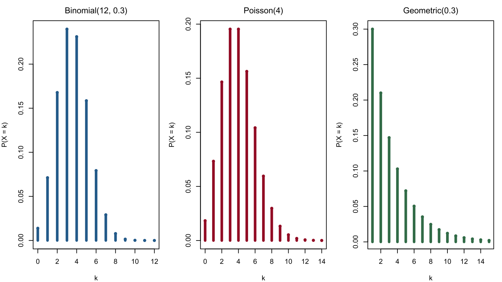
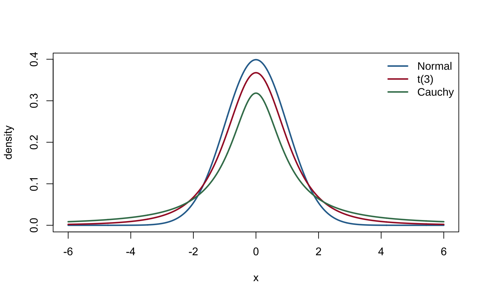

# Common Families of Distributions {#distribution-families}

This chapter corresponds to *chap-3.tex* and its four source fragments. It organizes the common discrete and continuous distributions, exponential families, and location--scale families. Each distribution is described by its support, probability law, moment generating function when it exists, mean, and variance. Where source parameterizations conflict, the probability law is treated as authoritative and the minimum correction is documented in migration_notes.md.

## Discrete distributions at a glance {#discrete-distributions-overview}

Write $q=1-p$ and $M_X(t)=E(e^{tX})$. The table covers every discrete distribution listed in the source slides.

| Distribution | Support and probability mass function | MGF | Mean; variance |
|:---|:---|:---|:---|
| Bernoulli$(p)$ | $k\in\{0,1\}$, $p^kq^{1-k}$ | $q+pe^t$ | $p$; $pq$ |
| Binomial$(n,p)$ | $k=0,\ldots,n$, $\binom nkp^kq^{n-k}$ | $(q+pe^t)^n$ | $np$; $npq$ |
| Discrete uniform$(0,\ldots,n)$ | $k=0,\ldots,n$, $1/(n+1)$ | $\dfrac{e^{(n+1)t}-1}{(n+1)(e^t-1)}$ | $n/2$; $n(n+2)/12$ |
| Geometric$(p)$ | $k=1,2,\ldots$, $pq^{k-1}$ | $\dfrac{pe^t}{1-qe^t}$ | $1/p$; $q/p^2$ |
| Hypergeometric$(N,K,n)$ | $\dfrac{\binom Kk\binom{N-K}{n-k}}{\binom Nn}$ | usually evaluated as a finite sum | $nK/N$; $\dfrac{nK(N-K)(N-n)}{N^2(N-1)}$ |
| Negative Binomial$(r,p)$ | $k=0,1,\ldots$, $\binom{k+r-1}{k}p^rq^k$ | $\left(\dfrac{p}{1-qe^t}\right)^r$ | $rq/p$; $rq/p^2$ |
| Poisson$(\lambda)$ | $k=0,1,\ldots$, $e^{-\lambda}\lambda^k/k!$ | $\exp\{\lambda(e^t-1)\}$ | $\lambda$; $\lambda$ |

The discrete-uniform MGF is defined by continuity at $t=0$, where it equals 1; the Geometric MGF is defined for $t<-\log q$. The hypergeometric range is

$$
\max(0,n-N+K)\le k\le\min(n,K).
$$

Here the negative-binomial variable counts failures before the $r$th success. If it instead counts the total number of trials needed for the $r$th success, it must be shifted by $r$.

## Generating mechanisms for discrete distributions {#discrete-distribution-mechanisms}

- One success/failure trial produces a Bernoulli variable; the sum of $n$ independent Bernoulli variables is Binomial.
- A Geometric variable records trials to the first success; the sum of $r$ counts of failures before successive successes has the negative-binomial law used above.
- The Hypergeometric law describes sampling without replacement from a finite population; the Binomial law describes independent repeated sampling.
- The Poisson law counts independent rare events in a fixed time or spatial region and is the Binomial limit when $n$ is large, $p$ is small, and $np$ remains stable.


``` r
old_par <- par(no.readonly = TRUE)
par(mfrow = c(1, 3), mar = c(4, 4, 2.5, 1), family = course_plot_family())
k1 <- 0:12
plot(k1, dbinom(k1, 12, 0.3), type = "h", lwd = 4, col = "#2C6E9B",
     xlab = "k", ylab = "P(X = k)", main = "Binomial(12, 0.3)")
points(k1, dbinom(k1, 12, 0.3), pch = 16, col = "#2C6E9B")
k2 <- 0:14
plot(k2, dpois(k2, 4), type = "h", lwd = 4, col = "#A51C30",
     xlab = "k", ylab = "P(X = k)", main = "Poisson(4)")
points(k2, dpois(k2, 4), pch = 16, col = "#A51C30")
k3 <- 1:15
plot(k3, dgeom(k3 - 1, 0.3), type = "h", lwd = 4, col = "#3E7C59",
     xlab = "k", ylab = "P(X = k)", main = "Geometric(0.3)")
points(k3, dgeom(k3 - 1, 0.3), pch = 16, col = "#3E7C59")
```

<div class="figure" style="text-align: center">

<p class="caption">(\#fig:en-chap03-discrete-pmf)Probability mass functions of Binomial, Poisson, and Geometric distributions</p>
</div>

``` r
par(old_par)
```

## Continuous distributions: bounded and positive support {#continuous-bounded-positive}

### Beta and uniform distributions {-}

For $\alpha,\beta>0$, $X\sim\operatorname{Beta}(\alpha,\beta)$ has density

$$
f(x)=\frac{x^{\alpha-1}(1-x)^{\beta-1}}{B(\alpha,\beta)},\qquad 0<x<1,
$$

with

$$
E(X)=\frac{\alpha}{\alpha+\beta},\qquad
\operatorname{Var}(X)=\frac{\alpha\beta}{(\alpha+\beta)^2(\alpha+\beta+1)}.
$$

Its MGF exists for every real $t$ and can be written ${}_1F_1(\alpha;\alpha+\beta;t)$, although it usually has no elementary closed form. Setting $\alpha=\beta=1$ gives $U(0,1)$.

More generally, $X\sim U(a,b)$ satisfies

$$
f(x)=\frac1{b-a},\quad a<x<b,\qquad
M_X(t)=\frac{e^{bt}-e^{at}}{t(b-a)}\ (t\ne0),\quad M_X(0)=1,
$$

$$
E(X)=\frac{a+b}{2},\qquad \operatorname{Var}(X)=\frac{(b-a)^2}{12}.
$$

### Gamma, exponential, and chi-squared distributions {-}

Use the shape--scale parameterization $X\sim\operatorname{Gamma}(k,\theta)$:

$$
f(x)=\frac{x^{k-1}e^{-x/\theta}}{\Gamma(k)\theta^k},\quad x>0,\qquad
M_X(t)=(1-\theta t)^{-k},\quad t<1/\theta,
$$

$$
E(X)=k\theta,\qquad \operatorname{Var}(X)=k\theta^2.
$$

Setting $k=1$ gives the exponential distribution. In terms of the rate $\lambda=1/\theta$,

$$
f(x)=\lambda e^{-\lambda x},\quad M_X(t)=\frac{\lambda}{\lambda-t},\quad
E(X)=\frac1\lambda,\quad \operatorname{Var}(X)=\frac1{\lambda^2}.
$$

Setting $k=\nu/2$ and $\theta=2$ gives the $\chi_\nu^2$ distribution:

$$
f(x)=\frac{x^{\nu/2-1}e^{-x/2}}{2^{\nu/2}\Gamma(\nu/2)},\quad x>0,\qquad
M_X(t)=(1-2t)^{-\nu/2},\quad t<1/2,
$$

with $E(X)=\nu$ and $\operatorname{Var}(X)=2\nu$.

### Weibull distribution {-}

For shape $k>0$ and scale $\lambda>0$,

$$
f(x)=\frac{k}{\lambda}\left(\frac{x}{\lambda}\right)^{k-1}
\exp\left\{-\left(\frac{x}{\lambda}\right)^k\right\},\qquad x>0,
$$

$$
E(X)=\lambda\Gamma\left(1+\frac1k\right),\qquad
\operatorname{Var}(X)=\lambda^2\left[\Gamma\left(1+\frac2k\right)-
\Gamma^2\left(1+\frac1k\right)\right].
$$

These moments exist for every $k>0$. The MGF is finite for all $t$ when $k>1$; $k=1$ is the exponential case; and every $t>0$ gives divergence when $0<k<1$.

## Continuous distributions: real support, heavy tails, and sampling laws {#continuous-real-heavy-tail}

### Normal, Logistic, Laplace, and lognormal distributions {-}

The normal distribution $N(\mu,\sigma^2)$ satisfies

$$
f(x)=\frac1{\sqrt{2\pi\sigma^2}}e^{-(x-\mu)^2/(2\sigma^2)},\qquad
M_X(t)=e^{\mu t+\sigma^2t^2/2},\quad E(X)=\mu,\quad \operatorname{Var}(X)=\sigma^2.
$$

The Logistic distribution with location $\mu$ and scale $s>0$ satisfies

$$
f(x)=\frac{e^{-(x-\mu)/s}}{s\{1+e^{-(x-\mu)/s}\}^2},\qquad
M_X(t)=e^{\mu t}\frac{\pi st}{\sin(\pi st)},\quad |t|<1/s,
$$

with mean $\mu$ and variance $\pi^2s^2/3$.

The double-exponential, or Laplace, distribution satisfies

$$
f(x)=\frac{\lambda}{2}e^{-\lambda|x-\mu|},\qquad
M_X(t)=e^{\mu t}\frac{\lambda^2}{\lambda^2-t^2},\quad |t|<\lambda,
$$

with mean $\mu$ and variance $2/\lambda^2$.

If $\log X\sim N(\mu,\sigma^2)$, then $X$ is lognormal:

$$
f(x)=\frac1{x\sigma\sqrt{2\pi}}e^{-(\log x-\mu)^2/(2\sigma^2)},\quad x>0,
$$

$$
E(X)=e^{\mu+\sigma^2/2},\qquad
\operatorname{Var}(X)=e^{2\mu+\sigma^2}(e^{\sigma^2}-1).
$$

All positive integer moments are finite, but $M_X(t)$ diverges for every $t>0$, so no MGF exists on a neighborhood of zero.

### Cauchy, Pareto, Student $t$, and $F$ distributions {-}

The Cauchy density with location $x_0$ and scale $\gamma>0$ is

$$
f(x)=\frac1{\pi\gamma\{1+((x-x_0)/\gamma)^2\}}.
$$

It has no MGF, mean, or variance.

The Pareto density with lower bound $x_m>0$ and shape $\alpha>0$ is

$$
f(x)=\frac{\alpha x_m^\alpha}{x^{\alpha+1}},\qquad x\ge x_m.
$$

Its MGF does not exist on a two-sided neighborhood of zero. For $\alpha>1$, the mean is $\alpha x_m/(\alpha-1)$; for $\alpha>2$, the variance is
$\alpha x_m^2/\{(\alpha-1)^2(\alpha-2)\}$.

The Student $t$ density with $\nu$ degrees of freedom is

$$
f(x)=\frac{\Gamma((\nu+1)/2)}{\sqrt{\nu\pi}\Gamma(\nu/2)}
\left(1+\frac{x^2}{\nu}\right)^{-(\nu+1)/2}.
$$

It has no MGF. Its mean is zero for $\nu>1$, and its variance is $\nu/(\nu-2)$ for $\nu>2$. The variance is infinite for $1<\nu\le2$, and the mean is undefined for $\nu\le1$.

If $X\sim F(d_1,d_2)$, then for $x>0$,

$$
f(x)=\frac{\Gamma((d_1+d_2)/2)}{\Gamma(d_1/2)\Gamma(d_2/2)}
\left(\frac{d_1}{d_2}\right)^{d_1/2}x^{d_1/2-1}
\left(1+\frac{d_1}{d_2}x\right)^{-(d_1+d_2)/2}.
$$

It has no MGF. For $d_2>2$, $E(X)=d_2/(d_2-2)$; for $d_2>4$,

$$
\operatorname{Var}(X)=
\frac{2d_2^2(d_1+d_2-2)}{d_1(d_2-2)^2(d_2-4)}.
$$


``` r
x <- seq(-6, 6, length.out = 1200)
matplot(x, cbind(dnorm(x), dt(x, 3), dcauchy(x)), type = "l", lty = 1,
        lwd = 2.2, col = c("#2C6E9B", "#A51C30", "#3E7C59"),
        xlab = "x", ylab = "density", family = course_plot_family())
legend("topright", c("Normal", "t(3)", "Cauchy"), lty = 1, lwd = 2.2,
       col = c("#2C6E9B", "#A51C30", "#3E7C59"), bty = "n")
```

<div class="figure" style="text-align: center">

<p class="caption">(\#fig:en-chap03-heavy-tail-comparison)Tail comparison for the standard normal, t(3), and standard Cauchy densities</p>
</div>

## Relationships among distributions {#distribution-relationships}

The source slides use the following map to summarize transformations, sums, and limiting relationships. Solid arrows mostly denote exact transformations or closure properties, while dashed arrows mostly denote limits; parameter conditions written next to an arrow are essential.

<div class="figure" style="text-align: center">

<p class="caption">(\#fig:en-chap03-source-distribution-map)Map of common distributional relationships from the source slides</p>
</div>

For example, sums of independent Poisson variables remain Poisson, and sums of independent normal variables remain normal. Sums of squared standard normals are chi-squared; ratios of two independent chi-squared variables after division by their degrees of freedom are $F$; and if $U\sim U(0,1)$, then $-\lambda^{-1}\log U$ is exponential with rate $\lambda$.

## Definition of an exponential family {#exponential-family-definition}

::: {.definition}
Suppose the density or mass function of $Y$ can be written as

$$
f(y;\theta,\phi)=\exp\left\{
\frac{y\theta-b(\theta)}{a(\phi)}+c(y,\phi)
\right\}.
(\#eq:exponential-family-form)
$$

Here $\theta$ is the natural parameter, $\phi$ is a scale, nuisance, or dispersion parameter, and $a,b,c$ are known functions. Then the law belongs to a one-parameter exponential dispersion family. With no dispersion parameter, take $a(\phi)=1$.
:::

The properties below also require support independent of $\theta$ and justify differentiation through the integral or sum.

## Normal and Gamma representations {#normal-gamma-exponential-family}

For $Y\sim N(\mu,\sigma^2)$,

$$
f(y)=\exp\left\{
\frac{y\mu-\mu^2/2}{\sigma^2}
-\frac{y^2}{2\sigma^2}-\frac12\log(2\pi\sigma^2)
\right\}.
$$

Comparison with Equation \@ref(eq:exponential-family-form) gives

$$
\theta=\mu,\quad a(\phi)=\sigma^2,\quad b(\theta)=\frac{\theta^2}{2},\quad
c(y,\phi)=-\frac{y^2}{2\sigma^2}-\frac12\log(2\pi\sigma^2).
$$

For a Gamma law with shape $\alpha$ and rate $\beta$, let $\mu=\alpha/\beta$ and $\phi=1/\alpha$. Then

$$
\theta=-\frac1\mu,\quad a(\phi)=\phi,\quad b(\theta)=-\log(-\theta),
$$

$$
c(y,\phi)=\frac1\phi\log\frac1\phi-log\Gamma\left(\frac1\phi\right)
+\left(\frac1\phi-1\right)\log y.
$$

Substitution recovers $f(y)=\beta^\alpha y^{\alpha-1}e^{-\beta y}/\Gamma(\alpha)$.

## Binomial, Bernoulli, and Poisson representations {#discrete-exponential-family}

For $Y\sim\operatorname{Binomial}(n,\pi)$,

$$
f(y;\pi)=\binom ny\pi^y(1-\pi)^{n-y},\qquad y=0,\ldots,n.
$$

Let

$$
\theta=\log\frac{\pi}{1-\pi},\qquad \pi=\frac{e^\theta}{1+e^\theta}.
$$

Then

$$
f(y;\pi)=\exp\left\{y\theta-n\log(1+e^\theta)+\log\binom ny\right\}.
$$

Thus $a(\phi)=1$, $b(\theta)=n\log(1+e^\theta)$, and $c(y,\phi)=\log\binom ny$. Setting $n=1$ gives Bernoulli, with $b(\theta)=\log(1+e^\theta)$ and $c(y,phi)=0$.

For $Y\sim\operatorname{Poisson}(\lambda)$,

$$
f(y;\lambda)=\exp\{y\log\lambda-\lambda-\log(y!)\},
$$

so $\theta=\log\lambda$, $a(\phi)=1$, $b(\theta)=e^\theta$, and $c(y,\phi)=-\log(y!)$.

## Mean and variance in an exponential family {#exponential-family-moments}

::: {.theorem}
**Property 1** If the support is independent of $\theta$ and the regularity conditions permit differentiation through the integral or sum, then

$$
E(Y)=b'(\theta),\qquad
\operatorname{Var}(Y)=b''(\theta)a(\phi).
(\#eq:exponential-family-moments)
$$
:::

::: {.proof}
Differentiate $\int f(y;\theta,\phi)dy=1$ with respect to $\theta$ and interchange the operations:

$$
0=\int\frac{\partial f}{\partial\theta}dy,\qquad
\frac{\partial f}{\partial\theta}=f\frac{y-b'(\theta)}{a(\phi)}.
$$

Hence $E\{Y-b'(\theta)\}=0$, so $E(Y)=b'(\theta)$. A second derivative gives

$$
\frac{\partial^2f}{\partial\theta^2}
=f\left\{\frac{(y-b'(\theta))^2}{a^2(\phi)}-
\frac{b''(\theta)}{a(\phi)}\right\}.
$$

After integration,

$$
0=\frac{\operatorname{Var}(Y)}{a^2(\phi)}-
\frac{b''(\theta)}{a(\phi)},
$$

which proves Equation \@ref(eq:exponential-family-moments). For a discrete law, replace the integral by a sum over the support.
:::

::: {.example}
**Normal distribution.** Since $b(\theta)=\theta^2/2$ and $a(\phi)=\sigma^2$, $E(Y)=\mu$ and $\operatorname{Var}(Y)=\sigma^2$.
:::

::: {.example}
**Poisson distribution.** Since $b(\theta)=e^\theta=\lambda$ and $a(\phi)=1$, $E(Y)=\lambda$ and $\operatorname{Var}(Y)=\lambda$.
:::

## Location, scale, and location--scale families {#location-scale-families}

::: {.theorem}
**Theorem 3.5.1** If $f$ is any density, $\mu\in\mathbb R$, and $\sigma>0$, then

$$
g(x\mid\mu,\sigma)=\frac1\sigma f\left(\frac{x-\mu}{\sigma}\right)
$$

is also a density.
:::

With $z=(x-\mu)/\sigma$, one obtains $\int g(x\mid\mu,\sigma)dx=\int f(z)dz=1$.

::: {.definition}
**Definition 3.5.2 (location family)** Given a standard density $f$, $\{f(x-\mu):\mu\in\mathbb R\}$ is its location family, indexed by location $\mu$.
:::

::: {.example}
**Example 3.5.3 (exponential location family)** Let $f(x)=e^{-x}$ for $x\ge0$ and zero otherwise. Then

$$
f(x\mid\mu)=\begin{cases}e^{-(x-\mu)},&x\ge\mu,\\0,&x<\mu.\end{cases}
$$
:::

::: {.definition}
**Definition 3.5.4 (scale family)** Given a standard density $f$, $\{\sigma^{-1}f(x/\sigma):\sigma>0\}$ is its scale family, indexed by scale $\sigma$.
:::

::: {.definition}
**Definition 3.5.5 (location--scale family)** Given a standard density $f$,

$$
\left\{\frac1\sigma f\left(\frac{x-\mu}{\sigma}\right):
\mu\in\mathbb R,\ \sigma>0\right\}
$$

is its location--scale family, with location $\mu$ and scale $\sigma$.
:::

::: {.theorem}
**Theorem 3.5.6** A variable $X$ has density $\sigma^{-1}f\{(x-\mu)/\sigma\}$ if and only if there is a variable $Z$ with density $f$ such that

$$
X=\sigma Z+\mu.
$$
:::

Normal, Cauchy, Logistic, and Laplace laws are standard location--scale families; standardization by $(X-\mu)/\sigma$ recovers the standard member.

## Chapter summary {#distribution-families-summary}

Common distributions form a network rather than an isolated formula sheet: sums of Bernoulli variables produce the Binomial law, rare-event limits connect Binomial and Poisson laws, the Gamma family contains exponential and chi-squared laws, and standardization and ratios produce $t$ and $F$. Exponential families unify natural parameters, means, variances, and likelihoods; location--scale families unify standard laws with general parameterizations.

> **After-class prompt:** Derive the negative-binomial MGF from its mass function, then use $b'(\theta)$ and $b''(\theta)$ to verify the means and variances of Binomial and Poisson variables.

**References:** Casella and Berger, *Statistical Inference*, 2nd ed., Chapter 3; Davison, *Statistical Models*, Chapter 10.
