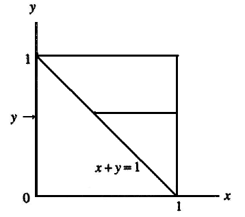
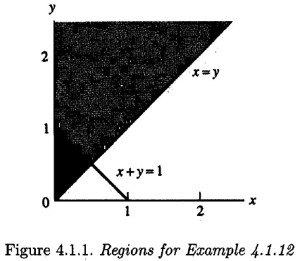
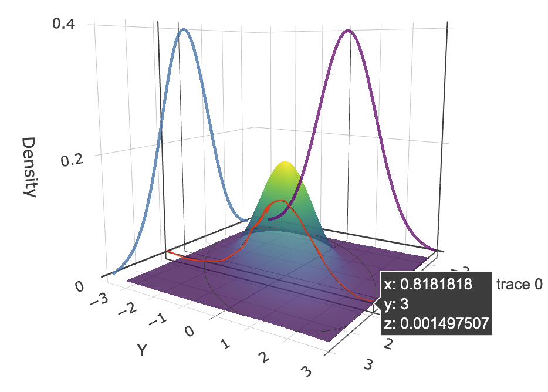
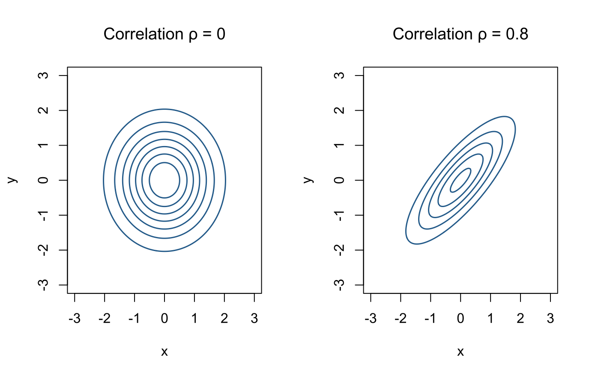
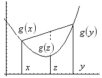

# Multiple Random Variables {#multiple-random-variables}

This chapter corresponds to *chap-4.tex* and its six source fragments. It covers joint and marginal distributions, conditional distributions and independence, bivariate transformations, hierarchical models, multivariate normal distributions, and fundamental inequalities. Every source figure is retained. Necessary corrections to integration variables, exponential signs, matrix formulas, and inequalities are recorded in migration_notes.md.

## Joint and marginal distributions and expectations {#joint-marginal-distributions}

::: {.definition}
The joint distribution function of $X,Y$ is

$$
F_{X,Y}(x,y)=P(X\le x,Y\le y).
$$

A nonnegative function $f_{X,Y}$ is a joint density if every Borel set
$A\subset\mathbb R^2$ satisfies

$$
P\{(X,Y)\in A\}=\iint_A f_{X,Y}(x,y)\,dx\,dy.
$$

In the discrete case, the joint mass function satisfies

$$
P\{(X,Y)\in A\}=\sum_{(x,y)\in A}p_{X,Y}(x,y).
$$
:::

::: {.theorem}
If $E|g(X,Y)|<\infty$, then

$$
E\{g(X,Y)\}=
\begin{cases}
\displaystyle\int_{-\infty}^{\infty}\int_{-\infty}^{\infty}
g(x,y)f_{X,Y}(x,y)\,dx\,dy,&\text{continuous case},\\[2mm]
\displaystyle\sum_{x,y}g(x,y)p_{X,Y}(x,y),&\text{discrete case}.
\end{cases}
$$
:::

Marginal densities are obtained by integration:

$$
f_X(x)=\int_{-\infty}^{\infty}f_{X,Y}(x,y)\,dy,\qquad
f_Y(y)=\int_{-\infty}^{\infty}f_{X,Y}(x,y)\,dx.
$$

<div class="figure" style="text-align: center">

<p class="caption">(\#fig:en-chap04-source-marginal-illustration)Source-slide illustration of a joint density and its marginals</p>
</div>

## Example 4.1.11: a density on the unit square {#example-4-1-11}

Let

$$
f(x,y)=
\begin{cases}
6xy^2,&0<x<1,\ 0<y<1,\\
0,&\text{otherwise}.
\end{cases}
$$

The marginal densities are

$$
f_X(x)=\int_0^1 6xy^2\,dy=2x,\quad 0<x<1,
$$

$$
f_Y(y)=\int_0^1 6xy^2\,dx=3y^2,\quad 0<y<1.
$$

For $P(X+Y\ge1)$, the region is
$A=\{(x,y):0<y<1,\ 1-y\le x\le1\}$, so

$$
\begin{aligned}
P(X+Y\ge1)
&=\int_0^1\int_{1-y}^1 6xy^2\,dx\,dy\\
&=3\int_0^1y^2\{1-(1-y)^2\}\,dy
=\frac9{10}.
\end{aligned}
$$

<div class="figure" style="text-align: center">

<p class="caption">(\#fig:en-chap04-source-region-411)Integration region for Example 4.1.11 from the source slides</p>
</div>

## Example 4.1.12: probability on a triangular support {#example-4-1-12}

Let

$$
f(x,y)=e^{-y},\qquad 0<x<y<\infty.
$$

This is normalized because
$\int_0^\infty\int_x^\infty e^{-y}\,dy\,dx=1$. The intersection of
$X+Y<1$ with the support is $0<x<1/2,\ x<y<1-x$. Hence

$$
\begin{aligned}
P(X+Y\ge1)
&=1-\int_0^{1/2}\int_x^{1-x}e^{-y}\,dy\,dx\\
&=1-\int_0^{1/2}\{e^{-x}-e^{-1+x}\}\,dx\\
&=2e^{-1/2}-e^{-1}.
\end{aligned}
$$

<div class="figure" style="text-align: center">

<p class="caption">(\#fig:en-chap04-source-region-412)Triangular support and complement region for Example 4.1.12</p>
</div>

## Conditional distributions, expectations, and variances {#conditional-distributions}

When $p_X(x)>0$, the discrete conditional mass function is

$$
p_{Y\mid X}(y\mid x)=P(Y=y\mid X=x)
=\frac{p_{X,Y}(x,y)}{p_X(x)}.
$$

For a continuous pair and $f_X(x)>0$,

$$
f_{Y\mid X}(y\mid x)=\frac{f_{X,Y}(x,y)}{f_X(x)}.
$$

<div class="figure" style="text-align: center">

<p class="caption">(\#fig:en-chap04-source-conditional-illustration)Source-slide illustration of conditional-density slices</p>
</div>

For $f(x,y)=e^{-y}$ on $0<x<y$,

$$
f_X(x)=\int_x^\infty e^{-y}\,dy=e^{-x},\qquad x>0,
$$

and therefore

$$
f_{Y\mid X}(y\mid x)=
\begin{cases}
e^{-(y-x)},&y>x,\\
0,&\text{otherwise}.
\end{cases}
$$

Thus $Y\mid X=x$ has the same law as $x+E$, where
$E\sim\operatorname{Exponential}(1)$, and

$$
E(Y\mid X=x)=x+1,\qquad
\operatorname{Var}(Y\mid X=x)=1.
$$

In general,

$$
E(Y\mid X=x)=\int y f_{Y\mid X}(y\mid x)\,dy,
$$

$$
\operatorname{Var}(Y\mid X=x)=
\int\{y-E(Y\mid X=x)\}^2f_{Y\mid X}(y\mid x)\,dy.
$$

## Independence and its consequences {#independence-properties}

::: {.definition}
Variables $X,Y$ are independent if, for every pair of Borel sets $A,B$,

$$
P(X\in A,Y\in B)=P(X\in A)P(Y\in B).
$$
:::

For a pair with a joint density or mass function, independence is equivalent to

$$
f_{X,Y}(x,y)=f_X(x)f_Y(y).
$$

::: {.lemma}
If the joint probability function factorizes on the whole support as
$f_{X,Y}(x,y)=g(x)h(y)$, then $X,Y$ are independent. The functions
$g,h$ need not themselves be normalized probability functions.
:::

For example,

$$
f(x,y)=\frac1{384}x^2y^4e^{-x/2-y},\qquad x,y>0,
$$

factorizes into an $x$ part and a $y$ part, so $X,Y$ are independent.

::: {.theorem}
If $X,Y$ are independent and the expectations exist, then

$$
E\{g(X)h(Y)\}=E\{g(X)\}E\{h(Y)\}.
$$

If the MGFs exist near zero, then

$$
M_{X+Y}(t)=M_X(t)M_Y(t).
$$
:::

For independent $X\sim N(\mu,\sigma^2)$ and
$Y\sim N(\gamma,\tau^2)$,

$$
M_{X+Y}(t)
=\exp\left\{(\mu+\gamma)t+\frac{\sigma^2+\tau^2}{2}t^2\right\},
$$

so $X+Y\sim N(\mu+\gamma,\sigma^2+\tau^2)$.

## Bivariate transformations and the Jacobian {#bivariate-transformations}

Let $(X,Y)$ have support $\mathcal A$ and define
$U=g_1(X,Y),V=g_2(X,Y)$. Suppose the transformation is one-to-one,
its inverse is $x=h_1(u,v),y=h_2(u,v)$, and the Jacobian is nonzero.
On

$$
\mathcal B=\{(u,v):(u,v)=(g_1(x,y),g_2(x,y)),\ (x,y)\in\mathcal A\},
$$

the transformed density is

$$
f_{U,V}(u,v)=
f_{X,Y}\{h_1(u,v),h_2(u,v)\}
\left|\frac{\partial(x,y)}{\partial(u,v)}\right|,
$$

where

$$
\frac{\partial(x,y)}{\partial(u,v)}
=
\begin{vmatrix}
\partial x/\partial u&\partial x/\partial v\\
\partial y/\partial u&\partial y/\partial v
\end{vmatrix}.
$$

::: {.example}
**Example 4.3.3 (product of two Beta variables)** Let

$$
X\sim\operatorname{Beta}(\alpha,\beta),\qquad
Y\sim\operatorname{Beta}(\alpha+\beta,\gamma)
$$

be independent, and set $U=XY,V=X$. The inverse is $x=v,y=u/v$, so

$$
J=
\begin{vmatrix}
0&1\\
1/v&-u/v^2
\end{vmatrix}
=-\frac1v.
$$

On $0<u<v<1$,

$$
\begin{aligned}
f_{U,V}(u,v)
={}&\frac{\Gamma(\alpha+\beta+\gamma)}
{\Gamma(\alpha)\Gamma(\beta)\Gamma(\gamma)}
v^{\alpha-1}(1-v)^{\beta-1}\\
&\times\left(\frac uv\right)^{\alpha+\beta-1}
\left(1-\frac uv\right)^{\gamma-1}\frac1v.
\end{aligned}
$$
:::

## Hierarchical models and total expectation {#hierarchical-models}

Let a mother fish lay $Y\sim\operatorname{Poisson}(\lambda)$ eggs, each of
which survives independently with probability $p$. Then
$X\mid Y\sim\operatorname{Binomial}(Y,p)$. For $x=0,1,\ldots$,

$$
\begin{aligned}
P(X=x)
&=\sum_{y=x}^{\infty}\binom yx p^x(1-p)^{y-x}
\frac{e^{-\lambda}\lambda^y}{y!}\\
&=\frac{(\lambda p)^xe^{-\lambda}}{x!}
\sum_{y=x}^{\infty}\frac{\{(1-p)\lambda\}^{y-x}}{(y-x)!}\\
&=\frac{(\lambda p)^xe^{-\lambda p}}{x!}.
\end{aligned}
$$

Thus $X\sim\operatorname{Poisson}(\lambda p)$, the Poisson-thinning property.

::: {.theorem}
**Theorem 4.4.3 (law of total expectation)** If the expectation exists,

$$
E(X)=E\{E(X\mid Y)\}.
$$
:::

For square-integrable $X$, $E(X\mid Y)$ is also the best mean-square
predictor of $X$ among measurable functions of $Y$:

$$
E\{X-E(X\mid Y)\}^2=\inf_h E\{X-h(Y)\}^2.
$$

## Mixture distributions and two hierarchical examples {#mixture-distributions}

::: {.definition}
If the conditional law of $X$ depends on another random quantity that itself
has a distribution, the marginal law of $X$ is a mixture distribution.
:::

Consider

$$
X\mid Y\sim\operatorname{Binomial}(Y,p),\quad
Y\mid\Lambda\sim\operatorname{Poisson}(\Lambda),\quad
\Lambda\sim\operatorname{Exponential}(\text{scale }\beta).
$$

Total expectation gives $E(X)=pE(Y)=pE(\Lambda)=p\beta$. For
$y=0,1,\ldots$,

$$
\begin{aligned}
P(Y=y)
&=\int_0^\infty
\frac{\lambda^ye^{-\lambda}}{y!}\frac1\beta e^{-\lambda/\beta}\,d\lambda\\
&=\frac1{\beta y!}\int_0^\infty
\lambda^ye^{-\lambda(1+1/\beta)}\,d\lambda\\
&=\left(\frac{\beta}{1+\beta}\right)^y\frac1{1+\beta}.
\end{aligned}
$$

Thus $Y$ is geometric on $0,1,\ldots$ with success probability
$1/(1+\beta)$. Replacing the exponential mixing law by a Gamma law gives a
negative-binomial mixture.

A second model is

$$
X_i\mid P_i\sim\operatorname{Bernoulli}(P_i),\qquad
P_i\sim\operatorname{Beta}(\alpha,\beta).
$$

If $P_i$ is the drug success probability for patient $i$ and
$Y=\sum_{i=1}^nX_i$, then

$$
E(Y)=\sum_{i=1}^nE\{E(X_i\mid P_i)\}
=\sum_{i=1}^nE(P_i)
=n\frac{\alpha}{\alpha+\beta}.
$$

## The law of total variance {#total-variance}

::: {.theorem}
If second moments exist,

$$
\operatorname{Var}(X)
=E\{\operatorname{Var}(X\mid Y)\}
+\operatorname{Var}\{E(X\mid Y)\}.
$$
:::

::: {.proof}
Write

$$
X-EX=\{X-E(X\mid Y)\}+\{E(X\mid Y)-EX\}.
$$

After squaring and taking expectation, the cross term is zero because

$$
E\!\left[\{X-E(X\mid Y)\}\{E(X\mid Y)-EX\}\right]=0.
$$

The remaining terms are $E\{\operatorname{Var}(X\mid Y)\}$ and
$\operatorname{Var}\{E(X\mid Y)\}$.
:::

## Multivariate normal distribution {#multivariate-normal}

::: {.definition}
An $m$-dimensional vector
$\mathbf X=(X_1,\ldots,X_m)^\top$ has distribution
$N_m(\boldsymbol\mu,\boldsymbol\Sigma)$, with positive-definite
$\boldsymbol\Sigma$, if its density is

$$
f_{\mathbf X}(\mathbf x)=
\frac{\exp\{-\tfrac12(\mathbf x-\boldsymbol\mu)^\top
\boldsymbol\Sigma^{-1}(\mathbf x-\boldsymbol\mu)\}}
{(2\pi)^{m/2}|\boldsymbol\Sigma|^{1/2}}.
$$
:::

Its multivariate MGF is

$$
M_{\mathbf X}(\mathbf t)
=E\{\exp(\mathbf t^\top\mathbf X)\}
=\exp\left(
\boldsymbol\mu^\top\mathbf t+
\frac12\mathbf t^\top\boldsymbol\Sigma\mathbf t
\right),
$$

so $E(\mathbf X)=\boldsymbol\mu$ and
$\operatorname{Var}(\mathbf X)=\boldsymbol\Sigma$.

For $m=2$,

$$
\boldsymbol\Sigma=
\begin{pmatrix}
\sigma_1^2&\rho\sigma_1\sigma_2\\
\rho\sigma_1\sigma_2&\sigma_2^2
\end{pmatrix},
$$

$$
\boldsymbol\Sigma^{-1}
=\frac1{1-\rho^2}
\begin{pmatrix}
1/\sigma_1^2&-\rho/(\sigma_1\sigma_2)\\
-\rho/(\sigma_1\sigma_2)&1/\sigma_2^2
\end{pmatrix}.
$$

With $z_i=(x_i-\mu_i)/\sigma_i$,

$$
f(x_1,x_2)=
\frac{\exp\left\{-\dfrac{z_1^2-2\rho z_1z_2+z_2^2}
{2(1-\rho^2)}\right\}}
{2\pi\sigma_1\sigma_2\sqrt{1-\rho^2}}.
$$

Thus $\operatorname{Cov}(X_1,X_2)=\rho\sigma_1\sigma_2$, and the
correlation coefficient is $\rho$.


``` r
grid <- seq(-3, 3, length.out = 120)
draw_bvn <- function(rho, main) {
  z <- outer(grid, grid, function(x, y) {
    exp(-(x^2 - 2 * rho * x * y + y^2) / (2 * (1 - rho^2))) /
      (2 * pi * sqrt(1 - rho^2))
  })
  contour(grid, grid, z, nlevels = 7, drawlabels = FALSE,
          col = "#2C6E9B", lwd = 1.5, xlab = "x", ylab = "y", main = main)
}
old_par <- par(no.readonly = TRUE)
par(mfrow = c(1, 2), family = course_plot_family())
draw_bvn(0, "Correlation ρ = 0")
draw_bvn(0.8, "Correlation ρ = 0.8")
```

<div class="figure" style="text-align: center">

<p class="caption">(\#fig:en-chap04-bivariate-normal-contours)Standard bivariate-normal contours for two correlations</p>
</div>

``` r
par(old_par)
```

## Young, Hölder, and Cauchy--Schwarz inequalities {#holder-cauchy}

::: {.lemma}
**Young's inequality (source Lemma 4.7.1)** If $a,b>0$, $p,q>1$, and
$1/p+1/q=1$, then

$$
\frac{a^p}{p}+\frac{b^q}{q}\ge ab,
$$

with equality if and only if $a^p=b^q$.
:::

For fixed $b$, the function
$g(a)=a^p/p+b^q/q-ab$ has its unique minimum where
$a^{p-1}=b$, equivalently $a^p=b^q$, and the minimum is zero.

::: {.theorem}
**Hölder's inequality** If the relevant moments are finite,

$$
|E(XY)|\le E|XY|
\le\{E|X|^p\}^{1/p}\{E|Y|^q\}^{1/q}.
$$
:::

Apply Young's inequality with

$$
a=\frac{|X|}{\{E|X|^p\}^{1/p}},\qquad
b=\frac{|Y|}{\{E|Y|^q\}^{1/q}},
$$

and take expectations. Setting $p=q=2$ gives Cauchy--Schwarz:

$$
|E(XY)|\le E|XY|
\le\{E(X^2)\}^{1/2}\{E(Y^2)\}^{1/2}.
$$

Applying it to $X-EX$ and $Y-EY$ yields

$$
\operatorname{Cov}^2(X,Y)
\le\operatorname{Var}(X)\operatorname{Var}(Y).
$$

## Lyapunov and Minkowski inequalities {#lyapunov-minkowski}

Hölder also gives, for $p>1$,

$$
E|X|\le\{E|X|^p\}^{1/p}.
$$

More generally, if $0<r<p$, Lyapunov's inequality is

$$
\{E|X|^r\}^{1/r}\le\{E|X|^p\}^{1/p}.
$$

::: {.theorem}
**Minkowski's inequality** For $1<p<\infty$,

$$
\{E|X+Y|^p\}^{1/p}
\le\{E|X|^p\}^{1/p}+\{E|Y|^p\}^{1/p}.
$$
:::

The proof starts from

$$
E|X+Y|^p
\le E\{|X||X+Y|^{p-1}\}
+E\{|Y||X+Y|^{p-1}\},
$$

and applies Hölder to both terms. Since the conjugate exponent
$q=p/(p-1)$ satisfies $q(p-1)=p$, cancellation of
$\{E|X+Y|^p\}^{(p-1)/p}$ gives the result.

## Convex functions and Jensen's inequality {#jensen-inequality}

::: {.definition}
A function $g$ is convex if, for all $x,y$ and $0<\lambda<1$,

$$
g\{\lambda x+(1-\lambda)y\}
\le\lambda g(x)+(1-\lambda)g(y).
$$

It is concave if $-g$ is convex.
:::

<div class="figure" style="text-align: center">

<p class="caption">(\#fig:en-chap04-source-convex-chord)A chord lies above the graph of a convex function (source slide)</p>
</div>

For a convex function, the secant slope

$$
g_x^\perp(y)=\frac{g(y)-g(x)}{y-x}
$$

is nondecreasing in $y$. Consequently, the supporting line determined by
$D^+g(x)=\lim_{y\downarrow x}g_x^\perp(y)$ lies below the graph:

$$
g(z)\ge g(x)+D^+g(x)(z-x).
$$

::: {.theorem}
**Jensen's inequality** If $g$ is convex and the expectations exist,

$$
E\{g(X)\}\ge g(EX).
$$
:::

<div class="figure" style="text-align: center">

<p class="caption">(\#fig:en-chap04-source-jensen-tangent)Supporting-line interpretation of Jensen’s inequality (source slide)</p>
</div>

For twice differentiable $g$, convexity is equivalent to $g''(x)\ge0$.
Equality always holds for a linear function; in general, $X$ must lie almost
surely where $g$ agrees with a supporting line.

## Two applications of Jensen's inequality {#jensen-examples}

For nonnegative $a_1,\ldots,a_n$, define the arithmetic, geometric, and
harmonic means:

$$
a_A=\frac1n\sum_{i=1}^na_i,\qquad
a_G=\left(\prod_{i=1}^na_i\right)^{1/n},\qquad
a_H=\left(\frac1n\sum_{i=1}^n\frac1{a_i}\right)^{-1}.
$$

Concavity of the logarithm and convexity of the reciprocal give

$$
a_H\le a_G\le a_A.
$$

If $f,g$ are densities and $X\sim f$, then

$$
E_f\!\left[\log\frac{g(X)}{f(X)}\right]
\le\log E_f\!\left[\frac{g(X)}{f(X)}\right]=0,
$$

so

$$
E_f\{\log g(X)\}\le E_f\{\log f(X)\}.
$$

This is equivalent to nonnegativity of Kullback--Leibler divergence and
helps explain why maximum likelihood favors the true model in expectation.

## Chapter summary {#multiple-random-variables-summary}

The joint law determines marginals, conditionals, and expectations of
functions. Independence factorizes probability functions, expectations, and
MGFs. Jacobians handle multivariate transformations. Total expectation and
total variance separate hierarchical models into conditional and mixing
layers. The multivariate normal distribution summarizes linear structure
through a mean vector and covariance matrix, while Hölder, Minkowski, and
Jensen provide fundamental bounds for later statistical arguments.

> **After-class prompt:** Recompute the region in Example 4.1.11, verify the
> Poisson-thinning property, and use Jensen's inequality to prove that the
> geometric mean does not exceed the arithmetic mean.

**Reference:** Casella and Berger, *Statistical Inference*, 2nd ed., Chapter 4.
