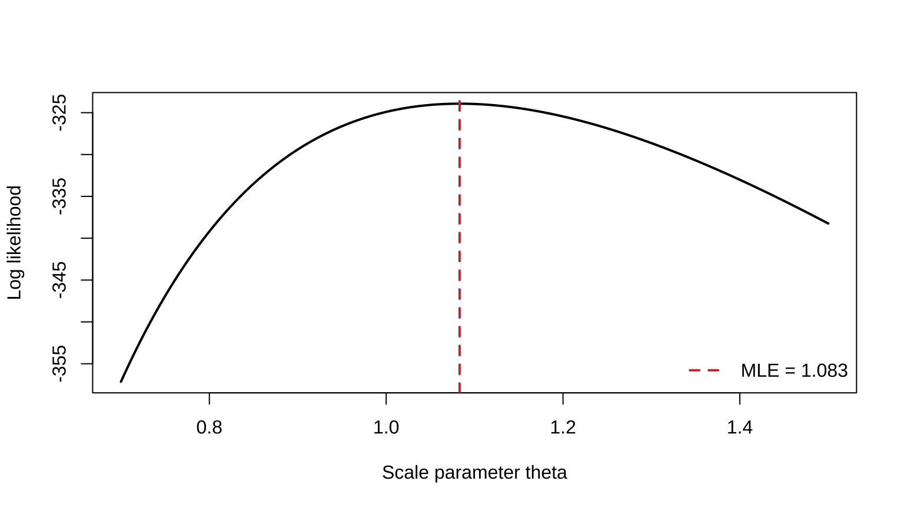
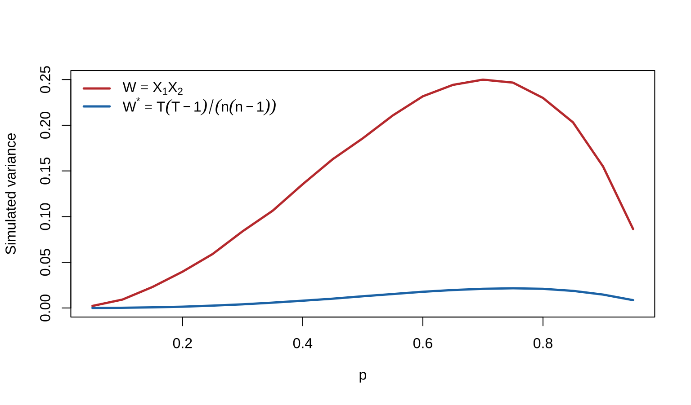

# Point Estimation {#point-estimation}

This chapter corresponds to *chap-7.tex* and its three LaTeX fragments. It covers moments, maximum likelihood, Bayes estimation, the EM algorithm, and evaluation by MSE, unbiasedness, the Cramér--Rao bound, Rao--Blackwellization, and loss functions. The source figure is retained, and relevant legacy R code is converted to a stable knitr example with only necessary changes.

## Point estimators and estimates {#point-estimator-definition}

::: {.definition}
Any sample function

$$W=W(X_1,\ldots,X_n)$$

may be used as a **point estimator**. Its realized value $W(\mathbf x)$ is an **estimate**.
:::

This formal definition does not make every statistic equally useful. Bias, variance, risk, and other optimality criteria determine whether an estimator is attractive.

## Method of moments {#method-of-moments}

For a population with $k$ unknown parameters
$\boldsymbol\theta=(\theta_1,\ldots,\theta_k)$, define

$$
m_j=\frac1n\sum_{i=1}^nX_i^j,\qquad
\mu_j(\boldsymbol\theta)=E_{\boldsymbol\theta}(X^j),\qquad j=1,\ldots,k.
$$

The method of moments solves

$$m_j=\mu_j(\boldsymbol\theta),\qquad j=1,\ldots,k$$

for $\hat\theta_1,\ldots,\hat\theta_k$.

::: {.example .source-numbered}
**Example 7.2.2 (Method of moments for the binomial family).** If $X_i\overset{\mathrm{iid}}\sim\operatorname{Bin}(k,p)$ and both $k,p$ are unknown, find their moment estimators.
:::

<details class="course-details solution-details">
<summary><strong>View detailed solution</strong></summary>

The first two population summaries are

$$E(X)=kp,\qquad E(X^2)=kp(1-p)+k^2p^2.$$

Writing $v_n=n^{-1}\sum_i(X_i-\bar X)^2$ gives

$$
\hat k_{\mathrm{MOM}}=\frac{\bar X^2}{\bar X-v_n},qquad
\hat p_{\mathrm{MOM}}=\frac{\bar X}{\hat k_{\mathrm{MOM}}}.
$$

If $\bar X-v_n\le0$, there is no interior solution in the allowed parameter space. Since $k$ is integer-valued, neighboring feasible integers must also be compared. This illustrates that moment estimates can be infeasible.

</details>

## Maximum likelihood and invariance {#maximum-likelihood-estimation}

The joint likelihood is

$$L(\boldsymbol\theta\mid\mathbf x)=\prod_{i=1}^nf(x_i\mid\boldsymbol\theta).$$

::: {.definition}
For fixed $\mathbf x$, a parameter value $\hat{\boldsymbol\theta}(\mathbf x)$ maximizing $L(\boldsymbol\theta\mid\mathbf x)$ over the parameter space is a **maximum likelihood estimator** (MLE).
:::

Maximizing $\ell=\log L$ is usually more stable. An interior candidate satisfies

$$\nabla_{\boldsymbol\theta}\ell(\boldsymbol\theta)=\mathbf0,$$

but boundaries, constraints, existence, and global maximality must still be checked.

::: {.theorem .source-numbered}
**Theorem 7.2.10 (Invariance of MLEs).** If $\hat\theta$ is the MLE of $\theta$, then the MLE of $\tau(\theta)$ is $\tau(\hat\theta)$. For a many-to-one transformation, likelihoods are profiled over all parameter values sharing the same transformed value.
:::

<details class="course-details proof-details">
<summary><strong>Expand proof</strong></summary>

Write $\eta=\tau(\theta)$ and define the profile likelihood

$$L^*(\eta\mid\mathbf x)=\sup_{\theta:\,\tau(\theta)=\eta}L(\theta\mid\mathbf x).$$

If $\hat\theta$ maximizes the original likelihood, then for every $\eta$,

$$L^*(\eta\mid\mathbf x)\le L(\hat\theta\mid\mathbf x)
\le L^*\{\tau(\hat\theta)\mid\mathbf x\}.$$

The last inequality holds because $\hat\theta$ belongs to the fiber with value $\tau(\hat\theta)$. Hence $L^*$ is maximized at $\hat\eta=\tau(\hat\theta)$. The one-to-one case is immediate.

</details>

The legacy R example used an exponential scale model but evaluated a likelihood that underflows numerically. The same model, sample generation, and grid search are retained below, using log likelihood.


``` r
set.seed(7301)
theta_true <- 1.1
n <- 300
x <- rexp(n, rate = 1 / theta_true)
theta_grid <- seq(0.7, 1.5, length.out = 200)
loglik <- -n * log(theta_grid) - sum(x) / theta_grid
theta_hat <- mean(x)
plot(theta_grid, loglik, type = "l", lwd = 2,
     xlab = "Scale parameter theta", ylab = "Log likelihood")
abline(v = theta_hat, col = "#C43C39", lty = 2, lwd = 2)
legend("bottomright", sprintf("MLE = %.3f", theta_hat),
       col = "#C43C39", lty = 2, lwd = 2, bty = "n")
```

<div class="figure" style="text-align: center">

<p class="caption">(\#fig:en-chap07-exponential-mle)Log likelihood and MLE for an exponential scale parameter</p>
</div>

## Two-parameter gamma MLE {#gamma-mle}

For the shape--scale density

$$
f(y;\alpha,\beta)=\frac{y^{\alpha-1}e^{-y/\beta}}
{\Gamma(\alpha)\beta^\alpha},\qquad y>0,
$$

the log likelihood is

$$
\ell(\alpha,\beta)=-n\log\Gamma(\alpha)-n\alpha\log\beta
+(\alpha-1)\sum_i\log y_i-\frac{\sum_i y_i}{\beta}.
$$

The score equations give $\hat\beta=\bar y/\hat\alpha$, while $\hat\alpha$ solves

$$
\log\hat\alpha-\psi(\hat\alpha)
=\log\bar y-\frac1n\sum_i\log y_i,
$$

where $\psi$ is the digamma function. Numerical root finding or joint optimization is normally required.

## Bayes estimation and Beta--Binomial conjugacy {#bayes-estimation}

For $\mathbf X\sim f(\mathbf x\mid\theta)$ and prior $\pi(\theta)$,

$$
\pi(\theta\mid\mathbf x)
=\frac{f(\mathbf x\mid\theta)\pi(\theta)}{m(\mathbf x)},qquad
m(\mathbf x)=\int f(\mathbf x\mid\theta)\pi(\theta)\,d\theta.
$$

::: {.example .source-numbered}
**Example 7.2.14 (Beta--Binomial Bayes estimation).** If $X_i\sim\operatorname{Bernoulli}(p)$, $Y=\sum_iX_i$, and
$p\sim\operatorname{Beta}(\alpha,\beta)$, find the posterior and the Bayes estimator under squared-error loss.
:::

<details class="course-details solution-details">
<summary><strong>View detailed solution</strong></summary>

Up to factors independent of $p$, likelihood times prior is

$$p^y(1-p)^{n-y}p^{\alpha-1}(1-p)^{\beta-1}
=p^{y+\alpha-1}(1-p)^{n-y+\beta-1},$$

which is a Beta kernel. Therefore

$$p\mid Y=y\sim\operatorname{Beta}(y+\alpha,n-y+\beta).$$

Under squared error loss, the Bayes estimator is the posterior mean

$$
\hat p_B=\frac{y+\alpha}{n+\alpha+\beta}
=\frac n{n+\alpha+\beta}\frac yn
+\frac{\alpha+\beta}{n+\alpha+\beta}\frac\alpha{\alpha+\beta}.
$$

It shrinks the sample proportion toward the prior mean.

</details>

## The EM algorithm: latent data and basic steps {#em-algorithm}

Let $\mathbf X$ be observed data, $\mathbf Z$ missing or latent data, and
$\mathbf Y=(\mathbf X,\mathbf Z)$ the complete data. At iteration $t$, define

$$
\begin{aligned}
Q(\boldsymbol\theta\mid\boldsymbol\theta^{(t)})
&=E_{\mathbf Z\mid\mathbf X,\boldsymbol\theta^{(t)}}
\{\log f_{\mathbf Y}(\mathbf Y\mid\boldsymbol\theta)\mid\mathbf X=\mathbf x\}\\
&=\int\log f_{\mathbf Y}(\mathbf y\mid\boldsymbol\theta)
f_{\mathbf Z\mid\mathbf X}(\mathbf z\mid\mathbf x,\boldsymbol\theta^{(t)})\,d\mathbf z.
\end{aligned}
$$

The EM cycle is:

1. **E-step:** compute $Q(\boldsymbol\theta\mid\boldsymbol\theta^{(t)})$;
2. **M-step:** maximize it to obtain $\boldsymbol\theta^{(t+1)}$;
3. repeat until parameter or objective changes fall below a chosen tolerance.

EM uses the conditional expectation of the complete-data **log likelihood**. Under standard conditions the observed likelihood does not decrease, but convergence may be to a local maximum or saddle point, so initialization and diagnostics matter.

## EM form for linear regression with missing responses {#em-missing-response}

Consider

$$
\mathbf Y=\mathbf W\boldsymbol\beta+\boldsymbol\varepsilon,qquad
\boldsymbol\varepsilon\sim N(\mathbf0,\sigma^2\mathbf I_n),
$$

with some responses missing and $\sigma^2$ treated as known. The E-step objective is

$$
\begin{aligned}
Q(\boldsymbol\beta\mid\boldsymbol\beta^{(t)})
&=-\frac n2\log(2\pi\sigma^2)\\
&\quad-\frac1{2\sigma^2}E\{(\mathbf Y-\mathbf W\boldsymbol\beta)^\top
(\mathbf Y-\mathbf W\boldsymbol\beta)\mid\mathbf x,\boldsymbol\beta^{(t)}\}.
\end{aligned}
$$

The M-step gives

$$
\boldsymbol\beta^{(t+1)}=(\mathbf W^\top\mathbf W)^{-1}\mathbf W^\top
E(\mathbf Y\mid\mathbf x,\boldsymbol\beta^{(t)}),
$$

where

$$
E(Y_j\mid\mathbf x,\boldsymbol\beta^{(t)})=
\begin{cases}y_j,&Y_j\text{ observed},\\
\mathbf w_j^\top\boldsymbol\beta^{(t)},&Y_j\text{ missing}.
\end{cases}
$$

With only responses missing, a fixed design, and ignorable missingness, missing responses add no observed information about $\boldsymbol\beta$; this example primarily displays the complete-data iteration.

## Mean squared error, bias, and normal variance estimation {#mse-bias-normal}

::: {.definition}
The mean squared error of $W$ for $\theta$ is

$$
\operatorname{MSE}_\theta(W)=E_\theta(W-\theta)^2
=\operatorname{Var}_\theta(W)+\{E_\theta(W)-\theta\}^2.
$$

If $E_\theta(W)=\theta$ for every $\theta$, then $W$ is unbiased.
:::

For $X_i\sim N(\mu,\sigma^2)$, both $\bar X$ and
$S^2=(n-1)^{-1}\sum_i(X_i-\bar X)^2$ are unbiased, and

$$
\operatorname{MSE}(\bar X)=\frac{\sigma^2}{n},\qquad
\operatorname{MSE}(S^2)=\frac{2\sigma^4}{n-1}.
$$

The normal-model MLE is $\hat\sigma^2_{\mathrm{MLE}}=(n-1)S^2/n$. It is biased, but

$$
\operatorname{MSE}(\hat\sigma^2_{\mathrm{MLE}})
=\sigma^4\frac{2n-1}{n^2}<\frac{2\sigma^4}{n-1}.
$$

Unbiasedness therefore does not imply smaller MSE. For scale parameters, squared error also changes with measurement units.

## MSE of the binomial Bayes estimator {#binomial-bayes-mse}

The sample proportion has MSE $p(1-p)/n$. Under a Beta prior,
$\hat p_B=(Y+\alpha)/(n+\alpha+\beta)$ has MSE

$$
\frac{np(1-p)}{(n+\alpha+\beta)^2}
+\left(\frac{np+\alpha}{n+\alpha+\beta}-p\right)^2.
$$

Without specific prior information, the source chooses
$\alpha=\beta=\sqrt{n/4}$, making the MSE constant in $p$:

$$
\hat p_B=\frac{Y+\sqrt{n/4}}{n+\sqrt n},\qquad
\operatorname{MSE}(\hat p_B)=\frac{n}{4(n+\sqrt n)^2}.
$$

<div class="figure" style="text-align: center">

<p class="caption">(\#fig:en-chap07-source-mse-bayes)Source-slide comparison of sample-proportion and Bayes-estimator MSE for n=4 and n=400</p>
</div>

## Best unbiased estimation and UMVUE {#umvue-definition}

::: {.definition}
An unbiased estimator $W^*$ of $\tau(\theta)$ is a **uniform minimum variance unbiased estimator** (UMVUE) if every other unbiased $W$ satisfies

$$\operatorname{Var}_\theta(W^*)\le\operatorname{Var}_\theta(W)
\quad\text{for every }\theta.$$
:::

Within the unbiased class, MSE equals variance. Finding a UMVUE generally requires an information bound or a complete sufficient statistic.

## The Cramér--Rao lower bound {#cramer-rao-bound}

::: {.theorem .source-numbered}
**Theorem 7.3.9 (Cramér--Rao lower bound).** Under regularity conditions including parameter-independent support, valid differentiation under the integral, and finite variance,

$$
\operatorname{Var}_\theta(W)\ge
\frac{\{dE_\theta(W)/d\theta\}^2}{I_n(\theta)},
\qquad
I_n(\theta)=E_\theta\left[\left\{\frac\partial{\partial\theta}
\log f(\mathbf X\mid\theta)\right\}^2\right].
$$
:::

<details class="course-details proof-details">
<summary><strong>Expand proof</strong></summary>

Let

$$U(\mathbf X;\theta)=\frac{\partial}{\partial\theta}\log f(\mathbf X\mid\theta)$$

be the score. Regularity and normalization of the density give

$$E_\theta U=\int \frac{\partial f(\mathbf x\mid\theta)}{\partial\theta}\,d\mathbf x
=\frac{d}{d\theta}\int f(\mathbf x\mid\theta)\,d\mathbf x=0.$$

Interchanging differentiation and integration once more,

$$\operatorname{Cov}_\theta(W,U)=E_\theta(WU)
=\frac{d}{d\theta}E_\theta(W).$$

Cauchy--Schwarz now yields

$$\left\{\frac{d}{d\theta}E_\theta(W)\right\}^2
\le \operatorname{Var}_\theta(W)\operatorname{Var}_\theta(U)
=\operatorname{Var}_\theta(W)I_n(\theta),$$

which rearranges to the stated bound. Equality holds exactly when $W-E_\theta(W)$ and the score are linearly related.

</details>

For iid observations, $I_n=nI_1$. Under regularity,

$$
I_1(\theta)=-E_\theta\left\{\frac{\partial^2}{\partial\theta^2}
\log f(X\mid\theta)\right\}.
$$

::: {.example .source-numbered}
**Example 7.3.12 (Attaining the information bound in the Poisson model).** Let $X_i\sim\operatorname{Poisson}(\lambda)$. Find the Fisher information and determine whether $\bar X$ attains the Cramér--Rao bound.
:::

<details class="course-details solution-details">
<summary><strong>View detailed solution</strong></summary>

For one observation,

$$\ell(\lambda)=X\log\lambda-\lambda-\log(X!),\qquad
U(\lambda)=\frac X\lambda-1,$$

so

$$I_1(\lambda)=E_\lambda\{U(\lambda)^2\}
=\frac{\operatorname{Var}(X)}{\lambda^2}=\frac1\lambda.$$

Therefore every unbiased estimator obeys

$$\operatorname{Var}_\lambda(W)\ge\lambda/n.$$

The sample mean has variance $\lambda/n$, attains the bound, and is the UMVUE.

</details>

## The irregular uniform model {#irregular-uniform-model}

::: {.example .source-numbered}
**Example 7.3.13 (Parameter-dependent support).** Let $X_i\sim U(0,\theta)$. Explain why the regular Cramér--Rao theorem cannot be applied directly and construct an unbiased estimator based on the sample maximum.
:::

<details class="course-details solution-details">
<summary><strong>View detailed solution</strong></summary>

For $X_i\sim U(0,\theta)$, the support depends on $\theta$, so the usual Cramér--Rao theorem does not apply.

Let $Y=X_{(n)}$. Then

$$f_Y(y\mid\theta)=ny^{n-1}\theta^{-n},\qquad0<y<\theta,$$

and

$$E_\theta(Y)=\frac n{n+1}\theta,qquad
\operatorname{Var}_\theta\left(\frac{n+1}{n}Y\right)
=\frac{\theta^2}{n(n+2)}.
$$

Thus $(n+1)Y/n$ is unbiased. Its apparent violation of a naively calculated bound is explained by

$$
\frac d{d\theta}\int_0^\theta h(x)f(x\mid\theta)\,dx
\ne\int_0^\theta h(x)\frac\partial{\partial\theta}f(x\mid\theta)\,dx.
$$

</details>

## The normal variance bound and attainment {#normal-variance-bound}

For $X_i\sim N(\mu,\sigma^2)$, the information bound for an unbiased estimator of $\sigma^2$ is $2\sigma^4/n$. Since
$\operatorname{Var}(S^2)=2\sigma^4/(n-1)$, $S^2$ does not attain this finite-sample bound.

::: {.theorem}
Under the regular Cramér--Rao conditions, an unbiased $W$ of $\tau(\theta)$ attains the bound if and only if a function $a(\theta)$ exists such that

$$
a(\theta)\{W(\mathbf x)-\tau(\theta)\}
=\frac\partial{\partial\theta}\log L(\theta\mid\mathbf x).
$$
:::

When the normal mean $\mu$ is known,

$$
\frac\partial{\partial\sigma^2}\log L
=\frac n{2\sigma^4}\left\{\frac1n\sum_i(x_i-\mu)^2-\sigma^2\right\},
$$

so $n^{-1}\sum_i(X_i-\mu)^2$ attains the bound. With unknown $\mu$, this statistic is unavailable and sufficiency-completeness methods are needed.

## Rao--Blackwell and Lehmann--Scheffé {#rao-blackwell-lehmann-scheffe}

::: {.theorem .source-numbered}
**Theorem 7.3.17 (Rao--Blackwell theorem).** If $W$ is unbiased for $\tau(\theta)$ and $T$ is sufficient, then

$$\Phi(T)=E(W\mid T)$$

is unbiased and has variance no greater than that of $W$ for every $\theta$.
:::

<details class="course-details proof-details">
<summary><strong>Expand proof</strong></summary>

Sufficiency makes the conditional law of $W$ given $T$ parameter-free, so $\Phi(T)=E(W\mid T)$ is a statistic. By iterated expectation,

$$E_\theta\{\Phi(T)\}=E_\theta\{E_\theta(W\mid T)\}=E_\theta(W)=\tau(\theta).$$

The total-variance identity gives

$$\operatorname{Var}_\theta(W)
=E_\theta\{\operatorname{Var}_\theta(W\mid T)\}
+\operatorname{Var}_\theta\{E_\theta(W\mid T)\}
\ge \operatorname{Var}_\theta\{\Phi(T)\}.$$

Equality holds exactly when the conditional variance is zero almost surely, that is, when $W$ was already a function of $T$.

</details>

::: {.theorem .source-numbered}
**Theorem 7.3.23 (Lehmann--Scheffé theorem).** If $T$ is complete and sufficient, every unbiased function $\phi(T)$ is the unique UMVUE of its expectation.
:::

<details class="course-details proof-details">
<summary><strong>Expand proof</strong></summary>

Let $W$ be any other unbiased estimator of the same target. Rao--Blackwellization gives $W^*=E(W\mid T)$, which is unbiased and has variance no greater than $W$. Both $W^*$ and $\phi(T)$ are functions of $T$, and

$$E_\theta\{W^*-\phi(T)\}=0\qquad\text{for every }\theta.$$

Completeness forces $W^*=\phi(T)$ almost surely. Hence $\phi(T)$ has no larger variance than any unbiased estimator and is a UMVUE. Applying the same argument to any second UMVUE proves almost-sure uniqueness.

</details>

A best unbiased estimator is unique almost surely. Equivalently, an unbiased estimator is UMVUE exactly when it is uncorrelated with every unbiased estimator of zero.

For a $U(0,\theta)$ sample, $Y=X_{(n)}$ is complete sufficient, so $(n+1)Y/n$ is the unique UMVUE of $\theta$.

## Rao--Blackwellization in the binomial model {#binomial-umvue-example}

::: {.example .source-numbered}
**Example 7.3.24 (A binomial UMVUE).** Let $X_i\sim\operatorname{Bin}(k,\theta)$ with known $k$. Find the UMVUE of $\tau(\theta)=k\theta(1-\theta)^{k-1}$, the probability of exactly one success in a single observation.
:::

<details class="course-details solution-details">
<summary><strong>View detailed solution</strong></summary>

Let $X_i\sim\operatorname{Bin}(k,\theta)$ with known $k$. The target is the probability of exactly one success in a single $\operatorname{Bin}(k,\theta)$ observation:

$$\tau(\theta)=k\theta(1-\theta)^{k-1}.$$

$h(X_1)=I(X_1=1)$ is unbiased, and
$T=\sum_iX_i\sim\operatorname{Bin}(nk,\theta)$ is complete sufficient. Hence

$$
\begin{aligned}
\phi(t)&=E\{h(X_1)\mid T=t\}=P(X_1=1\mid T=t)\\
&=\frac{k\theta(1-\theta)^{k-1}
\binom{k(n-1)}{t-1}\theta^{t-1}(1-\theta)^{k(n-1)-t+1}}
{\binom{kn}{t}\theta^t(1-\theta)^{kn-t}}\\
&=k\frac{\binom{k(n-1)}{t-1}}{\binom{kn}{t}}.
\end{aligned}
$$

The disappearance of $\theta$ after conditioning demonstrates reduction by sufficiency.

</details>

## Loss functions and risk {#loss-and-risk}

Common losses are absolute error $L(\theta,a)=|a-\theta|$ and squared error
$L(\theta,a)=(a-\theta)^2$. The risk of rule $\delta$ is

$$
R(\theta,\delta)=E_\theta L\{\theta,\delta(\mathbf X)\}
=\int_{\mathcal X}L\{\theta,\delta(\mathbf x)\}f(\mathbf x\mid\theta)\,d\mathbf x.
$$

If $R(\theta,\delta_1)<R(\theta,\delta_2)$ for every $\theta$, then $\delta_1$ uniformly dominates $\delta_2$.

::: {.example}
For squared-error estimation of normal $\sigma^2$, consider $\delta_b=bS^2$. Its risk is

$$
R((\mu,\sigma^2),\delta_b)
=\left\{\frac{2b^2}{n-1}+(b-1)^2\right\}\sigma^4.
$$

Differentiating gives $b=(n-1)/(n+1)$, so

$$\tilde S^2=\frac{n-1}{n+1}S^2
=\frac1{n+1}\sum_i(X_i-\bar X)^2$$

has minimum risk within the class $\{bS^2:b\ge0\}$.
:::

## Bayes risk and two Bayes rules {#bayes-risk-rules}

The prior-averaged risk is

$$r(\pi,\delta)=\int_\Theta R(\theta,\delta)\pi(\theta)\,d\theta.$$

Using $f(\mathbf x\mid\theta)\pi(\theta)=\pi(\theta\mid\mathbf x)m(\mathbf x)$,

$$
r(\pi,\delta)=\int_{\mathcal X}
\left[\int_\Theta L\{\theta,\delta(\mathbf x)\}
\pi(\theta\mid\mathbf x)\,d\theta\right]m(\mathbf x)\,d\mathbf x.
$$

Thus minimizing posterior expected loss pointwise gives:

- posterior mean under squared error;
- any posterior median under absolute error.

## Normal--normal Bayes estimation {#normal-bayes-estimator}

If $X_i\sim N(\theta,\sigma^2)$ and the prior is
$\theta\sim N(\mu,\tau^2)$, with $\sigma^2,\mu,\tau^2$ known, then

$$
E(\theta\mid\bar x)
=\frac{\tau^2}{\tau^2+\sigma^2/n}\bar x
+\frac{\sigma^2/n}{\tau^2+\sigma^2/n}\mu,
$$

$$
\operatorname{Var}(\theta\mid\bar x)
=\frac{\tau^2\sigma^2/n}{\tau^2+\sigma^2/n}.
$$

The posterior is normal, so its mean equals its median. Therefore squared and absolute error produce the same Bayes estimator in this example.

## A simulation comparison of Rao--Blackwellization {#rao-blackwell-simulation}

Let $X_1,\ldots,X_n\overset{\mathrm{iid}}\sim\operatorname{Bernoulli}(p)$ and suppose the target is $p^2$. A direct unbiased estimator is

$$W=X_1X_2,\qquad E_p(W)=p^2.$$

Let $T=\sum_{i=1}^nX_i$. Because $T$ is complete and sufficient for $p$, conditioning on $T=t$ gives

$$
E(W\mid T=t)
=P(X_1=X_2=1\mid T=t)
=\frac{\binom{t}{2}}{\binom{n}{2}}
=\frac{t(t-1)}{n(n-1)}.
$$

Hence $W^*=T(T-1)/\{n(n-1)\}$ remains unbiased and is the UMVUE of $p^2$. The experiment below makes the variance reduction in the Rao--Blackwell theorem visible.


``` r
set.seed(7307)
n_rb <- 20
b_rb <- 20000
p_grid <- seq(0.05, 0.95, by = 0.05)
variance_result <- t(vapply(p_grid, function(p) {
  x <- matrix(rbinom(b_rb * n_rb, size = 1, prob = p), nrow = b_rb)
  total <- rowSums(x)
  raw <- x[, 1] * x[, 2]
  improved <- total * (total - 1) / (n_rb * (n_rb - 1))
  c(raw = var(raw), Rao_Blackwell = var(improved))
}, numeric(2)))

matplot(p_grid, variance_result, type = "l", lty = 1, lwd = 2.5,
        col = c("#C43C39", "#1F77B4"),
        xlab = expression(p), ylab = "Simulated variance")
legend("topleft", c(expression(W == X[1] * X[2]),
                    expression(W^"*" == T * (T - 1) / (n * (n - 1)))),
       col = c("#C43C39", "#1F77B4"), lty = 1, lwd = 2.5, bty = "n")
```

<div class="figure" style="text-align: center">

<p class="caption">(\#fig:en-chap07-rao-blackwell-variance)Simulated variances of the raw and Rao--Blackwellized unbiased estimators (n=20)</p>
</div>

The blue curve stays below the red curve across the parameter range. This is not a bias--variance tradeoff: both estimators are unbiased, and the gain comes from retaining the information about $p$ contained in the sufficient statistic.

## Running case: point estimation of a defect rate {#defect-rate-point-estimation}

The same teaching case will connect Chapters 7--9. In an independent inspection of $n=200$ products, $y=16$ are defective. Let $p$ be the true defect rate and let the quality benchmark be $p_0=0.05$.

The maximum likelihood estimate is

$$\hat p_{\mathrm{MLE}}=\frac{16}{200}=0.08.$$

Suppose historical experience is represented by $p\sim\operatorname{Beta}(2,38)$, whose prior mean is $0.05$. Then

$$
p\mid y\sim\operatorname{Beta}(18,222),\qquad
\hat p_B=E(p\mid y)=\frac{18}{240}=0.075.
$$


``` r
n_defect <- 200
y_defect <- 16
knitr::kable(
  data.frame(
    Method = c("MLE", "Bayes posterior mean"),
    Estimate = c(y_defect / n_defect,
                 (2 + y_defect) / (2 + 38 + n_defect))
  ),
  digits = 3
)
```


|Method               | Estimate|
|:--------------------|--------:|
|MLE                  |    0.080|
|Bayes posterior mean |    0.075|

The Bayes estimate shrinks slightly toward the historical benchmark. Both quantities are point summaries only. Chapter 8 asks whether the data show that the rate exceeds the benchmark, and Chapter 9 quantifies the remaining uncertainty.

## Chapter summary {#point-estimation-summary}

- Moments match sample and population moments; maximum likelihood selects the parameter best supporting the observed sample.
- Bayes estimation combines prior and likelihood; EM optimizes through expected complete-data log likelihood.
- MSE trades bias against variance; under unbiasedness one can seek a UMVUE.
- The Cramér--Rao bound requires regularity, while Rao--Blackwellization and complete sufficiency offer a broader improvement route.
- Loss and risk define what “best” means; different losses can yield different Bayes rules.

Source-slide references: Casella, G. and Berger, R. L. (2002), *Statistical Inference*, 2nd ed., Chapter 7; Dempster, A. P., Laird, N. M. and Rubin, D. B. (1977), “Maximum Likelihood from Incomplete Data via the EM Algorithm,” *Journal of the Royal Statistical Society, Series B*, 39, 1--38.
