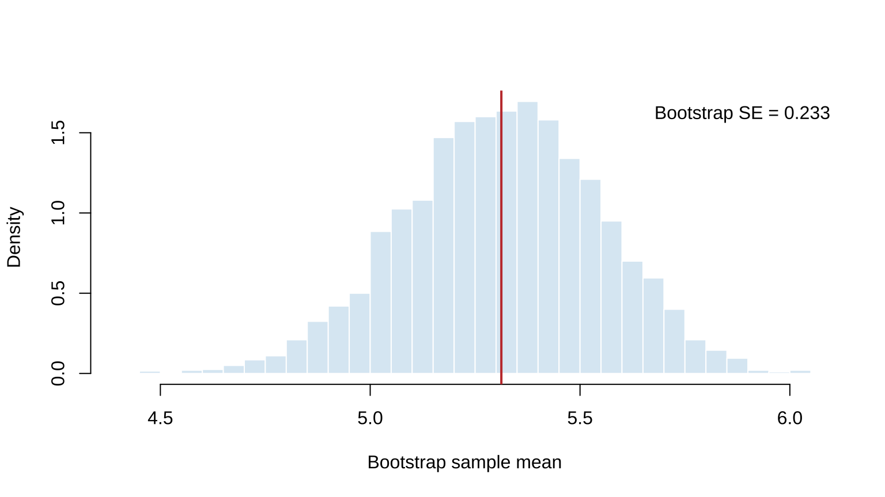
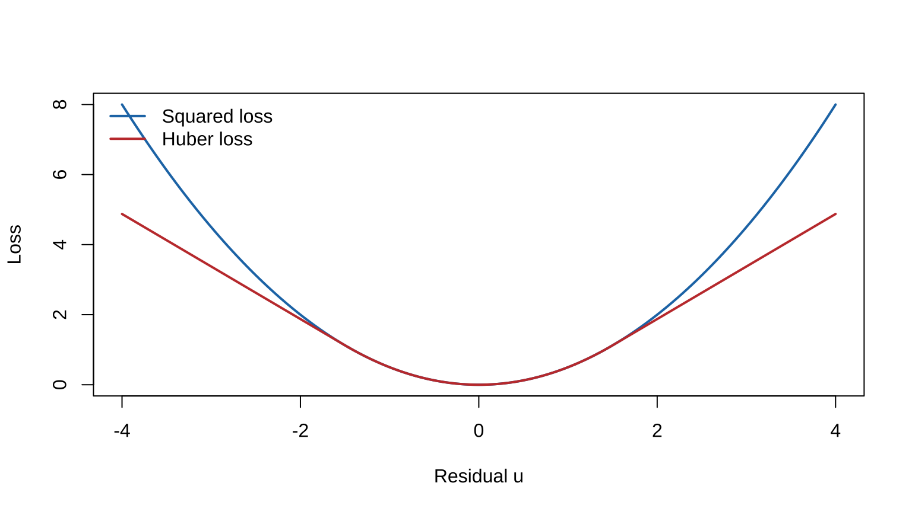

# Asymptotic Evaluations {#asymptotic-evaluations}

This chapter corresponds to *chap-10.tex* and its four LaTeX fragments. It covers consistency, asymptotic variance and efficiency, relative efficiency, bootstrap standard errors, Huber M-estimation, asymptotic LRT distributions, and approximate likelihood intervals. The source has no external figures or R files; two base-R examples illustrate bootstrap variation and robust loss.

## Consistent estimators {#consistent-estimators}

Asymptotic properties concern a sequence $W_n=W_n(X_1,\ldots,X_n)$ rather than one fixed-sample statistic.

::: {.definition}
The sequence $W_n$ is **consistent** for $\theta$ if, for every $\epsilon>0$ and $\theta\in\Theta$,
$$\lim_{n\to\infty}P_\theta(|W_n-\theta|<\epsilon)=1,$$
that is, $W_n\overset p\to\theta$.
:::

::: {.example}
If $X_i\overset{\mathrm{iid}}\sim N(\theta,1)$, then $\bar X_n\sim N(\theta,1/n)$ and
$$P_\theta(|\bar X_n-\theta|<\epsilon)
=P(-\epsilon\sqrt n<Z<\epsilon\sqrt n)\longrightarrow1.$$
Thus $\bar X_n$ is consistent.
:::

## MLE regularity conditions and consistency {#mle-regularity-consistency}

The source lists a common sufficient condition set:

1. $X_1,\ldots,X_n$ are iid from $f(x\mid\theta)$;
2. the model is identifiable;
3. densities have common support and are differentiable in $\theta$;
4. the true $\theta_0$ is interior to an open part of the parameter space;
5. $f$ is three times differentiable in $\theta$, with differentiation under the integral allowed;
6. locally, $|\partial^3\log f(x\mid\theta)/\partial\theta^3|\le M(x)$ and $E_{\theta_0}M(X)<\infty$.

The first four support the source's consistency result; the last two are added for asymptotic normality and efficiency. Modern versions can use different weaker assumptions, but the source condition set is preserved.

::: {.theorem}
Under the consistency regularity conditions, if $\hat\theta$ is the MLE and $\tau$ is continuous, then
$$P_\theta\{|\tau(\hat\theta)-\tau(\theta)|\ge\epsilon\}\longrightarrow0.$$
Hence $\tau(\hat\theta)$ is consistent.
:::

## Limiting and asymptotic variance {#limiting-asymptotic-variance}

Consistency asks whether an estimator reaches its target; efficiency concerns its rate and normalized variation.

::: {.definition}
If $k_n\operatorname{Var}(T_n)\to\tau^2<\infty$, then $\tau^2$ is a **limit of variances**. If
$$a_n\{T_n-\tau(\theta)\}\overset d\longrightarrow N(0,\sigma^2),$$
then $\sigma^2$ is the **asymptotic variance** for that normalization.
:::

For example, $n\operatorname{Var}(\bar X_n)=\sigma^2$. Yet $1/\bar X_n$ can have infinite exact variance in a normal model, while the delta method gives
$$E(1/\bar X_n)\approx1/\mu,\qquad
\operatorname{Var}(1/\bar X_n)\approx\frac{\sigma^2}{n\mu^4}.$$
Thus a limit of finite-sample variances and the variance of a limiting distribution are distinct concepts.

## Asymptotic efficiency and MLEs {#asymptotic-efficiency}

::: {.definition}
If
$$\sqrt n\{W_n-\tau(\theta)\}\overset d\longrightarrow N\{0,v(\theta)\},$$
and
$$v(\theta)=\frac{[\tau'(\theta)]^2}{I_1(\theta)},\qquad
I_1(\theta)=E_\theta\left[\left\{\frac\partial{\partial\theta}\log f(X\mid\theta)\right\}^2\right],$$
then $W_n$ is asymptotically efficient.
:::

::: {.theorem}
Under the stated regularity conditions, if $\hat\theta$ is the MLE and $\tau$ has the required continuity and differentiability, then
$$\sqrt n\{\tau(\hat\theta)-\tau(\theta)\}\overset d\longrightarrow N\{0,v(\theta)\},$$
where $v(\theta)$ is the Cramér--Rao bound. Thus $\tau(\hat\theta)$ is consistent and asymptotically efficient.
:::

## Asymptotic relative efficiency {#asymptotic-relative-efficiency}

::: {.definition}
If
$$\sqrt n\{W_n-\tau(\theta)\}\Rightarrow N(0,\sigma_W^2),\qquad
\sqrt n\{V_n-\tau(\theta)\}\Rightarrow N(0,\sigma_V^2),$$
then
$$\operatorname{ARE}(V_n,W_n)=\frac{\sigma_W^2}{\sigma_V^2}.$$
Under this convention, ARE above one means that $V_n$ has smaller asymptotic variance.
:::

## Bootstrap standard errors {#bootstrap-standard-errors}

Resample $n$ observations with replacement from the empirical distribution. Enumerating all $n^n$ resamples gives
$$\operatorname{Var}^*(\hat\theta)=\frac1{n^n-1}\sum_{i=1}^{n^n}(\hat\theta_i^*-\bar{\hat\theta}^*)^2.$$
With $B$ Monte Carlo resamples, use
$$\operatorname{Var}_B^*(\hat\theta)=\frac1{B-1}\sum_{i=1}^B(\hat\theta_i^*-\bar{\hat\theta}^*)^2.$$
One must distinguish Monte Carlo convergence as $B\to\infty$ for fixed data from bootstrap consistency as $n\to\infty$.


``` r
set.seed(1001)
x <- c(4.1, 5.3, 4.8, 6.2, 5.7, 4.9, 5.5, 6.0)
B <- 4000
boot_mean <- replicate(B, mean(sample(x, replace = TRUE)))
hist(boot_mean, breaks = 32, probability = TRUE,
     col = "#DCEAF4", border = "white",
     xlab = "Bootstrap sample mean", main = "")
abline(v = mean(x), col = "#C43C39", lwd = 2)
legend("topright", sprintf("Bootstrap SE = %.3f", sd(boot_mean)), bty = "n")
```

<div class="figure" style="text-align: center">

<p class="caption">(\#fig:en-chap10-bootstrap-se)Bootstrap distribution and standard error of a sample mean</p>
</div>

## Huber loss and M-estimation {#huber-m-estimators}

Huber loss is quadratic near zero and linear in the tails:
$$\rho_k(u)=\begin{cases}u^2/2,&|u|\le k,\\ k|u|-k^2/2,&|u|>k.\end{cases}$$
An M-estimator minimizes $\sum_i\rho_k(x_i-a)$. With $\psi=\rho'$, it solves
$\sum_i\psi(x_i-\hat\theta)=0$. If $E_{\theta_0}\psi(X-\theta_0)=0$, then
$$-\frac1{\sqrt n}\sum_{i=1}^n\psi(X_i-\theta_0)
\Rightarrow N\left(0,E_{\theta_0}[\psi(X-\theta_0)^2]\right),$$
and local linearization of the estimating equation yields asymptotic normality of $\hat\theta$.


``` r
u <- seq(-4, 4, length.out = 401)
k <- 1.5
huber <- ifelse(abs(u) <= k, u^2 / 2, k * abs(u) - k^2 / 2)
plot(u, u^2 / 2, type = "l", lwd = 2, col = "#1F77B4",
     xlab = "Residual u", ylab = "Loss")
lines(u, huber, lwd = 2, col = "#C43C39")
legend("topleft", c("Squared loss", "Huber loss"),
       col = c("#1F77B4", "#C43C39"), lty = 1, lwd = 2, bty = "n")
```

<div class="figure" style="text-align: center">

<p class="caption">(\#fig:en-chap10-huber-loss)Squared loss and Huber loss</p>
</div>

## Asymptotic distribution of LRTs {#asymptotic-lrt-distribution}

::: {.theorem}
For $H_0:\theta=\theta_0$ against $H_1:\theta\ne\theta_0$, if the iid model and MLE satisfy the regularity conditions, then under $H_0$,
$$-2\log\lambda(\mathbf X)\overset d\longrightarrow\chi_1^2.$$
:::

More generally, if the unrestricted model has dimension $p$ and the null has $q$ free dimensions, then under smooth interior regularity,
$$-2\log\lambda(\mathbf X)\Rightarrow\chi^2_{p-q}.$$
An approximate level $\alpha$ test rejects for $-2\log\lambda\ge\chi^2_{p-q,1-\alpha}$. Boundary parameters, nonidentifiability, and parameter-dependent support can invalidate this limit.

## Approximate maximum-likelihood intervals {#approximate-ml-intervals}

Observed information gives
$$\widehat{\operatorname{Var}}\{h(\hat\theta)\}
\approx\frac{[h'(\hat\theta)]^2}
{-\left.\dfrac{\partial^2}{\partial\theta^2}\log L(\theta\mid\mathbf x)\right|_{\theta=\hat\theta}}.$$
MLE asymptotic normality and Slutsky's theorem yield the Wald interval
$$h(\hat\theta)\pm z_{\alpha/2}
\sqrt{\widehat{\operatorname{Var}}\{h(\hat\theta)\}}.$$

## LRT intervals {#lrt-intervals}

Inverting the LRT gives the approximate $1-\alpha$ confidence set
$$\left\{\theta:-2\log\frac{L(\theta\mid\mathbf x)}{L(\hat\theta\mid\mathbf x)}
\le\chi^2_{1,1-\alpha}\right\}.$$

::: {.example}
If $Y=\sum_iX_i$ for independent Bernoulli$(p)$ observations and $\hat p=y/n$, the binomial LRT interval is
$$\left\{p:-2\log\left[
\frac{p^y(1-p)^{n-y}}{\hat p^y(1-\hat p)^{n-y}}
\right]\le\chi^2_{1,1-\alpha}\right\}.$$
Its endpoints are normally obtained by one-dimensional root finding.
:::

## Chapter summary {#asymptotic-evaluations-summary}

Consistency, asymptotic normality, and efficiency describe large-sample accuracy and variation; bootstrap uses the empirical distribution to approximate sampling variation; M-estimation limits the influence of extreme residuals; and Wilks-type chi-square approximations connect LRTs, tests, and intervals, subject to regularity conditions.
