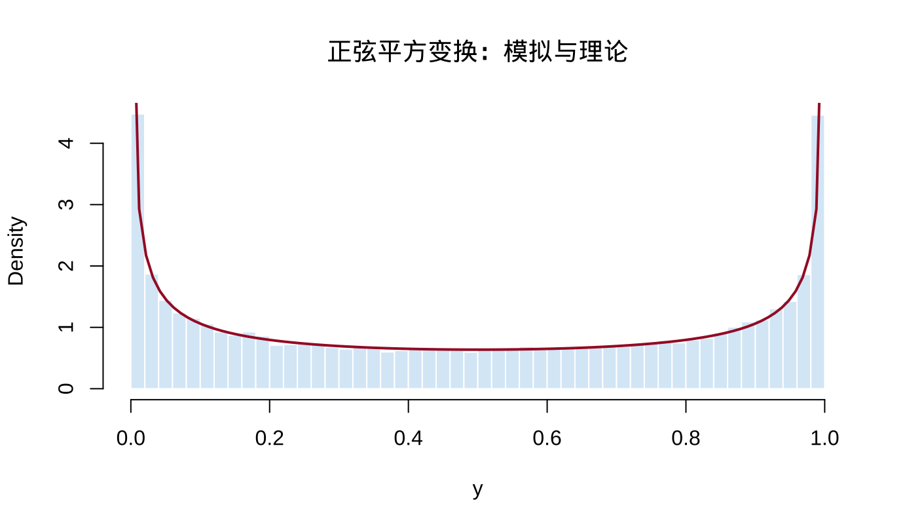

# 随机变量的变换与期望 {#transformations-expectations}

本章对应原课件 *chap-2.tex* 及其四个子文件，依次讨论随机变量函数的分布、期望、矩与矩母函数，以及积分号下求导。原课件中的明显公式或排印错误已更正并记录在 migration_notes.md。

## 随机变量函数的分布 {#distribution-functions-rv}

设随机变量 $X$ 的分布函数为 $F_X$，$g:\mathbb R\to\mathbb R$ 是 Borel 可测函数，令 $Y=g(X)$。对任意 Borel 集 $A$，

$$
P(Y\in A)=P\{g(X)\in A\}=P\{X\in g^{-1}(A)\},
$$

其中 $g^{-1}(A)=\{x:g(x)\in A\}$。特别地，

$$
F_Y(y)=P(Y\le y)=P\{X\in g^{-1}((-\infty,y])\}.
$$

若 $X$ 有密度 $f_X$，则 $F_Y(y)=\int_{\{x:g(x)\le y\}}f_X(x)\,dx$。若 $X$ 离散，则

$$
p_Y(y)=\sum_{x\in g^{-1}(\{y\})}p_X(x),\qquad y\in\mathcal Y,
$$

而在 $y\notin\mathcal Y$ 时 $p_Y(y)=0$。

## 例 2.1.2：正弦平方变换 {#sin-square-transformation}

设 $X\sim U(0,2\pi)$，即 $f_X(x)=1/(2\pi)$（$0<x<2\pi$），令 $Y=\sin^2X$。其支撑集为 $[0,1]$。对 $0<y<1$，一个周期内满足 $\sin^2x\le y$ 的区间总长度为 $4\arcsin\sqrt y$，所以

$$
F_Y(y)=\frac{2}{\pi}\arcsin\sqrt y,\qquad
f_Y(y)=\frac{1}{\pi\sqrt{y(1-y)}}.
$$

<div class="figure" style="text-align: center">

<p class="caption">(\#fig:chap02-sine-square-source-figure)原课件用于说明 sin² 变换多值性的示意图</p>
</div>

下面用 R 模拟检查理论密度。


``` r
set.seed(202509)
x <- runif(50000, 0, 2 * pi)
y <- sin(x)^2
hist(y, probability = TRUE, breaks = 50,
     col = "#D9EAF7", border = "white",
     main = "正弦平方变换：模拟与理论", xlab = "y")
curve(1 / (pi * sqrt(x * (1 - x))),
      from = 0.002, to = 0.998, add = TRUE,
      col = "#A51C30", lwd = 2)
```

<div class="figure" style="text-align: center">

<p class="caption">(\#fig:chap02-sine-square-simulation)Y=sin²(X) 的模拟分布与理论密度</p>
</div>

## 支撑集与单调变换 {#support-monotone-transform}

::: {.definition}
随机变量 $X$ 的支撑集及变换后变量的可能取值集合分别记为

$$
\mathcal X=\{x:f_X(x)>0\},\qquad
\mathcal Y=\{y:y=g(x)\text{ for some }x\in\mathcal X\}.
$$
:::

若 $g$ 严格递增，则 $F_Y(y)=F_X\{g^{-1}(y)\}$；若 $g$ 严格递减且 $X$ 连续，则 $F_Y(y)=1-F_X\{g^{-1}(y)\}$。

::: {.theorem}
**定理 2.1.5（单调变换公式）** 设 $X$ 有连续密度 $f_X$，$Y=g(X)$，$g$ 单调，且 $g^{-1}$ 在 $\mathcal Y$ 上连续可微，则

$$
f_Y(y)=
\begin{cases}
f_X\{g^{-1}(y)\}\left|\dfrac{d}{dy}g^{-1}(y)\right|,&y\in\mathcal Y,\\
0,&\text{其他}.
\end{cases}
$$
:::

绝对值保证无论 $g$ 递增还是递减，所得密度都非负。

## 例 2.1.6：倒数 Gamma 变换 {#inverse-gamma-example}

设

$$
f_X(x)=\frac{x^{n-1}e^{-x/\beta}}{(n-1)!\beta^n},\qquad x>0,
$$

令 $Y=1/X$。此时 $g^{-1}(y)=1/y$，$\mathcal Y=(0,\infty)$，且 $|(g^{-1})'(y)|=1/y^2$。因此

$$
\begin{aligned}
f_Y(y)
&=f_X(1/y)\frac1{y^2}\\
&=\frac{1}{(n-1)!\beta^n}
\left(\frac1y\right)^{n+1}
\exp\left(-\frac1{\beta y}\right),\qquad y>0.
\end{aligned}
$$

这是逆 Gamma 分布的一个特殊情形。

## 例 2.1.7：标准正态的平方 {#normal-square-example}

设 $X\sim N(0,1)$，$Y=X^2$。对 $y>0$，

$$
F_Y(y)=P(-\sqrt y\le X\le\sqrt y)
=2\Phi(\sqrt y)-1.
$$

求导得

$$
f_Y(y)=\frac{\phi(\sqrt y)}{\sqrt y}
=\frac{1}{\sqrt{2\pi y}}e^{-y/2},\qquad y>0,
$$

故 $Y\sim\chi_1^2$。原课件误把正态密度 $\phi$ 写成分布函数 $\Phi$，此处已更正。

## 分段单调变换 {#piecewise-monotone-transform}

::: {.theorem}
**定理 2.1.8** 设 $P(X\in A_0)=0$、$P(X\in\bigcup_{i=1}^kA_i)=1$，$f_X$ 在各 $A_i$ 上连续，且 $g$ 限制在各 $A_i$ 上均单调。记相应反函数支为 $g_i^{-1}$。若各反函数支在 $\mathcal Y$ 上连续可微，则

$$
f_Y(y)=
\begin{cases}
\displaystyle\sum_{i=1}^k f_X\{g_i^{-1}(y)\}
\left|\dfrac{d}{dy}g_i^{-1}(y)\right|,&y\in\mathcal Y,\\
0,&\text{其他}.
\end{cases}
$$
:::

因此，对于 $Y=\sin^2X$ 或 $Y=X^2$，必须把所有原像分支的贡献相加。

## 概率积分变换 {#probability-integral-transform}

::: {.theorem}
**定理 2.1.10** 若 $X$ 的分布函数 $F_X$ 连续，则 $Y=F_X(X)\sim U(0,1)$。
:::

在 $F_X$ 严格递增时，对 $0<y<1$，

$$
\begin{aligned}
P(Y\le y)
&=P\{F_X(X)\le y\}\\
&=P\{X\le F_X^{-1}(y)\}\\
&=F_X\{F_X^{-1}(y)\}=y.
\end{aligned}
$$

对一般连续分布可用广义逆完成证明。该变换是随机数生成和拟合优度检验的重要基础。

## 期望的定义与计算 {#expected-value-definition}

::: {.definition}
**定义 2.2.1** 设 $(\mathcal S,\mathcal B,P)$ 是概率空间。若 $\int_{\mathcal S}|X|\,dP<\infty$，则

$$
E(X)=\int_{\mathcal S}X\,dP.
$$
:::

若 $E|g(X)|<\infty$，则连续情形和离散情形分别有

$$
E\{g(X)\}=\int_{-\infty}^{\infty}g(x)f_X(x)\,dx,
\qquad
E\{g(X)\}=\sum_xg(x)p_X(x).
$$

这常称为无意识统计学家法则（LOTUS）。也可先求 $Y=g(X)$ 的分布，再由 $E(Y)=\int yf_Y(y)\,dy$ 计算；前一种方法通常更短。

## 期望的例子与性质 {#expectation-examples-properties}

- **例 2.2.2：** 若 $f_X(x)=\lambda^{-1}e^{-x/\lambda}$（$x>0$），则 $E(X)=\lambda$；这里 $\lambda$ 是尺度参数。
- **例 2.2.3：** 若 $X\sim\operatorname{Binomial}(n,p)$，则 $E(X)=np$。
- **例 2.2.4：** 标准 Cauchy 分布满足 $E|X|=\infty$，所以 $E(X)$ 不存在。不能用对称性把两个发散积分相消。

::: {.theorem}
**定理 2.2.5** 若有关期望存在，则

1. $E\{ag_1(X)+bg_2(X)+c\}=aE\{g_1(X)\}+bE\{g_2(X)\}+c$；
2. 若 $g_1\ge0$，则 $E\{g_1(X)\}\ge0$；
3. 若 $g_1\ge g_2$，则 $E\{g_1(X)\}\ge E\{g_2(X)\}$；
4. 若 $a\le g_1\le b$，则 $a\le E\{g_1(X)\}\le b$。
:::

若二阶矩存在，均值是平方损失下的最佳常数中心：

$$
\arg\min_cE(X-c)^2=E(X),\qquad
\min_cE(X-c)^2=\operatorname{Var}(X).
$$

## 矩、中心矩与矩母函数 {#moments-mgf}

::: {.definition}
**定义 2.3.1** $n$ 阶原点矩与中心矩分别为

$$
\mu_n'=E(X^n),\qquad
\mu_n=E\{(X-\mu)^n\},\quad\mu=E(X).
$$

特别地，$\operatorname{Var}(X)=\mu_2$，标准差为 $\sqrt{\operatorname{Var}(X)}$。
:::

若方差有限，则 $\operatorname{Var}(aX+b)=a^2\operatorname{Var}(X)$。

::: {.definition}
**定义 2.3.6** 若期望在 $t=0$ 的某个邻域内有限，则

$$
M_X(t)=E(e^{tX})
$$

称为 $X$ 的矩母函数（MGF）。
:::

::: {.theorem}
**定理 2.3.7** 若 $M_X$ 在 $0$ 的某个邻域存在，则 $E(X^n)=M_X^{(n)}(0)$。
:::

在可交换求导与积分的条件下，$M_X^{(n)}(t)=E(X^ne^{tX})$，令 $t=0$ 即得结论。

## 相同矩不必确定相同分布 {#same-moments-example}

**例 2.3.10** 考虑

$$
f_1(x)=\frac{1}{\sqrt{2\pi}x}
\exp\left\{-\frac{(\log x)^2}{2}\right\},\qquad x>0,
$$

以及 $f_2(x)=f_1(x)\{1+\sin(2\pi\log x)\}$。若 $X_1\sim f_1$，则 $E(X_1^r)=e^{r^2/2}$（整数 $r\ge0$）。对 $X_2\sim f_2$，

$$
E(X_2^r)=E(X_1^r)+
\int_0^\infty x^rf_1(x)\sin(2\pi\log x)\,dx.
$$

作 $y=\log x-r$ 后，附加项由奇函数积分及 $\sin(2\pi r)=0$ 可知为零。因此两个不同分布具有相同的所有整数阶矩。

::: {.theorem}
**定理 2.3.11** 若 $F_X,F_Y$ 的所有矩存在，则：

1. 若二者支撑有界，$F_X=F_Y$ 当且仅当 $E(X^r)=E(Y^r)$ 对所有非负整数 $r$ 成立；
2. 若二者 MGF 在 $0$ 的某个邻域存在且相等，则 $F_X=F_Y$。
:::

## MGF 收敛与两个经典 MGF {#mgf-convergence-examples}

::: {.theorem}
**定理 2.3.12** 若存在 $\delta>0$，使 $M_{X_i}(t)\to M_X(t)$ 对 $t\in[-\delta,\delta]$ 成立，且 $M_X$ 是某分布的 MGF，则在 $F_X$ 的每个连续点 $x$，$F_{X_i}(x)\to F_X(x)$。
:::

这一结论可用于证明中心极限定理等分布收敛结果。对二项与 Poisson 分布，

$$
M_{\operatorname{Bin}(n,p)}(t)=\{pe^t+(1-p)\}^n,
$$

$$
M_{\operatorname{Poi}(\lambda)}(t)
=\sum_{x=0}^{\infty}e^{tx}\frac{e^{-\lambda}\lambda^x}{x!}
=\exp\{\lambda(e^t-1)\}.
$$


``` r
n <- 12
p <- 0.3
mgf_binom <- function(t) (1 - p + p * exp(t))^n
h <- 1e-5
c(numerical_derivative =
    (mgf_binom(h) - mgf_binom(-h)) / (2 * h),
  theoretical_mean = n * p)
```

```
## numerical_derivative     theoretical_mean 
##                  3.6                  3.6
```

## 例 2.3.13：Poisson 近似 {#poisson-approximation}

令 $X_n\sim\operatorname{Binomial}(n,p_n)$ 且 $np_n\to\lambda$，则

$$
\begin{aligned}
M_{X_n}(t)
&=\{1+p_n(e^t-1)\}^n\\
&=\left\{1+\frac{(e^t-1)(np_n)}n\right\}^n\\
&\longrightarrow\exp\{\lambda(e^t-1)\}.
\end{aligned}
$$

极限是 $\operatorname{Poisson}(\lambda)$ 的 MGF，故 $X_n$ 依分布收敛到该 Poisson 分布。当 $n$ 大、$p$ 小且 $np$ 适中时，二项概率可用 Poisson 概率近似；原课件写成概率“相等”，此处更正为“近似/极限”。

## Leibniz 法则与支配收敛 {#leibniz-dominated}

::: {.theorem}
**定理 2.4.1（Leibniz 法则）** 在满足相应连续性和可积控制条件时，

$$
\begin{aligned}
\frac{d}{d\theta}\int_{a(\theta)}^{b(\theta)}f(x,\theta)\,dx
={}&f\{b(\theta),\theta\}b'(\theta)
-f\{a(\theta),\theta\}a'(\theta)\\
&+\int_{a(\theta)}^{b(\theta)}
\frac{\partial}{\partial\theta}f(x,\theta)\,dx.
\end{aligned}
$$
:::

若上下限为常数，上式只保留积分项。

::: {.theorem}
**定理 2.4.2** 若 $h(x,y)\to h(x,y_0)$，且在 $y_0$ 的邻域存在可积函数 $g$ 使 $|h(x,y)|\le g(x)$，则

$$
\lim_{y\to y_0}\int h(x,y)\,dx
=\int\lim_{y\to y_0}h(x,y)\,dx.
$$
:::

关键条件是存在与 $y$ 无关的可积上界。

## 积分号下求导 {#differentiate-under-integral}

::: {.theorem}
**定理 2.4.3** 设 $f(x,\theta)$ 在 $\theta_0$ 可微。若存在 $\delta>0$ 和可积函数 $g(x,\theta_0)$，使对 $|\Delta|\le\delta$，

$$
\left|\frac{f(x,\theta_0+\Delta)-f(x,\theta_0)}{\Delta}\right|
\le g(x,\theta_0),
$$

则

$$
\left.\frac{d}{d\theta}\int f(x,\theta)\,dx\right|_{\theta=\theta_0}
=\int\left.\frac{\partial}{\partial\theta}f(x,\theta)
\right|_{\theta=\theta_0}\,dx.
$$
:::

一个常用推论是：若在 $\theta_0$ 的邻域内 $|\partial f/\partial\theta|$ 被某个可积函数一致控制，则可交换求导与积分。

**例 2.4.6** 若 $X\sim N(\mu,1)$，

$$
M_X(t)=\frac1{\sqrt{2\pi}}\int_{-\infty}^{\infty}
e^{tx}e^{-(x-\mu)^2/2}\,dx,
$$

则在上述条件下 $M_X'(t)=E(Xe^{tX})$。配方可得 $M_X(t)=\exp(\mu t+t^2/2)$，故 $M_X'(0)=\mu$。严格论证时，交换操作不能被视为自动成立。

## 级数与微分、积分的交换 {#series-interchange}

::: {.theorem}
**定理 2.4.8** 若 $\sum_{x=0}^{\infty}h(\theta,x)$ 在 $(a,b)$ 收敛，各项偏导连续，且导数级数在每个有界闭子区间上一致收敛，则

$$
\frac{d}{d\theta}\sum_{x=0}^{\infty}h(\theta,x)
=\sum_{x=0}^{\infty}\frac{\partial}{\partial\theta}h(\theta,x).
$$
:::

::: {.theorem}
**定理 2.4.10** 若 $\sum_{x=0}^{\infty}h(\theta,x)$ 在 $[a,b]$ 一致收敛，且每项连续，则

$$
\int_a^b\sum_{x=0}^{\infty}h(\theta,x)\,d\theta
=\sum_{x=0}^{\infty}\int_a^b h(\theta,x)\,d\theta.
$$
:::

## 本章小结 {#transformations-expectations-summary}

先确定变换后的支撑集，再用 CDF 法、Jacobian 法或分支求和法求分布；计算期望时优先考虑 LOTUS；用 MGF 连接矩与分布；交换极限、微分、积分或求和前，必须核查支配条件或一致收敛条件。

> **课后提示：** 请重新推导 $Y=X^2$、$Y=1/X$ 与 $Y=\sin^2X$ 的支撑集和密度，并比较 CDF 法与变换公式的优缺点。
