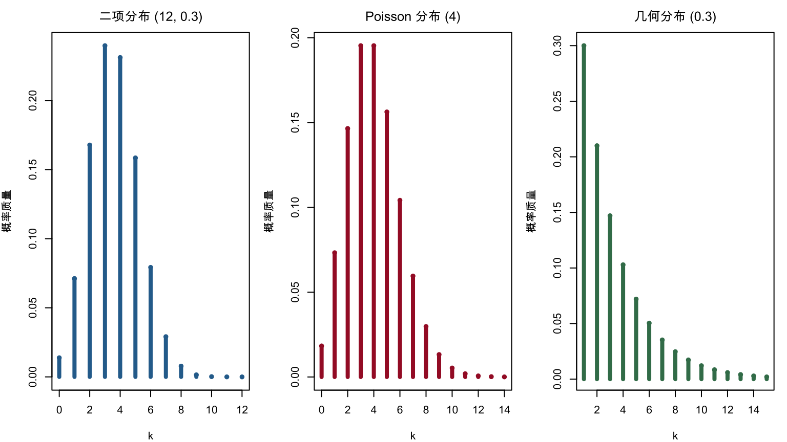
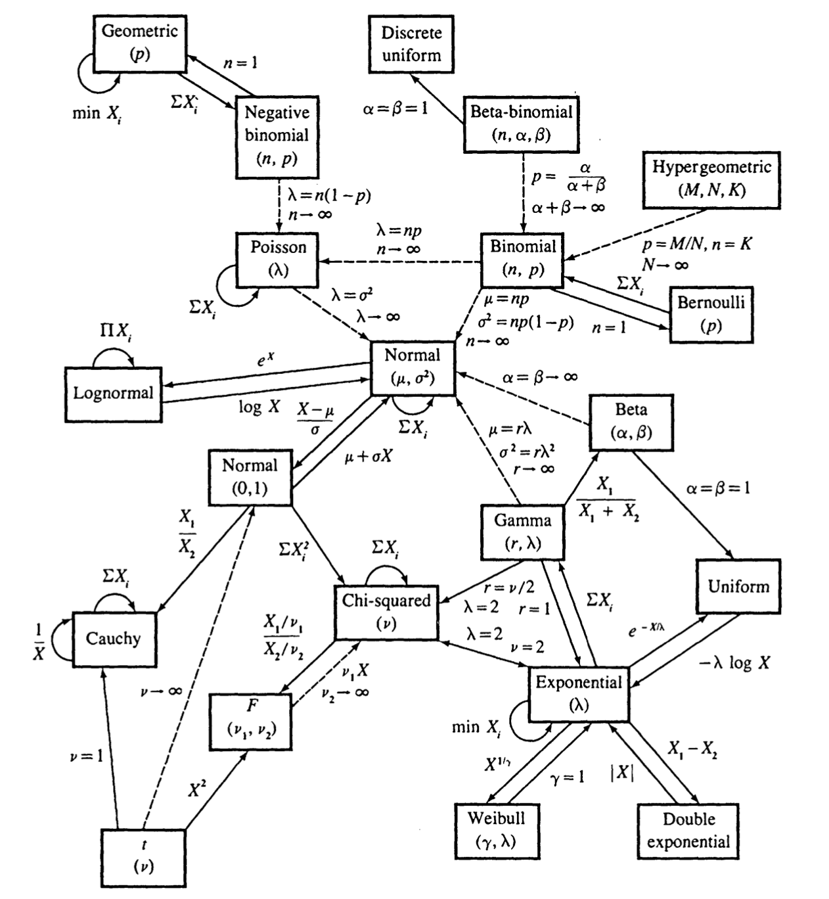

# 常见分布族 {#distribution-families}

本章对应原课件 *chap-3.tex* 及四个子文件，依次整理常用离散分布、连续分布、指数族和位置—尺度族。各分布统一给出支撑集、概率函数、矩母函数（若存在）、均值和方差。原稿中参数化彼此冲突之处以概率函数为准作最小更正，详见 migration_notes.md。

## 离散分布总览 {#discrete-distributions-overview}

记 $q=1-p$，$M_X(t)=E(e^{tX})$。下表覆盖原课件列出的全部离散分布。

| 分布 | 支撑集与概率质量函数 | MGF | 均值；方差 |
|:---|:---|:---|:---|
| Bernoulli$(p)$ | $k\in\{0,1\}$，$p^kq^{1-k}$ | $q+pe^t$ | $p$；$pq$ |
| Binomial$(n,p)$ | $k=0,\ldots,n$，$\binom nkp^kq^{n-k}$ | $(q+pe^t)^n$ | $np$；$npq$ |
| 离散均匀$(0,\ldots,n)$ | $k=0,\ldots,n$，$1/(n+1)$ | $\dfrac{e^{(n+1)t}-1}{(n+1)(e^t-1)}$ | $n/2$；$n(n+2)/12$ |
| Geometric$(p)$ | $k=1,2,\ldots$，$pq^{k-1}$ | $\dfrac{pe^t}{1-qe^t}$ | $1/p$；$q/p^2$ |
| Hypergeometric$(N,K,n)$ | $\dfrac{\binom Kk\binom{N-K}{n-k}}{\binom Nn}$ | 通常用有限和计算 | $nK/N$；$\dfrac{nK(N-K)(N-n)}{N^2(N-1)}$ |
| Negative Binomial$(r,p)$ | $k=0,1,\ldots$，$\binom{k+r-1}{k}p^rq^k$ | $\left(\dfrac{p}{1-qe^t}\right)^r$ | $rq/p$；$rq/p^2$ |
| Poisson$(\lambda)$ | $k=0,1,\ldots$，$e^{-\lambda}\lambda^k/k!$ | $\exp\{\lambda(e^t-1)\}$ | $\lambda$；$\lambda$ |

离散均匀 MGF 在 $t=0$ 处按连续延拓取 1；Geometric MGF 的定义域为 $t<-\log q$。超几何变量的取值范围为

$$
\max(0,n-N+K)\le k\le\min(n,K).
$$

这里的负二项变量记录第 $r$ 次成功前的失败数。若变量改为获得第 $r$ 次成功所需的总试验次数，则应整体平移 $r$。

## 离散分布的生成机制 {#discrete-distribution-mechanisms}

- 一次成功/失败试验产生 Bernoulli 变量，$n$ 个独立 Bernoulli 变量之和服从 Binomial 分布。
- Geometric 分布记录第一次成功所需的试验次数；$r$ 段成功前失败数之和产生上述 Negative Binomial 分布。
- Hypergeometric 对应有限总体不放回抽样，Binomial 对应独立重复抽样。
- Poisson 描述固定时间或空间内相互独立的稀有事件计数，也是 $n$ 大、$p$ 小且 $np$ 稳定时的 Binomial 极限。


``` r
old_par <- par(no.readonly = TRUE)
par(mfrow = c(1, 3), mar = c(4, 4, 2.5, 1), family = course_plot_family())
k1 <- 0:12
plot(k1, dbinom(k1, 12, 0.3), type = "h", lwd = 4, col = "#2C6E9B",
     xlab = "k", ylab = "概率质量", main = "二项分布 (12, 0.3)")
points(k1, dbinom(k1, 12, 0.3), pch = 16, col = "#2C6E9B")
k2 <- 0:14
plot(k2, dpois(k2, 4), type = "h", lwd = 4, col = "#A51C30",
     xlab = "k", ylab = "概率质量", main = "Poisson 分布 (4)")
points(k2, dpois(k2, 4), pch = 16, col = "#A51C30")
k3 <- 1:15
plot(k3, dgeom(k3 - 1, 0.3), type = "h", lwd = 4, col = "#3E7C59",
     xlab = "k", ylab = "概率质量", main = "几何分布 (0.3)")
points(k3, dgeom(k3 - 1, 0.3), pch = 16, col = "#3E7C59")
```

<div class="figure" style="text-align: center">

<p class="caption">(\#fig:chap03-discrete-pmf)二项、Poisson 与几何分布的概率质量函数</p>
</div>

``` r
par(old_par)
```

## 连续分布：有限支撑与正半轴 {#continuous-bounded-positive}

### Beta 与均匀分布 {-}

若 $\alpha,\beta>0$，$X\sim\operatorname{Beta}(\alpha,\beta)$ 的密度为

$$
f(x)=\frac{x^{\alpha-1}(1-x)^{\beta-1}}{B(\alpha,\beta)},\qquad 0<x<1.
$$

其均值和方差为

$$
E(X)=\frac{\alpha}{\alpha+\beta},\qquad
\operatorname{Var}(X)=\frac{\alpha\beta}{(\alpha+\beta)^2(\alpha+\beta+1)}.
$$

MGF 对所有实数 $t$ 存在，可写成 ${}_1F_1(\alpha;\alpha+\beta;t)$，但通常没有初等闭式。$\alpha=\beta=1$ 时得到 $U(0,1)$。

一般地，$X\sim U(a,b)$ 满足

$$
f(x)=\frac1{b-a},\quad a<x<b,\qquad
M_X(t)=\frac{e^{bt}-e^{at}}{t(b-a)}\ (t\ne0),\quad M_X(0)=1,
$$

$$
E(X)=\frac{a+b}{2},\qquad \operatorname{Var}(X)=\frac{(b-a)^2}{12}.
$$

### Gamma、指数与卡方分布 {-}

采用形状—尺度参数化 $X\sim\operatorname{Gamma}(k,\theta)$：

$$
f(x)=\frac{x^{k-1}e^{-x/\theta}}{\Gamma(k)\theta^k},\quad x>0,\qquad
M_X(t)=(1-\theta t)^{-k},\quad t<1/\theta,
$$

$$
E(X)=k\theta,\qquad \operatorname{Var}(X)=k\theta^2.
$$

当 $k=1$ 时得到指数分布。若用率参数 $\lambda=1/\theta$，则

$$
f(x)=\lambda e^{-\lambda x},\quad M_X(t)=\frac{\lambda}{\lambda-t},\quad
E(X)=\frac1\lambda,\quad \operatorname{Var}(X)=\frac1{\lambda^2}.
$$

令 $k=\nu/2,\theta=2$，得到 $\chi_\nu^2$ 分布：

$$
f(x)=\frac{x^{\nu/2-1}e^{-x/2}}{2^{\nu/2}\Gamma(\nu/2)},\quad x>0,\qquad
M_X(t)=(1-2t)^{-\nu/2},\quad t<1/2,
$$

且 $E(X)=\nu$、$\operatorname{Var}(X)=2\nu$。

### Weibull 分布 {-}

若形状 $k>0$、尺度 $\lambda>0$，则

$$
f(x)=\frac{k}{\lambda}\left(\frac{x}{\lambda}\right)^{k-1}
\exp\left\{-\left(\frac{x}{\lambda}\right)^k\right\},\qquad x>0,
$$

$$
E(X)=\lambda\Gamma\left(1+\frac1k\right),\qquad
\operatorname{Var}(X)=\lambda^2\left[\Gamma\left(1+\frac2k\right)-
\Gamma^2\left(1+\frac1k\right)\right].
$$

这些矩对任意 $k>0$ 都存在。MGF 在 $k>1$ 时处处有限；$k=1$ 是指数分布；$0<k<1$ 时任意 $t>0$ 都发散。

## 连续分布：实轴、重尾与抽样分布 {#continuous-real-heavy-tail}

### 正态、Logistic、Laplace 与对数正态 {-}

正态分布 $N(\mu,\sigma^2)$ 满足

$$
f(x)=\frac1{\sqrt{2\pi\sigma^2}}e^{-(x-\mu)^2/(2\sigma^2)},\qquad
M_X(t)=e^{\mu t+\sigma^2t^2/2},\quad E(X)=\mu,\quad \operatorname{Var}(X)=\sigma^2.
$$

位置 $\mu$、尺度 $s>0$ 的 Logistic 分布满足

$$
f(x)=\frac{e^{-(x-\mu)/s}}{s\{1+e^{-(x-\mu)/s}\}^2},\qquad
M_X(t)=e^{\mu t}\frac{\pi st}{\sin(\pi st)},\quad |t|<1/s,
$$

均值为 $\mu$，方差为 $\pi^2s^2/3$。

双指数（Laplace）分布满足

$$
f(x)=\frac{\lambda}{2}e^{-\lambda|x-\mu|},\qquad
M_X(t)=e^{\mu t}\frac{\lambda^2}{\lambda^2-t^2},\quad |t|<\lambda,
$$

均值为 $\mu$，方差为 $2/\lambda^2$。

若 $\log X\sim N(\mu,\sigma^2)$，则 $X$ 服从对数正态分布，

$$
f(x)=\frac1{x\sigma\sqrt{2\pi}}
e^{-(\log x-\mu)^2/(2\sigma^2)},\quad x>0,
$$

$$
E(X)=e^{\mu+\sigma^2/2},\qquad
\operatorname{Var}(X)=e^{2\mu+\sigma^2}(e^{\sigma^2}-1).
$$

其所有正整数阶矩有限，但任意 $t>0$ 时 $M_X(t)$ 发散，因此零点邻域内的 MGF 不存在。

### Cauchy、Pareto、Student $t$ 与 $F$ {-}

位置 $x_0$、尺度 $\gamma>0$ 的 Cauchy 密度为

$$
f(x)=\frac1{\pi\gamma\{1+((x-x_0)/\gamma)^2\}}.
$$

它没有 MGF，均值与方差也不存在。

下界 $x_m>0$、形状 $\alpha>0$ 的 Pareto 密度为

$$
f(x)=\frac{\alpha x_m^\alpha}{x^{\alpha+1}},\qquad x\ge x_m.
$$

其 MGF 不在零点双侧邻域存在；$\alpha>1$ 时均值为 $\alpha x_m/(\alpha-1)$，$\alpha>2$ 时方差为
$\alpha x_m^2/\{(\alpha-1)^2(\alpha-2)\}$。

自由度 $\nu$ 的 Student $t$ 密度为

$$
f(x)=\frac{\Gamma((\nu+1)/2)}{\sqrt{\nu\pi}\Gamma(\nu/2)}
\left(1+\frac{x^2}{\nu}\right)^{-(\nu+1)/2}.
$$

其 MGF 不存在；$\nu>1$ 时均值为 0，$\nu>2$ 时方差为 $\nu/(\nu-2)$。$1<\nu\le2$ 时方差无穷，$\nu\le1$ 时均值不存在。

若 $X\sim F(d_1,d_2)$，则 $x>0$ 时

$$
f(x)=\frac{\Gamma((d_1+d_2)/2)}{\Gamma(d_1/2)\Gamma(d_2/2)}
\left(\frac{d_1}{d_2}\right)^{d_1/2}x^{d_1/2-1}
\left(1+\frac{d_1}{d_2}x\right)^{-(d_1+d_2)/2}.
$$

它没有 MGF；$d_2>2$ 时 $E(X)=d_2/(d_2-2)$，$d_2>4$ 时

$$
\operatorname{Var}(X)=
\frac{2d_2^2(d_1+d_2-2)}{d_1(d_2-2)^2(d_2-4)}.
$$


``` r
x <- seq(-6, 6, length.out = 1200)
matplot(x, cbind(dnorm(x), dt(x, 3), dcauchy(x)), type = "l", lty = 1,
        lwd = 2.2, col = c("#2C6E9B", "#A51C30", "#3E7C59"),
        xlab = "x", ylab = "density", family = course_plot_family())
legend("topright", c("Normal", "t(3)", "Cauchy"), lty = 1, lwd = 2.2,
       col = c("#2C6E9B", "#A51C30", "#3E7C59"), bty = "n")
```

<div class="figure" style="text-align: center">

<p class="caption">(\#fig:chap03-heavy-tail-comparison)标准正态、t(3) 与标准 Cauchy 密度的尾部比较</p>
</div>

## 分布之间的关系 {#distribution-relationships}

原课件用下图概括常见变换、求和和极限关系。实线多表示精确变换或封闭性，虚线多表示极限近似；箭头旁的参数条件是关系成立的关键。

<div class="figure" style="text-align: center">

<p class="caption">(\#fig:chap03-source-distribution-map)原课件中的常见分布关系图</p>
</div>

例如：独立 Poisson 变量之和仍为 Poisson；独立正态变量之和仍为正态；标准正态平方和产生卡方；两个独立卡方变量除以各自自由度后的比值产生 $F$；若 $U\sim U(0,1)$，则 $-\lambda^{-1}\log U$ 服从率为 $\lambda$ 的指数分布。

## 指数族的定义 {#exponential-family-definition}

::: {.definition}
若 $Y$ 的概率密度或概率质量函数可写成

$$
f(y;\theta,\phi)=\exp\left\{
\frac{y\theta-b(\theta)}{a(\phi)}+c(y,\phi)
\right\},
(\#eq:exponential-family-form)
$$

其中 $\theta$ 是自然参数，$\phi$ 是尺度、干扰或离散参数，$a,b,c$ 是已知函数，则称其属于单参数指数离散族。无额外离散参数时可令 $a(\phi)=1$。
:::

以下性质还要求支撑集不随 $\theta$ 改变，并允许在积分或求和号下对 $\theta$ 求导。

## 正态与 Gamma 的指数族表示 {#normal-gamma-exponential-family}

若 $Y\sim N(\mu,\sigma^2)$，则

$$
f(y)=\exp\left\{
\frac{y\mu-\mu^2/2}{\sigma^2}
-\frac{y^2}{2\sigma^2}-\frac12\log(2\pi\sigma^2)
\right\}.
$$

与式 \@ref(eq:exponential-family-form) 比较可得

$$
\theta=\mu,\quad a(\phi)=\sigma^2,\quad b(\theta)=\frac{\theta^2}{2},\quad
c(y,\phi)=-\frac{y^2}{2\sigma^2}-\frac12\log(2\pi\sigma^2).
$$

对形状 $\alpha$、率 $\beta$ 的 Gamma 分布，令 $\mu=\alpha/\beta$、$\phi=1/\alpha$，则

$$
\theta=-\frac1\mu,\quad a(\phi)=\phi,\quad b(\theta)=-\log(-\theta),
$$

$$
c(y,\phi)=\frac1\phi\log\frac1\phi-log\Gamma\left(\frac1\phi\right)
+\left(\frac1\phi-1\right)\log y.
$$

代回即可恢复 $f(y)=\beta^\alpha y^{\alpha-1}e^{-\beta y}/\Gamma(\alpha)$。

## 二项、Bernoulli 与 Poisson 的指数族表示 {#discrete-exponential-family}

若 $Y\sim\operatorname{Binomial}(n,\pi)$，则

$$
f(y;\pi)=\binom ny\pi^y(1-\pi)^{n-y},\qquad y=0,\ldots,n.
$$

令

$$
\theta=\log\frac{\pi}{1-\pi},\qquad \pi=\frac{e^\theta}{1+e^\theta},
$$

则

$$
f(y;\pi)=\exp\left\{y\theta-n\log(1+e^\theta)+\log\binom ny\right\}.
$$

故 $a(\phi)=1$、$b(\theta)=n\log(1+e^\theta)$、$c(y,\phi)=\log\binom ny$。当 $n=1$ 时得到 Bernoulli 分布，此时 $b(\theta)=\log(1+e^\theta)$、$c(y,\phi)=0$。

若 $Y\sim\operatorname{Poisson}(\lambda)$，则

$$
f(y;\lambda)=\exp\{y\log\lambda-\lambda-\log(y!)\},
$$

所以 $\theta=\log\lambda$、$a(\phi)=1$、$b(\theta)=e^\theta$、$c(y,\phi)=-\log(y!)$。

## 指数族的均值与方差 {#exponential-family-moments}

::: {.theorem}
**性质 1** 在支撑集不依赖 $\theta$ 且可交换求导与积分（或求和）的正则条件下，

$$
E(Y)=b'(\theta),\qquad
\operatorname{Var}(Y)=b''(\theta)a(\phi).
(\#eq:exponential-family-moments)
$$
:::

::: {.proof .source-numbered}
<details class="course-details proof-details">
<summary><strong>展开证明</strong></summary>

由 $\int f(y;\theta,\phi)dy=1$，对 $\theta$ 求导并交换操作，有

$$
0=\int\frac{\partial f}{\partial\theta}dy,\qquad
\frac{\partial f}{\partial\theta}
=f\frac{y-b'(\theta)}{a(\phi)}.
$$

故 $E\{Y-b'(\theta)\}=0$，即 $E(Y)=b'(\theta)$。再次求导，

$$
\frac{\partial^2f}{\partial\theta^2}
=f\left\{\frac{(y-b'(\theta))^2}{a^2(\phi)}-
\frac{b''(\theta)}{a(\phi)}\right\}.
$$

积分后得到

$$
0=\frac{\operatorname{Var}(Y)}{a^2(\phi)}-
\frac{b''(\theta)}{a(\phi)},
$$

从而得到式 \@ref(eq:exponential-family-moments)。离散情形将积分替换为对支撑集求和。

</details>
:::

::: {.example}
**正态分布。** $b(\theta)=\theta^2/2$、$a(\phi)=\sigma^2$，所以 $E(Y)=\mu$、$\operatorname{Var}(Y)=\sigma^2$。
:::

<details class="course-details solution-details">
<summary><strong>查看详细解答</strong></summary>

自然参数是 $\theta=\mu$。因此

$$
b'(\theta)=\theta,\qquad b''(\theta)=1.
$$

代入性质 1 得

$$
E(Y)=b'(\mu)=\mu,\qquad
\operatorname{Var}(Y)=b''(\mu)a(\phi)=1\cdot\sigma^2=\sigma^2.
$$

</details>

::: {.example}
**Poisson 分布。** $b(\theta)=e^\theta=\lambda$、$a(\phi)=1$，所以 $E(Y)=\lambda$、$\operatorname{Var}(Y)=\lambda$。
:::

<details class="course-details solution-details">
<summary><strong>查看详细解答</strong></summary>

由 $\theta=\log\lambda$ 可知 $e^\theta=\lambda$，并且

$$
b'(\theta)=e^\theta,qquad b''(\theta)=e^\theta.
$$

所以

$$
E(Y)=e^\theta=\lambda,qquad
\operatorname{Var}(Y)=e^\theta\cdot1=\lambda.
$$

</details>

## 位置族、尺度族与位置—尺度族 {#location-scale-families}

::: {.theorem .source-numbered}
**定理 3.5.1** 若 $f$ 是任意概率密度，$\mu\in\mathbb R$、$\sigma>0$，则

$$
g(x\mid\mu,\sigma)=\frac1\sigma f\left(\frac{x-\mu}{\sigma}\right)
$$

也是概率密度。
:::

<details class="course-details proof-details">
<summary><strong>展开证明</strong></summary>

非负性由 $f\ge0$ 与 $\sigma>0$ 立即得到。再令
$z=(x-\mu)/\sigma$，则 $x=\mu+\sigma z$、$dx=\sigma dz$，因此

$$
\begin{aligned}
\int_{-\infty}^{\infty}g(x\mid\mu,\sigma)\,dx
&=\int_{-\infty}^{\infty}
\frac1\sigma f\left(\frac{x-\mu}{\sigma}\right)\,dx\\
&=\int_{-\infty}^{\infty}\frac1\sigma f(z)\sigma\,dz
=\int_{-\infty}^{\infty}f(z)\,dz=1.
\end{aligned}
$$

故 $g$ 非负且积分为 1，确为概率密度。

</details>

::: {.definition}
**定义 3.5.2（位置族）** 给定标准密度 $f$，$\{f(x-\mu):\mu\in\mathbb R\}$ 称为以 $\mu$ 为位置参数的位置族。
:::

::: {.example .source-numbered}
**例 3.5.3（指数位置族）** 取 $f(x)=e^{-x}$（$x\ge0$；其他处为 0），则

$$
f(x\mid\mu)=\begin{cases}e^{-(x-\mu)},&x\ge\mu,\\0,&x<\mu.\end{cases}
$$
:::

<details class="course-details solution-details">
<summary><strong>查看详细解答</strong></summary>

位置变换把标准密度中的自变量 $x$ 替换为 $x-\mu$。原支撑条件
$x\ge0$ 同时变为 $x-\mu\ge0$，也就是 $x\ge\mu$；因此密度的正值部分整体向右平移 $\mu$，但形状不变。归一化可直接验证为

$$
\int_\mu^\infty e^{-(x-\mu)}\,dx
=\int_0^\infty e^{-z}\,dz=1.
$$

这里 $\mu$ 还是分布支撑的下端点，所以在寿命或反应时间模型中也可解释为阈值参数。

</details>

::: {.definition}
**定义 3.5.4（尺度族）** 给定标准密度 $f$，$\{\sigma^{-1}f(x/\sigma):\sigma>0\}$ 称为以 $\sigma$ 为尺度参数的尺度族。
:::

::: {.definition}
**定义 3.5.5（位置—尺度族）** 给定标准密度 $f$，

$$
\left\{\frac1\sigma f\left(\frac{x-\mu}{\sigma}\right):
\mu\in\mathbb R,\ \sigma>0\right\}
$$

称为位置—尺度族，$\mu$ 与 $\sigma$ 分别是位置和尺度参数。
:::

::: {.theorem .source-numbered}
**定理 3.5.6** $X$ 的密度为 $\sigma^{-1}f\{(x-\mu)/\sigma\}$，当且仅当存在密度为 $f$ 的随机变量 $Z$，使

$$
X=\sigma Z+\mu.
$$
:::

<details class="course-details proof-details">
<summary><strong>展开证明</strong></summary>

先证“若”。设 $Z$ 的密度为 $f$，且 $X=\sigma Z+\mu$。由于
$\sigma>0$，反变换为 $z=(x-\mu)/\sigma$，其导数绝对值为
$1/\sigma$。由一维变量变换公式，

$$
f_X(x)=f\left(\frac{x-\mu}{\sigma}\right)\frac1\sigma.
$$

再证“仅若”。若 $X$ 具有上述密度，定义
$Z=(X-\mu)/\sigma$，即 $X=\sigma Z+\mu$。对反向变换
$x=\sigma z+\mu$ 使用变量变换公式，

$$
f_Z(z)=f_X(\sigma z+\mu)\sigma
=\frac1\sigma f(z)\sigma=f(z).
$$

所以 $Z$ 的密度确为标准密度 $f$，两方向均成立。

</details>

::: {.source-theorem}
**定理 3.5.7（位置—尺度变换的矩）** 若 $Z$ 的密度为 $f$，且
$E(Z)$、$\operatorname{Var}(Z)$ 存在，则对
$X=\sigma Z+\mu$ 有

$$
E(X)=\sigma E(Z)+\mu,\qquad
\operatorname{Var}(X)=\sigma^2\operatorname{Var}(Z).
$$

特别地，若 $E(Z)=0$、$\operatorname{Var}(Z)=1$，则
$E(X)=\mu$、$\operatorname{Var}(X)=\sigma^2$。
:::

<details class="course-details proof-details">
<summary><strong>展开证明</strong></summary>

由定理 3.5.6，可在同一表示中写成 $X=\sigma Z+\mu$。期望的线性性给出

$$
E(X)=E(\sigma Z+\mu)=\sigma E(Z)+\mu.
$$

常数平移不改变方差，而乘以常数会使方差乘以该常数的平方，因此

$$
\operatorname{Var}(X)
=\operatorname{Var}(\sigma Z+\mu)
=\sigma^2\operatorname{Var}(Z).
$$

</details>

正态、Cauchy、Logistic 和 Laplace 都是典型的位置—尺度族；标准化 $(X-\mu)/\sigma$ 将一般成员还原为标准分布。

## 本章小结 {#distribution-families-summary}

常见分布不是孤立的公式表：Bernoulli 求和产生 Binomial，稀有事件极限连接 Binomial 与 Poisson，Gamma 家族包含指数与卡方，标准化与比值产生 $t$ 和 $F$。指数族统一自然参数、均值、方差与似然结构；位置—尺度族统一标准分布与一般参数化。

> **课后提示：** 从概率函数重新推导负二项分布的 MGF，并用 $b'(\theta)$、$b''(\theta)$ 验证 Binomial 与 Poisson 的均值和方差。

**参考资料：** Casella and Berger, *Statistical Inference*, 2nd ed., Chapter 3；Davison, *Statistical Models*, Chapter 10。
