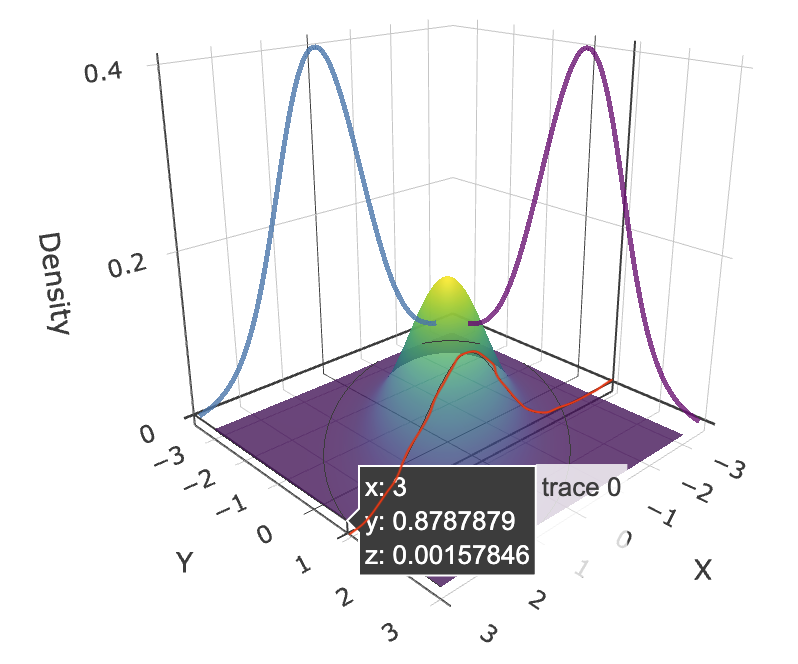
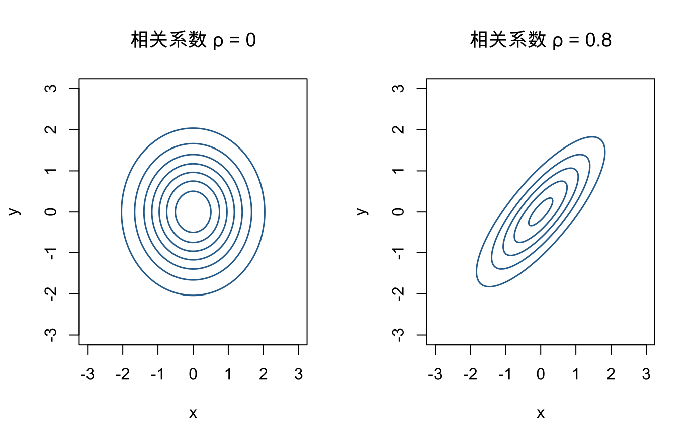
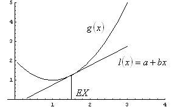

# 多元随机变量 {#multiple-random-variables}

本章对应原课件 *chap-4.tex* 及六个子文件，讨论联合与边缘分布、条件分布与独立性、二维变换、层次模型、多元正态分布以及常用概率不等式。原稿中的图形均保留；明显的积分变量、指数符号、矩阵公式和不等式排印问题已作最小更正，并记录在 migration_notes.md。

## 联合分布、边缘分布与函数期望 {#joint-marginal-distributions}

::: {.definition}
随机变量 $X,Y$ 的联合分布函数定义为

$$
F_{X,Y}(x,y)=P(X\le x,Y\le y).
$$

若存在非负函数 $f_{X,Y}$，使任意 Borel 集 $A\subset\mathbb R^2$ 满足

$$
P\{(X,Y)\in A\}=\iint_A f_{X,Y}(x,y)\,dx\,dy,
$$

则称其为联合概率密度。离散情形相应地满足

$$
P\{(X,Y)\in A\}=\sum_{(x,y)\in A}p_{X,Y}(x,y).
$$
:::

::: {.theorem}
若 $E|g(X,Y)|<\infty$，则

$$
E\{g(X,Y)\}=
\begin{cases}
\displaystyle\int_{-\infty}^{\infty}\int_{-\infty}^{\infty}
g(x,y)f_{X,Y}(x,y)\,dx\,dy,&\text{连续情形},\\[2mm]
\displaystyle\sum_{x,y}g(x,y)p_{X,Y}(x,y),&\text{离散情形}.
\end{cases}
$$
:::

联合密度可通过积分得到边缘密度：

$$
f_X(x)=\int_{-\infty}^{\infty}f_{X,Y}(x,y)\,dy,\qquad
f_Y(y)=\int_{-\infty}^{\infty}f_{X,Y}(x,y)\,dx.
$$

<div class="figure" style="text-align: center">

<p class="caption">(\#fig:chap04-source-marginal-illustration)原课件用于说明联合密度与边缘密度的图形</p>
</div>

## 例 4.1.11：单位正方形上的联合密度 {#example-4-1-11}

设

$$
f(x,y)=
\begin{cases}
6xy^2,&0<x<1,\ 0<y<1,\\
0,&\text{其他}.
\end{cases}
$$

边缘密度为

$$
f_X(x)=\int_0^1 6xy^2\,dy=2x,\quad 0<x<1,
$$

$$
f_Y(y)=\int_0^1 6xy^2\,dx=3y^2,\quad 0<y<1.
$$

要求 $P(X+Y\ge1)$，积分区域为
$A=\{(x,y):0<y<1,\ 1-y\le x\le1\}$，故

$$
\begin{aligned}
P(X+Y\ge1)
&=\int_0^1\int_{1-y}^1 6xy^2\,dx\,dy\\
&=3\int_0^1y^2\{1-(1-y)^2\}\,dy
=\frac9{10}.
\end{aligned}
$$

<div class="figure" style="text-align: center">

<p class="caption">(\#fig:chap04-source-region-411)例 4.1.11 的积分区域（原课件图）</p>
</div>

## 例 4.1.12：三角支撑上的概率 {#example-4-1-12}

设联合密度

$$
f(x,y)=e^{-y},\qquad 0<x<y<\infty.
$$

它确为密度，因为
$\int_0^\infty\int_x^\infty e^{-y}\,dy\,dx=1$。事件
$X+Y<1$ 与支撑集的交集为 $0<x<1/2,\ x<y<1-x$，因此

$$
\begin{aligned}
P(X+Y\ge1)
&=1-\int_0^{1/2}\int_x^{1-x}e^{-y}\,dy\,dx\\
&=1-\int_0^{1/2}\{e^{-x}-e^{-1+x}\}\,dx\\
&=2e^{-1/2}-e^{-1}.
\end{aligned}
$$

<div class="figure" style="text-align: center">

<p class="caption">(\#fig:chap04-source-region-412)例 4.1.12 的三角支撑与补事件区域（原课件图）</p>
</div>

## 条件分布、条件期望与条件方差 {#conditional-distributions}

当 $p_X(x)>0$ 时，离散条件概率质量函数为

$$
p_{Y\mid X}(y\mid x)=P(Y=y\mid X=x)
=\frac{p_{X,Y}(x,y)}{p_X(x)}.
$$

连续情形在 $f_X(x)>0$ 时定义为

$$
f_{Y\mid X}(y\mid x)=\frac{f_{X,Y}(x,y)}{f_X(x)}.
$$

<div class="figure" style="text-align: center">

<p class="caption">(\#fig:chap04-source-conditional-illustration)原课件用于说明条件密度截面的图形</p>
</div>

对上一节 $f(x,y)=e^{-y}$、$0<x<y$ 的例子，

$$
f_X(x)=\int_x^\infty e^{-y}\,dy=e^{-x},\qquad x>0,
$$

所以

$$
f_{Y\mid X}(y\mid x)=
\begin{cases}
e^{-(y-x)},&y>x,\\
0,&\text{其他}.
\end{cases}
$$

这说明 $Y\mid X=x$ 与 $x+E$ 同分布，其中
$E\sim\operatorname{Exponential}(1)$。因此

$$
E(Y\mid X=x)=x+1,\qquad
\operatorname{Var}(Y\mid X=x)=1.
$$

一般地，

$$
E(Y\mid X=x)=\int y f_{Y\mid X}(y\mid x)\,dy,
$$

$$
\operatorname{Var}(Y\mid X=x)=
\int\{y-E(Y\mid X=x)\}^2f_{Y\mid X}(y\mid x)\,dy.
$$

## 独立性及其推论 {#independence-properties}

::: {.definition}
若对任意 Borel 集 $A,B$ 都有

$$
P(X\in A,Y\in B)=P(X\in A)P(Y\in B),
$$

则称 $X,Y$ 相互独立。
:::

对具有联合密度或联合质量函数的变量，独立性等价于

$$
f_{X,Y}(x,y)=f_X(x)f_Y(y).
$$

::: {.lemma}
若联合概率函数可在整个支撑集上分解为
$f_{X,Y}(x,y)=g(x)h(y)$，则 $X,Y$ 独立。函数 $g,h$ 本身不必已经归一化。
:::

例如

$$
f(x,y)=\frac1{384}x^2y^4e^{-x/2-y},\qquad x,y>0,
$$

可分解为只含 $x$ 与只含 $y$ 的乘积，故 $X,Y$ 独立。

::: {.theorem}
若 $X,Y$ 独立且期望存在，则

$$
E\{g(X)h(Y)\}=E\{g(X)\}E\{h(Y)\}.
$$

若相应 MGF 在零点附近存在，则

$$
M_{X+Y}(t)=M_X(t)M_Y(t).
$$
:::

若独立的 $X\sim N(\mu,\sigma^2)$、$Y\sim N(\gamma,\tau^2)$，则

$$
M_{X+Y}(t)
=\exp\left\{(\mu+\gamma)t+\frac{\sigma^2+\tau^2}{2}t^2\right\},
$$

因此 $X+Y\sim N(\mu+\gamma,\sigma^2+\tau^2)$。

## 二维变换与 Jacobian {#bivariate-transformations}

设连续随机向量 $(X,Y)$ 的支撑集为 $\mathcal A$，定义
$U=g_1(X,Y),V=g_2(X,Y)$。若变换一一对应，反变换为
$x=h_1(u,v),y=h_2(u,v)$，且 Jacobian 非零，则在新支撑集

$$
\mathcal B=\{(u,v):(u,v)=(g_1(x,y),g_2(x,y)),\ (x,y)\in\mathcal A\}
$$

上，

$$
f_{U,V}(u,v)=
f_{X,Y}\{h_1(u,v),h_2(u,v)\}
\left|\frac{\partial(x,y)}{\partial(u,v)}\right|,
$$

$$
\frac{\partial(x,y)}{\partial(u,v)}
=
\begin{vmatrix}
\partial x/\partial u&\partial x/\partial v\\
\partial y/\partial u&\partial y/\partial v
\end{vmatrix}.
$$

::: {.example}
**例 4.3.3（两个 Beta 变量的乘积）** 设独立的

$$
X\sim\operatorname{Beta}(\alpha,\beta),\qquad
Y\sim\operatorname{Beta}(\alpha+\beta,\gamma),
$$

并令 $U=XY,V=X$。反变换为 $x=v,y=u/v$，所以

$$
J=
\begin{vmatrix}
0&1\\
1/v&-u/v^2
\end{vmatrix}
=-\frac1v.
$$

在 $0<u<v<1$ 上，

$$
\begin{aligned}
f_{U,V}(u,v)
={}&\frac{\Gamma(\alpha+\beta+\gamma)}
{\Gamma(\alpha)\Gamma(\beta)\Gamma(\gamma)}
v^{\alpha-1}(1-v)^{\beta-1}\\
&\times\left(\frac uv\right)^{\alpha+\beta-1}
\left(1-\frac uv\right)^{\gamma-1}\frac1v.
\end{aligned}
$$
:::

## 层次模型与全期望公式 {#hierarchical-models}

设母鱼产卵数 $Y\sim\operatorname{Poisson}(\lambda)$，每枚卵独立地以概率 $p$ 存活，故
$X\mid Y\sim\operatorname{Binomial}(Y,p)$。对 $x=0,1,\ldots$，

$$
\begin{aligned}
P(X=x)
&=\sum_{y=x}^{\infty}\binom yx p^x(1-p)^{y-x}
\frac{e^{-\lambda}\lambda^y}{y!}\\
&=\frac{(\lambda p)^xe^{-\lambda}}{x!}
\sum_{y=x}^{\infty}\frac{\{(1-p)\lambda\}^{y-x}}{(y-x)!}\\
&=\frac{(\lambda p)^xe^{-\lambda p}}{x!}.
\end{aligned}
$$

因此 $X\sim\operatorname{Poisson}(\lambda p)$，这就是 Poisson 稀释性质。

::: {.theorem}
**定理 4.4.3（全期望公式）** 若期望存在，则

$$
E(X)=E\{E(X\mid Y)\}.
$$
:::

在平方可积情形，$E(X\mid Y)$ 还是所有 $Y$ 的可测函数中对 $X$ 的最佳均方预测：

$$
E\{X-E(X\mid Y)\}^2=\inf_h E\{X-h(Y)\}^2.
$$

## 混合分布与两类层次例子 {#mixture-distributions}

::: {.definition}
若 $X$ 的条件分布依赖于另一个本身也服从某分布的随机量，则 $X$ 的边缘分布称为混合分布。
:::

考虑

$$
X\mid Y\sim\operatorname{Binomial}(Y,p),\quad
Y\mid\Lambda\sim\operatorname{Poisson}(\Lambda),\quad
\Lambda\sim\operatorname{Exponential}(\text{scale }\beta).
$$

全期望公式给出 $E(X)=pE(Y)=pE(\Lambda)=p\beta$。对 $y=0,1,\ldots$，

$$
\begin{aligned}
P(Y=y)
&=\int_0^\infty
\frac{\lambda^ye^{-\lambda}}{y!}\frac1\beta e^{-\lambda/\beta}\,d\lambda\\
&=\frac1{\beta y!}\int_0^\infty
\lambda^ye^{-\lambda(1+1/\beta)}\,d\lambda\\
&=\left(\frac{\beta}{1+\beta}\right)^y\frac1{1+\beta}.
\end{aligned}
$$

所以 $Y$ 服从成功概率 $1/(1+\beta)$、支撑为 $0,1,\ldots$ 的几何分布。若把 $\Lambda$ 推广为 Gamma 混合变量，则得到负二项混合分布。

另一个层次模型是

$$
X_i\mid P_i\sim\operatorname{Bernoulli}(P_i),\qquad
P_i\sim\operatorname{Beta}(\alpha,\beta).
$$

若 $P_i$ 是药物对第 $i$ 位患者的成功概率，$Y=\sum_{i=1}^nX_i$，则

$$
E(Y)=\sum_{i=1}^nE\{E(X_i\mid P_i)\}
=\sum_{i=1}^nE(P_i)
=n\frac{\alpha}{\alpha+\beta}.
$$

## 全方差公式 {#total-variance}

::: {.theorem}
若二阶矩存在，则

$$
\operatorname{Var}(X)
=E\{\operatorname{Var}(X\mid Y)\}
+\operatorname{Var}\{E(X\mid Y)\}.
$$
:::

::: {.proof}
写成

$$
X-EX=\{X-E(X\mid Y)\}+\{E(X\mid Y)-EX\}.
$$

平方取期望后，交叉项为零，因为

$$
E\!\left[\{X-E(X\mid Y)\}\{E(X\mid Y)-EX\}\right]=0.
$$

其余两项分别是
$E\{\operatorname{Var}(X\mid Y)\}$ 与
$\operatorname{Var}\{E(X\mid Y)\}$。
:::

## 多元正态分布 {#multivariate-normal}

::: {.definition}
$m$ 维随机向量 $\mathbf X=(X_1,\ldots,X_m)^\top$ 若服从
$N_m(\boldsymbol\mu,\boldsymbol\Sigma)$，其中
$\boldsymbol\Sigma$ 正定，则联合密度为

$$
f_{\mathbf X}(\mathbf x)=
\frac{\exp\{-\tfrac12(\mathbf x-\boldsymbol\mu)^\top
\boldsymbol\Sigma^{-1}(\mathbf x-\boldsymbol\mu)\}}
{(2\pi)^{m/2}|\boldsymbol\Sigma|^{1/2}}.
$$
:::

其多元 MGF 为

$$
M_{\mathbf X}(\mathbf t)
=E\{\exp(\mathbf t^\top\mathbf X)\}
=\exp\left(
\boldsymbol\mu^\top\mathbf t+
\frac12\mathbf t^\top\boldsymbol\Sigma\mathbf t
\right),
$$

故 $E(\mathbf X)=\boldsymbol\mu$、
$\operatorname{Var}(\mathbf X)=\boldsymbol\Sigma$。

当 $m=2$，

$$
\boldsymbol\Sigma=
\begin{pmatrix}
\sigma_1^2&\rho\sigma_1\sigma_2\\
\rho\sigma_1\sigma_2&\sigma_2^2
\end{pmatrix},
$$

$$
\boldsymbol\Sigma^{-1}
=\frac1{1-\rho^2}
\begin{pmatrix}
1/\sigma_1^2&-\rho/(\sigma_1\sigma_2)\\
-\rho/(\sigma_1\sigma_2)&1/\sigma_2^2
\end{pmatrix}.
$$

令 $z_i=(x_i-\mu_i)/\sigma_i$，则

$$
f(x_1,x_2)=
\frac{\exp\left\{-\dfrac{z_1^2-2\rho z_1z_2+z_2^2}
{2(1-\rho^2)}\right\}}
{2\pi\sigma_1\sigma_2\sqrt{1-\rho^2}}.
$$

其中 $\operatorname{Cov}(X_1,X_2)=\rho\sigma_1\sigma_2$，相关系数为 $\rho$。


``` r
grid <- seq(-3, 3, length.out = 120)
draw_bvn <- function(rho, main) {
  z <- outer(grid, grid, function(x, y) {
    exp(-(x^2 - 2 * rho * x * y + y^2) / (2 * (1 - rho^2))) /
      (2 * pi * sqrt(1 - rho^2))
  })
  contour(grid, grid, z, nlevels = 7, drawlabels = FALSE,
          col = "#2C6E9B", lwd = 1.5, xlab = "x", ylab = "y", main = main)
}
old_par <- par(no.readonly = TRUE)
par(mfrow = c(1, 2), family = course_plot_family())
draw_bvn(0, "相关系数 ρ = 0")
draw_bvn(0.8, "相关系数 ρ = 0.8")
```

<div class="figure" style="text-align: center">

<p class="caption">(\#fig:chap04-bivariate-normal-contours)不同相关系数下的标准二元正态密度等高线</p>
</div>

``` r
par(old_par)
```

## Young、Hölder 与 Cauchy--Schwarz 不等式 {#holder-cauchy}

::: {.lemma}
**Young 不等式（原稿 Lemma 4.7.1）** 若 $a,b>0$，
$p,q>1$ 且 $1/p+1/q=1$，则

$$
\frac{a^p}{p}+\frac{b^q}{q}\ge ab,
$$

等号当且仅当 $a^p=b^q$。
:::

固定 $b$，考察
$g(a)=a^p/p+b^q/q-ab$，其唯一极小点满足
$a^{p-1}=b$，即 $a^p=b^q$，极小值为 0。

::: {.theorem}
**Hölder 不等式** 若相应矩有限，则

$$
|E(XY)|\le E|XY|
\le\{E|X|^p\}^{1/p}\{E|Y|^q\}^{1/q}.
$$
:::

在 Young 不等式中令

$$
a=\frac{|X|}{\{E|X|^p\}^{1/p}},\qquad
b=\frac{|Y|}{\{E|Y|^q\}^{1/q}},
$$

再取期望即得。取 $p=q=2$ 得 Cauchy--Schwarz 不等式

$$
|E(XY)|\le E|XY|
\le\{E(X^2)\}^{1/2}\{E(Y^2)\}^{1/2}.
$$

将其用于 $X-EX$ 与 $Y-EY$，得到

$$
\operatorname{Cov}^2(X,Y)
\le\operatorname{Var}(X)\operatorname{Var}(Y).
$$

## Lyapunov 与 Minkowski 不等式 {#lyapunov-minkowski}

Hölder 不等式还给出：若 $p>1$，

$$
E|X|\le\{E|X|^p\}^{1/p}.
$$

更一般地，若 $0<r<p$，则 Lyapunov 不等式为

$$
\{E|X|^r\}^{1/r}\le\{E|X|^p\}^{1/p}.
$$

::: {.theorem}
**Minkowski 不等式** 对 $1<p<\infty$，

$$
\{E|X+Y|^p\}^{1/p}
\le\{E|X|^p\}^{1/p}+\{E|Y|^p\}^{1/p}.
$$
:::

证明从

$$
E|X+Y|^p
\le E\{|X||X+Y|^{p-1}\}
+E\{|Y||X+Y|^{p-1}\}
$$

出发，分别使用 Hölder 不等式。共轭指数
$q=p/(p-1)$ 满足 $q(p-1)=p$，约去
$\{E|X+Y|^p\}^{(p-1)/p}$ 即得结论。

## 凸函数与 Jensen 不等式 {#jensen-inequality}

::: {.definition}
函数 $g$ 若对任意 $x,y$ 和 $0<\lambda<1$ 满足

$$
g\{\lambda x+(1-\lambda)y\}
\le\lambda g(x)+(1-\lambda)g(y),
$$

则称 $g$ 为凸函数；若 $-g$ 凸，则 $g$ 为凹函数。
:::

<div class="figure" style="text-align: center">

<p class="caption">(\#fig:chap04-source-convex-chord)凸函数的弦位于图像上方（原课件图）</p>
</div>

对凸函数，割线斜率

$$
g_x^\perp(y)=\frac{g(y)-g(x)}{y-x}
$$

随 $y$ 单调不减。因此右导数
$D^+g(x)=\lim_{y\downarrow x}g_x^\perp(y)$ 所确定的支撑线位于函数图像下方：

$$
g(z)\ge g(x)+D^+g(x)(z-x).
$$

::: {.theorem}
**Jensen 不等式** 若 $g$ 为凸函数且期望存在，则

$$
E\{g(X)\}\ge g(EX).
$$
:::

<div class="figure" style="text-align: center">

<p class="caption">(\#fig:chap04-source-jensen-tangent)Jensen 不等式的切线解释（原课件图）</p>
</div>

若 $g$ 二阶可微，则 $g''(x)\ge0$ 是凸性的充分必要条件。线性函数中 Jensen 等号恒成立；一般等号条件是 $X$ 几乎处处落在 $g$ 与某条支撑线重合的集合上。

## Jensen 不等式的两个例子 {#jensen-examples}

对非负数 $a_1,\ldots,a_n$，算术平均、几何平均和调和平均分别为

$$
a_A=\frac1n\sum_{i=1}^na_i,\qquad
a_G=\left(\prod_{i=1}^na_i\right)^{1/n},\qquad
a_H=\left(\frac1n\sum_{i=1}^n\frac1{a_i}\right)^{-1}.
$$

由对数的凹性及倒数函数的凸性可得

$$
a_H\le a_G\le a_A.
$$

若 $f,g$ 是密度且 $X\sim f$，则

$$
E_f\!\left[\log\frac{g(X)}{f(X)}\right]
\le\log E_f\!\left[\frac{g(X)}{f(X)}\right]=0,
$$

因此

$$
E_f\{\log g(X)\}\le E_f\{\log f(X)\}.
$$

这等价于 Kullback--Leibler 散度非负，也是最大似然方法偏好真实模型的一个理论解释。

## 本章小结 {#multiple-random-variables-summary}

联合分布决定边缘、条件和函数期望；独立性使联合概率函数、期望和 MGF 分解；Jacobian 处理多元变换；全期望与全方差公式把层次模型拆成条件层和混合层；多元正态用均值向量和协方差矩阵统一描述线性结构；Hölder、Minkowski 与 Jensen 则为后续统计推导提供基本界。

> **课后提示：** 重新计算例 4.1.11 的积分区域，验证 Poisson 稀释性质，并用 Jensen 不等式证明几何平均不超过算术平均。

**参考资料：** Casella and Berger, *Statistical Inference*, 2nd ed., Chapter 4。
