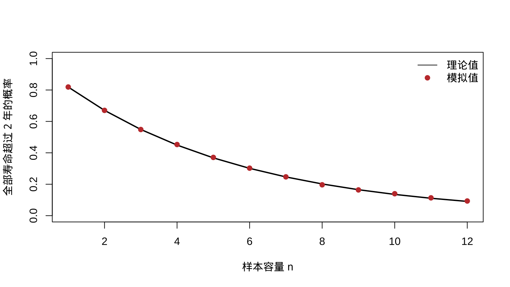
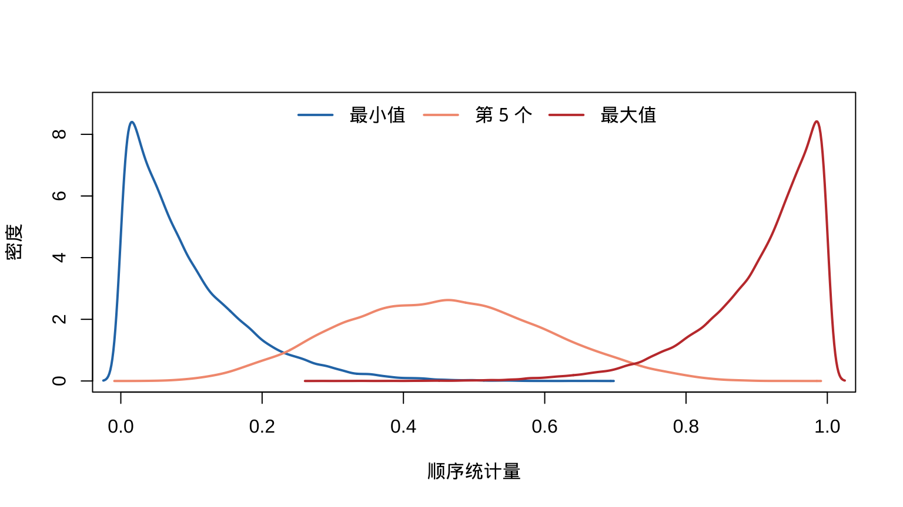
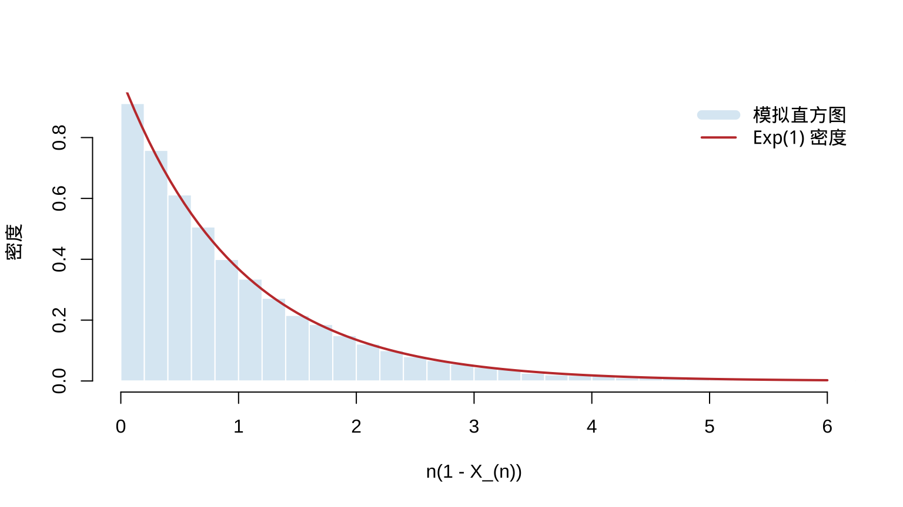

# 随机样本及其性质 {#random-samples}

本章对应原课件 *chap-5.tex*、四个 LaTeX 子文件及补充稿 *chapter-5.md*，讨论随机抽样、抽样分布、顺序统计量、随机变量收敛、中心极限定理、Slutsky 定理和 Delta 方法。补充稿末尾的截断处已按 iid 计算补全；原稿订正见 migration_notes.md。

## 随机样本模型 {#random-sample-model}

::: {.definition}
若 $X_1,\ldots,X_n$ 相互独立，且每个 $X_i$ 都具有同一个 pmf 或 pdf $f(x)$，则称它们为来自总体 $f$、容量为 $n$ 的**随机样本**，也称独立同分布（iid）。
:::

独立性给出联合分布

$$f(x_1,\ldots,x_n)=\prod_{i=1}^nf(x_i).$$

若总体属于参数族 $f(x\mid\theta)$，则同一个未知参数出现在每个因子中：

$$f(x_1,\ldots,x_n\mid\theta)=\prod_{i=1}^nf(x_i\mid\theta).$$

随机样本模型也称“从无限总体抽样”。对有限总体，**有放回抽样**满足 iid 条件；**无放回抽样**的各次取值不独立，但当总体容量 $N$ 远大于样本容量 $n$ 时，iid 模型常可作为近似。

::: {.source-example}
**例 5.1.3（有限总体近似）** 从有限总体 $\{1,\ldots,1000\}$ 中无放回抽取 10 个数。求 10 个数都大于 200 的概率，并比较 iid 近似与精确概率。
:::

<details class="course-details solution-details">
<summary><strong>查看详细解答</strong></summary>

若暂把 10 次抽取看作独立，则单次抽到大于 200 的数的概率为 $800/1000$，因而

$$
P_{\mathrm{iid}}=\left(\frac{800}{1000}\right)^{10}=0.107374.
$$

精确计算时，令 $Y$ 表示样本中大于 200 的数的个数，则
$Y\sim\operatorname{Hypergeometric}(N=1000,M=800,K=10)$，所以

$$
P(Y=10)=\frac{\binom{800}{10}\binom{200}{0}}{\binom{1000}{10}}
=0.106164.
$$

两者相差约 $0.00121$。这里 $n/N=0.01$ 很小，说明 iid 近似是合理的，但它并非精确的无放回抽样模型。

</details>

## 指数总体的电路板寿命例题 {#exponential-sample-example}

::: {.example .source-numbered}
**例 5.1.2（指数总体的样本密度）**

设 $X_1,\ldots,X_n$ 来自以 $\beta>0$ 为尺度参数的指数总体。把 $X_i$ 视为第 $i$ 块同型电路板的寿命，则

$$
f(\mathbf x\mid\beta)=\prod_{i=1}^n\frac1\beta e^{-x_i/\beta}
=\frac1{\beta^n}\exp\left(-\frac{\sum_i x_i}{\beta}\right),\qquad x_i>0.
$$

求所有电路板寿命都超过 2 年的概率。
:::

<details class="course-details solution-details">
<summary><strong>查看详细解答</strong></summary>

先按联合密度直接积分：

$$
\begin{aligned}
P(X_1>2,\ldots,X_n>2)
&=\int_2^\infty\cdots\int_2^\infty\prod_{i=1}^n\frac1\beta e^{-x_i/\beta}\,d\mathbf x\\
&=(e^{-2/\beta})^n=e^{-2n/\beta}.
\end{aligned}
$$

也可直接利用 iid 性质：
$P(\cap_i\{X_i>2\})=\prod_iP(X_i>2)=e^{-2n/\beta}$。当平均寿命 $\beta$ 相对于 $n$ 较大时，该概率接近 1。

</details>


``` r
set.seed(5201)
beta <- 10
n_grid <- 1:12
theory <- exp(-2 * n_grid / beta)
simulation <- vapply(n_grid, function(n) {
  x <- matrix(rexp(30000 * n, rate = 1 / beta), ncol = n)
  mean(apply(x, 1, min) > 2)
}, numeric(1))
plot(n_grid, theory, type = "l", lwd = 2, ylim = c(0, 1),
     xlab = "样本容量 n", ylab = "全部寿命超过 2 年的概率")
points(n_grid, simulation, pch = 19, col = "#C43C39")
legend("topright", c("理论值", "模拟值"), lty = c(1, NA), pch = c(NA, 19),
       col = c("black", "#C43C39"), bty = "n")
```

<div class="figure" style="text-align: center">

<p class="caption">(\#fig:chap05-exponential-board-simulation)全部电路板寿命超过 2 年的理论概率与模拟概率</p>
</div>

## 统计量、样本均值与样本方差 {#statistics-sampling-distributions}

::: {.definition}
设 $X_1,\ldots,X_n$ 为随机样本，$T$ 是定义在样本空间上的实值或向量值函数，则 $Y=T(X_1,\ldots,X_n)$ 称为**统计量**，$Y$ 的概率分布称为它的**抽样分布**。
:::

$$
\bar X=\frac1n\sum_{i=1}^nX_i,\qquad
S^2=\frac1{n-1}\sum_{i=1}^n(X_i-\bar X)^2,\qquad S=\sqrt{S^2}.
$$

::: {.source-theorem}
**定理 5.2.4（离差平方和恒等式）** 对任意实数 $x_1,\ldots,x_n$，记
$\bar x=n^{-1}\sum_i x_i$，则

$$
\sum_{i=1}^n(x_i-a)^2
=\sum_{i=1}^n(x_i-\bar x)^2+n(\bar x-a)^2,
$$

因而离差平方和在 $a=\bar x$ 时达到最小值，并且

$$
(n-1)s^2=\sum_{i=1}^n(x_i-\bar x)^2
=\sum_{i=1}^nx_i^2-n\bar x^2.
$$
:::

<details class="course-details proof-details">
<summary><strong>展开证明</strong></summary>

在每一项中加减 $\bar x$：

$$
\begin{aligned}
\sum_{i=1}^n(x_i-a)^2
&=\sum_{i=1}^n\{(x_i-\bar x)+(\bar x-a)\}^2\\
&=\sum_{i=1}^n(x_i-\bar x)^2
+2(\bar x-a)\sum_{i=1}^n(x_i-\bar x)
+n(\bar x-a)^2.
\end{aligned}
$$

由于 $\sum_i(x_i-\bar x)=0$，交叉项消失，第一式成立；右端只有最后一项依赖 $a$，故在 $a=\bar x$ 时最小。再令 $a=0$，并整理
$\sum_i(x_i-\bar x)^2=\sum_i x_i^2-n\bar x^2$，即得第二式。

</details>

::: {.source-lemma}
**引理 5.2.5（iid 和的均值与方差）** 若 $E\{g(X_1)\}$ 与
$\operatorname{Var}\{g(X_1)\}$ 存在，则

$$
E\left\{\sum_{i=1}^ng(X_i)\right\}=nE\{g(X_1)\},\qquad
\operatorname{Var}\left\{\sum_{i=1}^ng(X_i)\right\}
=n\operatorname{Var}\{g(X_1)\}.
$$
:::

<details class="course-details proof-details">
<summary><strong>展开证明</strong></summary>

期望的结论只用到同分布与期望的线性性：

$$
E\left\{\sum_i g(X_i)\right\}=\sum_iE\{g(X_i)\}
=nE\{g(X_1)\}.
$$

方差还需独立性。展开中心化和的平方后，$n$ 个平方项各给出
$\operatorname{Var}\{g(X_1)\}$；对 $i\ne j$，交叉项的期望为

$$
E([g(X_i)-Eg(X_i)][g(X_j)-Eg(X_j)])=0,
$$

所以总方差为 $n\operatorname{Var}\{g(X_1)\}$。

</details>

::: {.theorem .source-numbered}
**定理 5.2.6（样本均值与样本方差）** 若 $X_1,\ldots,X_n$ iid，
$E(X_i)=\mu$ 且 $\operatorname{Var}(X_i)=\sigma^2<\infty$，则

$$E(\bar X)=\mu,\quad \operatorname{Var}(\bar X)=\sigma^2/n,
\quad E(S^2)=\sigma^2.$$
:::

<details class="course-details proof-details">
<summary><strong>展开证明</strong></summary>

由引理 5.2.5，

$$
E(\bar X)=\frac1n\sum_iE(X_i)=\mu,
\qquad
\operatorname{Var}(\bar X)=\frac1{n^2}\sum_i\operatorname{Var}(X_i)
=\frac{\sigma^2}{n}.
$$

再由定理 5.2.4，

$$
(n-1)S^2=\sum_iX_i^2-n\bar X^2.
$$

注意 $E(X_i^2)=\sigma^2+\mu^2$，以及
$E(\bar X^2)=\operatorname{Var}(\bar X)+[E(\bar X)]^2
=\sigma^2/n+\mu^2$，于是

$$
\begin{aligned}
(n-1)E(S^2)
&=n(\sigma^2+\mu^2)
-n\left(\frac{\sigma^2}{n}+\mu^2\right)\\
&=(n-1)\sigma^2.
\end{aligned}
$$

两边除以 $n-1$ 即得 $E(S^2)=\sigma^2$。这也解释了样本方差分母采用 $n-1$：它使 $S^2$ 对总体方差无偏。

</details>

若再假定总体正态，则样本均值不仅具有上述均值和方差，而且
$\bar X\sim N(\mu,\sigma^2/n)$；这一结论可由下一节的 MGF 直接识别。

## 样本均值的矩母函数与正态例题 {#sample-mean-mgf}

::: {.theorem .source-numbered}
**定理 5.2.7（样本均值的 MGF）**

若总体矩母函数为 $M_X(t)$，则
$M_{\bar X}(t)=[M_X(t/n)]^n$。
:::

::: {.proof .source-numbered}
<details class="course-details proof-details">
<summary><strong>展开证明</strong></summary>

由独立性，

$$
M_{\bar X}(t)=E\prod_{i=1}^ne^{tX_i/n}
=\prod_{i=1}^nE(e^{tX_i/n})=[M_X(t/n)]^n.
$$

</details>
:::

::: {.source-example}
**例 5.2.8（正态样本均值）** 若总体为 $N(\mu,\sigma^2)$，求 $\bar X$ 的分布。
:::

<details class="course-details solution-details">
<summary><strong>查看详细解答</strong></summary>

若总体为 $N(\mu,\sigma^2)$，则

$$
M_{\bar X}(t)=\left[\exp\left(\mu\frac tn+\frac{\sigma^2(t/n)^2}{2}\right)\right]^n
=\exp\left(\mu t+\frac{(\sigma^2/n)t^2}{2}\right),
$$

故 $\bar X\sim N(\mu,\sigma^2/n)$。

</details>

同一方法也说明：若 $X_i\overset{\mathrm{iid}}\sim
\operatorname{Gamma}(\alpha,\beta)$（形状—尺度参数化），则
$\sum_iX_i\sim\operatorname{Gamma}(n\alpha,\beta)$，从而
$\bar X\sim\operatorname{Gamma}(n\alpha,\beta/n)$。

## 卷积公式 {#convolution-formula}

::: {.theorem .source-numbered}
**定理 5.2.9（卷积公式）**

若连续随机变量 $X,Y$ 相互独立，则 $Z=X+Y$ 的密度为

$$f_Z(z)=\int_{-\infty}^{\infty}f_X(x)f_Y(z-x)\,dx.$$
:::

::: {.proof .source-numbered}
<details class="course-details proof-details">
<summary><strong>展开证明</strong></summary>

令 $Z=X+Y,W=X$。反变换为 $X=W,Y=Z-W$，Jacobian 绝对值为 1，故
$f_{Z,W}(z,w)=f_X(w)f_Y(z-w)$；对 $w$ 积分即得结论。

</details>
:::

::: {.source-example}
**例 5.2.10（Cauchy 变量之和）** 若 $U\sim\operatorname{Cauchy}(0,\sigma)$、
$V\sim\operatorname{Cauchy}(0,\tau)$ 且相互独立，则
$U+V\sim\operatorname{Cauchy}(0,\sigma+\tau)$。因此 iid 标准 Cauchy 样本的均值 $\bar X$ 仍服从标准 Cauchy 分布。
:::

<details class="course-details derivation-details">
<summary><strong>查看推导过程</strong></summary>

卷积公式给出

$$
f_{U+V}(z)=\int_{-\infty}^{\infty}
\frac{\sigma}{\pi(\sigma^2+u^2)}
\frac{\tau}{\pi\{\tau^2+(z-u)^2\}}\,du.
$$

教材把该积分的部分分式分解与反导计算留作练习 5.7；其计算结果为

$$
f_{U+V}(z)=\frac{\sigma+\tau}
{\pi\{(\sigma+\tau)^2+z^2\}},
$$

即尺度参数相加。反复应用该结论，$\sum_{i=1}^nX_i\sim
\operatorname{Cauchy}(0,n)$；再除以 $n$，得到
$\bar X\sim\operatorname{Cauchy}(0,1)$。这说明在总体方差不存在时，样本均值的离散程度未必随 $n$ 增大而缩小。

</details>

## 正态总体的抽样性质 {#normal-sample-properties}

::: {.source-theorem}
**定理 5.3.1（正态样本均值与方差）** 若
$X_1,\ldots,X_n\overset{\mathrm{iid}}\sim N(\mu,\sigma^2)$，则

1. $\bar X$ 与 $S^2$ 相互独立；
2. $\bar X\sim N(\mu,\sigma^2/n)$；
3. $(n-1)S^2/\sigma^2\sim\chi^2_{n-1}$。
:::

<details class="course-details proof-details">
<summary><strong>展开证明</strong></summary>

先标准化 $Z_i=(X_i-\mu)/\sigma$，因此只需证明 $\mu=0$、
$\sigma=1$ 的情形；第 2 点已由例 5.2.8 得到。

对独立性，令 $Y_1=\bar X$、$Y_i=X_i-\bar X$（$i=2,\ldots,n$）。
$S^2$ 只依赖 $(Y_2,\ldots,Y_n)$，而正态样本联合密度在这一线性变换后可分解为只含 $Y_1$ 的因子与只含 $(Y_2,\ldots,Y_n)$ 的因子。故
$Y_1=\bar X$ 与残差向量独立，从而与 $S^2$ 独立。

下面按教材的递推证明卡方结论。记 $\bar X_k,S_k^2$ 为前 $k$ 个观测的均值和方差，则平方和分解给出

$$
kS_{k+1}^2=(k-1)S_k^2+
\frac{k}{k+1}(X_{k+1}-\bar X_k)^2.
$$

当 $k=1$ 时，
$S_2^2=(X_2-X_1)^2/2\sim\chi_1^2$。假设
$(k-1)S_k^2\sim\chi_{k-1}^2$。因为
$X_{k+1}-\bar X_k\sim N(0,(k+1)/k)$，所以

$$
\frac{k}{k+1}(X_{k+1}-\bar X_k)^2\sim\chi_1^2.
$$

该变量与 $S_k^2$ 独立，故两个独立卡方变量相加后自由度相加，得到
$kS_{k+1}^2\sim\chi_k^2$。归纳完成标准正态情形；恢复尺度后即为
$(n-1)S^2/\sigma^2\sim\chi_{n-1}^2$。

</details>

## Student t 与 Snedecor F 抽样分布 {#t-f-sampling-distributions}

::: {.definition}
**定义 5.3.4（Student $t$ 分布）**

若 $X_i\overset{\mathrm{iid}}\sim N(\mu,\sigma^2)$，则

$$T=\frac{\bar X-\mu}{S/\sqrt n}\sim t_{n-1}.$$

一般的 $t_p$ 密度为

$$f_T(t)=\frac{\Gamma((p+1)/2)}{\Gamma(p/2)\sqrt{p\pi}}
\left(1+\frac{t^2}{p}\right)^{-(p+1)/2},\quad t\in\mathbb R.$$
:::

::: {.definition}
**定义 5.3.6（Snedecor $F$ 分布）**

若两个正态随机样本相互独立，则

$$F=\frac{S_X^2/\sigma_X^2}{S_Y^2/\sigma_Y^2}\sim F_{n-1,m-1}.$$

一般的 $F_{p,q}$ 密度为

$$
f_F(x)=\frac{\Gamma((p+q)/2)}{\Gamma(p/2)\Gamma(q/2)}
\left(\frac pq\right)^{p/2}\frac{x^{p/2-1}}{[1+(p/q)x]^{(p+q)/2}},\quad x>0.
$$
:::

## 离散型顺序统计量 {#discrete-order-statistics}

::: {.definition}
**定义 5.4.1（顺序统计量）**

将样本从小到大排列所得的 $X_{(1)}\le\cdots\le X_{(n)}$ 称为顺序统计量；特别地，$X_{(1)}=\min_iX_i$，$X_{(n)}=\max_iX_i$。
:::

::: {.source-theorem}
**定理 5.4.3（离散型顺序统计量）**

设离散总体的可能值为 $x_1<x_2<\cdots$，$P(X=x_i)=p_i$，记 $P_i=\sum_{r=1}^ip_r$、$P_0=0$。则

$$P(X_{(j)}\le x_i)=\sum_{k=j}^n\binom nkP_i^k(1-P_i)^{n-k},$$

$$
P(X_{(j)}=x_i)=\sum_{k=j}^n\binom nk
\{P_i^k(1-P_i)^{n-k}-P_{i-1}^k(1-P_{i-1})^{n-k}\}.
$$
:::

<details class="course-details proof-details">
<summary><strong>展开证明</strong></summary>

令 $Y=\sum_{r=1}^nI(X_r\le x_i)$，则 $Y\sim\operatorname{Bin}(n,P_i)$，且
$\{X_{(j)}\le x_i\}\iff\{Y\ge j\}$。因此

$$
P(X_{(j)}\le x_i)=P(Y\ge j)
=\sum_{k=j}^n\binom nkP_i^k(1-P_i)^{n-k}.
$$

又因为总体取值按 $x_1<x_2<\cdots$ 排列，

$$
\begin{aligned}
P(X_{(j)}=x_i)
&=P(X_{(j)}\le x_i)-P(X_{(j)}<x_i)\\
&=P(X_{(j)}\le x_i)-P(X_{(j)}\le x_{i-1}),
\end{aligned}
$$

把第一式分别用于 $P_i$ 与 $P_{i-1}$ 即得结论。

</details>

## 连续型顺序统计量 {#continuous-order-statistics}

::: {.theorem .source-numbered}
**定理 5.4.4（连续型顺序统计量）**

若总体 cdf、pdf 分别为 $F_X,f_X$，则

$$
f_{X_{(j)}}(x)=\frac{n!}{(j-1)!(n-j)!}f_X(x)[F_X(x)]^{j-1}[1-F_X(x)]^{n-j}.
$$
:::

<details class="course-details proof-details">
<summary><strong>展开证明</strong></summary>

对很小的 $dx>0$，事件 $x<X_{(j)}\le x+dx$ 要求：恰有 $j-1$ 个样本值不超过 $x$，一个样本值落入 $(x,x+dx]$，其余 $n-j$ 个大于 $x+dx$。选择这三组观测的方式数为
$n!/\{(j-1)!1!(n-j)!\}$，所以

$$
\begin{aligned}
P(x<X_{(j)}\le x+dx)
&=\frac{n!}{(j-1)!(n-j)!}[F_X(x)]^{j-1}\\
&\quad\times\{F_X(x+dx)-F_X(x)\}
[1-F_X(x+dx)]^{n-j}.
\end{aligned}
$$

两边除以 $dx$ 并令 $dx\downarrow0$，利用
$\{F_X(x+dx)-F_X(x)\}/dx\to f_X(x)$，即得密度公式。

</details>

::: {.source-example}
**例 5.4.5（均匀总体的顺序统计量）** 若
$X_i\overset{\mathrm{iid}}\sim U(0,1)$，求 $X_{(j)}$ 的密度并识别其分布。
:::

<details class="course-details solution-details">
<summary><strong>查看详细解答</strong></summary>

在 $0<x<1$ 上，$F_X(x)=x$、$f_X(x)=1$。代入定理 5.4.4，

$$
f_{X_{(j)}}(x)=\frac{n!}{(j-1)!(n-j)!}
x^{j-1}(1-x)^{n-j}.
$$

而 $B(j,n-j+1)=(j-1)!(n-j)!/n!$，故

$$X_{(j)}\sim\operatorname{Beta}(j,n-j+1).$$

于是 $E(X_{(j)})=j/(n+1)$。这也解释了后图中最小值、第 5 个顺序统计量与最大值密度峰值所处的位置。

</details>

对 $1\le i<j\le n$，

$$
\begin{aligned}
f_{X_{(i)},X_{(j)}}(u,v)
&=\frac{n!f_X(u)f_X(v)}{(i-1)!(j-i-1)!(n-j)!}[F_X(u)]^{i-1}\\
&\quad\times[F_X(v)-F_X(u)]^{j-i-1}[1-F_X(v)]^{n-j},\quad u<v.
\end{aligned}
$$

全部顺序统计量的联合密度为

$$
f_{X_{(1)},\ldots,X_{(n)}}(\mathbf x)=
\begin{cases}n!\prod_{i=1}^nf_X(x_i),&x_1<\cdots<x_n,\\0,&\text{其他}.
\end{cases}
$$

这些联合密度的系数来自把样本分配到
$(-\infty,u)$、$du$、$(u,v)$、$dv$ 与 $(v,\infty)$ 五类区域的多项式计数；全部顺序统计量的联合密度则对应 $n!$ 种原始标签排列。


``` r
set.seed(5202)
n <- 10
ord <- t(apply(matrix(runif(40000 * n), ncol = n), 1, sort))
cols <- c("#2878B5", "#F39B7F", "#C43C39")
plot(NA, xlim = c(0, 1), ylim = c(0, 9), xlab = "顺序统计量", ylab = "密度")
for (k in seq_along(c(1, 5, 10))) lines(density(ord[, c(1, 5, 10)[k]]), lwd = 2, col = cols[k])
legend("top", c("最小值", "第 5 个", "最大值"), lwd = 2, col = cols, bty = "n", horiz = TRUE)
```

<div class="figure" style="text-align: center">

<p class="caption">(\#fig:chap05-uniform-order-statistics)均匀总体中不同顺序统计量的抽样分布</p>
</div>

## 依概率收敛与弱大数定律 {#probability-convergence-wlln}

::: {.definition}
若对每个 $\varepsilon>0$，$P(|X_n-X|\ge\varepsilon)\to0$，则称 $X_n$ 依概率收敛于 $X$，记为 $X_n\overset p\to X$。
:::

::: {.theorem .source-numbered}
**定理 5.5.2（弱大数定律）**

若 $X_i$ iid，$E(X_i)=\mu$ 且 $\operatorname{Var}(X_i)=\sigma^2<\infty$，则弱大数定律给出

$$\bar X_n=\frac1n\sum_{i=1}^nX_i\overset p\longrightarrow\mu.$$
:::

<details class="course-details proof-details">
<summary><strong>展开证明</strong></summary>

由定理 5.2.6，$E(\bar X_n)=\mu$、
$\operatorname{Var}(\bar X_n)=\sigma^2/n$。对任意 $\varepsilon>0$，Chebyshev 不等式给出

$$
P(|\bar X_n-\mu|\ge\varepsilon)
\le\frac{\operatorname{Var}(\bar X_n)}{\varepsilon^2}
=\frac{\sigma^2}{n\varepsilon^2}\longrightarrow0.
$$

这正是 $\bar X_n\overset p\to\mu$ 的定义。

</details>

::: {.source-theorem}
**定理 5.5.4（连续映射）** 若 $X_n\overset p\to X$ 且 $h$ 连续，则
$h(X_n)\overset p\to h(X)$。
:::

::: {.source-example}
**例 5.5.3--5.5.5（样本方差与标准差的相合性）** 由 $E(S_n^2)=\sigma^2$，Chebyshev 不等式给出

$$P(|S_n^2-\sigma^2|\ge\varepsilon)\le\operatorname{Var}(S_n^2)/\varepsilon^2.$$

故 $\operatorname{Var}(S_n^2)\to0$ 是 $S_n^2\overset p\to\sigma^2$ 的充分条件；连续映射定理再给出 $S_n\overset p\to\sigma$。
:::

<details class="course-details derivation-details">
<summary><strong>查看推导过程</strong></summary>

若 $\operatorname{Var}(S_n^2)\to0$，则对每个 $\varepsilon>0$，上式右端趋于 0，故
$S_n^2\overset p\to\sigma^2$。因为平方根函数在 $[0,\infty)$ 上连续，

$$
S_n=\sqrt{S_n^2}\overset p\longrightarrow\sqrt{\sigma^2}=\sigma.
$$

教材在此只给出“$\operatorname{Var}(S_n^2)\to0$ 是充分条件”，并没有在仅假设二阶矩有限时证明该条件；因此这里不把它误写成无附加条件的结论。

</details>

## 几乎处处收敛与强大数定律 {#almost-sure-convergence-slln}

::: {.definition}
若 $P(\lim_{n\to\infty}X_n=X)=1$，则称 $X_n$ 几乎处处收敛于 $X$，记为 $X_n\overset{a.s.}\to X$。即除一个概率为 0 的样本点集合外，$X_n(s)\to X(s)$。
:::

::: {.theorem .source-numbered}
**定理 5.5.9（强大数定律）**

若 $X_i$ iid，$E(X_i)=\mu$ 且 $\operatorname{Var}(X_i)<\infty$，则
$\bar X_n\overset{a.s.}\to\mu$。
:::

::: {.example .source-numbered}
**例 5.5.7（几乎处处收敛）**

在均匀概率空间 $[0,1]$ 上令 $X_n(s)=s+s^n$、$X(s)=s$。对 $s<1$ 有 $X_n(s)\to X(s)$，而 $X_n(1)=2\not\to1$。因单点集 $\{1\}$ 的概率为 0，仍有 $X_n\overset{a.s.}\to X$。
:::

<details class="course-details solution-details">
<summary><strong>查看详细解答</strong></summary>

对每个 $0\le s<1$，几何数列给出 $s^n\to0$，所以
$X_n(s)=s+s^n\to s=X(s)$。唯一失败点为 $s=1$，此处
$X_n(1)=2$ 对所有 $n$ 成立。由于均匀分布下 $P(\{1\})=0$，收敛成立的集合 $[0,1)$ 的概率为 1，故属于几乎处处收敛。

</details>

教材的例 5.5.8 还说明：依概率收敛不必推出整列几乎处处收敛。其“滑动区间”指标变量在每个固定样本点上会无限次取 0 与 1，但取 1 的区间长度趋于 0，因而仍依概率趋于 0。这个对照强调了两种收敛对样本路径要求的差别。

## 依分布收敛与均匀最大值 {#distribution-convergence-uniform-max}

::: {.definition}
若在 $F_X$ 的每个连续点 $x$ 上 $F_{X_n}(x)\to F_X(x)$，则称 $X_n\overset d\to X$。
:::

$X_n\overset p\to X$ 蕴含 $X_n\overset d\to X$；当极限是常数 $\mu$ 时二者等价，极限 cdf 在 $x<\mu$ 为 0，在 $x>\mu$ 为 1。

::: {.source-example}
**例 5.5.11（均匀样本最大值）** 若
$X_i\overset{\mathrm{iid}}\sim U(0,1)$，判断 $X_{(n)}$ 的极限，并寻找非退化的缩放极限。
:::

<details class="course-details solution-details">
<summary><strong>查看详细解答</strong></summary>

因为 $X_{(n)}\le1$，对 $0<\varepsilon<1$，

$$
\begin{aligned}
P(|X_{(n)}-1|\ge\varepsilon)
&=P(X_{(n)}\le1-\varepsilon)\\
&=P(X_i\le1-\varepsilon, i=1,\ldots,n)\\
&=(1-\varepsilon)^n\to0,
\end{aligned}
$$

所以 $X_{(n)}\overset p\to1$。进一步，对 $t\ge0$，

$$P\{n(1-X_{(n)})\le t\}=1-(1-t/n)^n\to1-e^{-t},$$

即 $n(1-X_{(n)})\overset d\to\operatorname{Exp}(1)$。

</details>


``` r
set.seed(5203)
n <- 80
z <- n * (1 - apply(matrix(runif(50000 * n), ncol = n), 1, max))
hist(z, probability = TRUE, breaks = 45, col = "#DCEAF4", border = "white",
     xlim = c(0, 6), main = NULL, xlab = "n(1 - X_(n))", ylab = "密度")
curve(dexp(x), 0, 6, add = TRUE, lwd = 2, col = "#C43C39")
legend("topright", c("模拟直方图", "Exp(1) 密度"), lwd = c(8, 2),
       col = c("#DCEAF4", "#C43C39"), bty = "n")
```

<div class="figure" style="text-align: center">

<p class="caption">(\#fig:chap05-uniform-maximum-limit)缩放后的均匀样本最大值逼近 Exp(1)</p>
</div>

## 中心极限定理与 Slutsky 定理 {#clt-slutsky}

::: {.source-theorem}
**定理 5.5.14（MGF 版本的中心极限定理）** 若 $X_i$ iid，
$E(X_i)=\mu$、$\operatorname{Var}(X_i)=\sigma^2>0$，并且共同 MGF 在
0 的某邻域存在，则

$$\frac{\sqrt n(\bar X_n-\mu)}{\sigma}\overset d\longrightarrow N(0,1).$$
:::

<details class="course-details proof-details">
<summary><strong>展开证明</strong></summary>

令 $Y_i=(X_i-\mu)/\sigma$，则 $E(Y_i)=0$、$E(Y_i^2)=1$。记其 MGF 为
$M_Y$。由独立性，标准化样本均值的 MGF 为

$$M_n(t)=\left[M_Y\left(\frac{t}{\sqrt n}\right)\right]^n.$$

在 0 附近作二阶 Taylor 展开：

$$
M_Y(u)=1+uE(Y_i)+\frac{u^2}{2}E(Y_i^2)+R(u)
=1+\frac{u^2}{2}+R(u),
$$

其中 $R(u)/u^2\to0$。取 $u=t/\sqrt n$，便有

$$
M_n(t)=\left[1+\frac1n\left\{\frac{t^2}{2}
+nR(t/\sqrt n)\right\}\right]^n.
$$

对固定 $t$，$nR(t/\sqrt n)\to0$，故
$M_n(t)\to e^{t^2/2}$。右端是标准正态 MGF，MGF 唯一性给出所需的依分布收敛。

</details>

::: {.theorem .source-numbered}
**定理 5.5.15（有限方差版本的中心极限定理）** 若 $X_i$ iid，
$E(X_i)=\mu$，$0<\operatorname{Var}(X_i)=\sigma^2<\infty$，则

$$\frac{\sqrt n(\bar X_n-\mu)}{\sigma}\overset d\longrightarrow N(0,1).$$
:::

有限方差版本比 MGF 版本更强，可用特征函数证明而不要求 MGF 存在。教材未展开复变量证明，正文也不自行补造；Cauchy 样本均值的反例则说明有限方差条件不能任意删去。

::: {.theorem .source-numbered}
**定理 5.5.17（Slutsky 定理）** 若 $X_n\overset d\to X$ 且
$Y_n\overset p\to a$（$a$ 为常数），则

$$Y_nX_n\overset d\to aX,\qquad X_n+Y_n\overset d\to X+a.$$
:::

::: {.source-example}
**例 5.5.18（用样本标准差学生化）** 当 $\sigma$ 未知但
$S_n\overset p\to\sigma$ 时，说明以 $S_n$ 代替 $\sigma$ 不改变标准正态极限。
:::

<details class="course-details solution-details">
<summary><strong>查看详细解答</strong></summary>

由连续映射定理，$S_n\overset p\to\sigma>0$ 推出
$\sigma/S_n\overset p\to1$。中心极限定理与 Slutsky 定理于是给出

$$
\frac{\sqrt n(\bar X_n-\mu)}{S_n}
=\frac\sigma{S_n}\frac{\sqrt n(\bar X_n-\mu)}\sigma
\overset d\longrightarrow N(0,1).
$$

这里第一因子消除了未知尺度，第二因子提供正态极限；学生化后极限分布不再含未知的 $\sigma$。

</details>

## Taylor 近似与多元方差传播 {#taylor-variance-propagation}

::: {.source-theorem}
**定理 5.5.21（Taylor 余项）** 若 $g$ 在 $a$ 附近具有 $r+1$ 阶导数，
$T_r(x)=\sum_{j=0}^r g^{(j)}(a)(x-a)^j/j!$，则

$$\frac{g(x)-T_r(x)}{(x-a)^r}\longrightarrow0\qquad(x\to a).$$
:::

令 $\mathbf T=(T_1,\ldots,T_k)$，$E(\mathbf T)=\boldsymbol\theta$，并记
$g_i'(\boldsymbol\theta)=\left.\partial g(\mathbf t)/\partial t_i\right|_{\mathbf t=\boldsymbol\theta}$。一阶 Taylor 展开为

$$g(\mathbf T)\approx g(\boldsymbol\theta)+\sum_{i=1}^kg_i'(\boldsymbol\theta)(T_i-\theta_i).$$

因此

$$E\{g(\mathbf T)\}\approx g(\boldsymbol\theta),$$

$$
\operatorname{Var}\{g(\mathbf T)\}\approx
\sum_i[g_i'(\boldsymbol\theta)]^2\operatorname{Var}(T_i)
+2\sum_{i>j}g_i'(\boldsymbol\theta)g_j'(\boldsymbol\theta)\operatorname{Cov}(T_i,T_j).
$$

## Delta 方法及两个应用 {#delta-method-applications}

::: {.source-example}
**例 5.5.22（胜算的近似方差）** 对 Bernoulli 样本，令
$\hat p=\bar X$，以 $\hat p/(1-\hat p)$ 估计总体胜算 $p/(1-p)$。
:::

<details class="course-details solution-details">
<summary><strong>查看详细解答</strong></summary>

对 Bernoulli 样本，$\hat p=\bar X$。若 $g(p)=p/(1-p)$，则

$$
\operatorname{Var}\left(\frac{\hat p}{1-\hat p}\right)
\approx[g'(p)]^2\operatorname{Var}(\hat p)=\frac{p}{n(1-p)^3}.
$$

具体地，$g'(p)=1/(1-p)^2$，而
$\operatorname{Var}(\hat p)=p(1-p)/n$，所以

$$
[g'(p)]^2\operatorname{Var}(\hat p)
=\frac1{(1-p)^4}\frac{p(1-p)}n
=\frac{p}{n(1-p)^3}.
$$

</details>

::: {.source-example}
**例 5.5.23（倒数变换的近似矩）** 若 $E_\mu(X)=\mu\ne0$，用一阶 Taylor 展开近似 $1/X$ 的均值和方差。
:::

<details class="course-details solution-details">
<summary><strong>查看详细解答</strong></summary>

若 $E_\mu(X)=\mu\ne0$，取 $g(\mu)=1/\mu$，则

$$E_\mu(1/X)\approx1/\mu,\qquad
\operatorname{Var}_\mu(1/X)\approx\mu^{-4}\operatorname{Var}_\mu(X).$$

因为 $g'(\mu)=-\mu^{-2}$，

$$
g(X)\approx g(\mu)+g'(\mu)(X-\mu)
=\frac1\mu-\frac{X-\mu}{\mu^2}.
$$

取期望时线性项均值为 0；取方差时常数项消失，故得到上述两个近似。它们是一阶局部近似，不声称 $E(1/X)$ 必然存在，也不把近似等号写成精确等号。

</details>

::: {.theorem .source-numbered}
**定理 5.5.24（Delta 方法）**

若 $\sqrt n(Y_n-\theta)\overset d\to N(0,\sigma^2)$ 且 $g'(\theta)$ 存在且非零，则

$$
\sqrt n\{g(Y_n)-g(\theta)\}
\overset d\longrightarrow N(0,\sigma^2[g'(\theta)]^2).
$$
:::

::: {.proof .source-numbered}
<details class="course-details proof-details">
<summary><strong>展开证明</strong></summary>

由可微性，存在随机余项 $r_n$ 使

$$
g(Y_n)-g(\theta)=g'(\theta)(Y_n-\theta)+r_n(Y_n-\theta),
$$

并且只要 $Y_n\overset p\to\theta$，就有 $r_n\overset p\to0$。而
$\sqrt n(Y_n-\theta)\overset d\to N(0,\sigma^2)$ 蕴含该序列为
$O_p(1)$，从而 $Y_n-\theta=O_p(n^{-1/2})$。于是

$$
\sqrt n\{g(Y_n)-g(\theta)\}
=\{g'(\theta)+r_n\}\sqrt n(Y_n-\theta).
$$

Slutsky 定理给出极限
$N(0,\sigma^2[g'(\theta)]^2)$。这也说明原稿中仅写“余项趋于 0”还不够，必须控制乘上 $\sqrt n$ 后的余项。

</details>
:::

::: {.source-example}
**例 5.5.25（倒数样本均值）** 对 $Y_n=\bar X$、$g(x)=1/x$，求其渐近分布并给出可计算的近似方差。
:::

<details class="course-details solution-details">
<summary><strong>查看详细解答</strong></summary>

对 $Y_n=\bar X$、$g(x)=1/x$，当 $\mu\ne0$ 时，

$$
\sqrt n\left(\frac1{\bar X}-\frac1\mu\right)
\overset d\longrightarrow N\left(0,\frac{\operatorname{Var}(X_1)}{\mu^4}\right).
$$

以 $S^2$ 和 $\bar X$ 代替未知量，

$$
\widehat{\operatorname{Var}}(1/\bar X)\approx\frac{S^2}{n\bar X^4},\qquad
\frac{\sqrt n(1/\bar X-1/\mu)}{S/\bar X^2}\overset d\to N(0,1).
$$

这里 $g'(\mu)=-1/\mu^2$，平方后给出渐近方差
$\operatorname{Var}(X_1)/\mu^4$。再以相合的 $S^2$ 和 $\bar X$ 分别代替未知的
$\operatorname{Var}(X_1)$ 与 $\mu$，并记住 $\operatorname{Var}(\bar X)$ 含因子 $1/n$，即可得到
$S^2/(n\bar X^4)$。

</details>

::: {.source-theorem}
**定理 5.5.26（二阶 Delta 方法）** 若
$\sqrt n(Y_n-\theta)\overset d\to N(0,\sigma^2)$、
$g'(\theta)=0$ 且 $g''(\theta)\ne0$，则

$$
n\{g(Y_n)-g(\theta)\}
\overset d\longrightarrow \frac{\sigma^2g''(\theta)}2\chi_1^2.
$$
:::

当一阶导数为 0 时，一阶 Delta 方法退化；保留 Taylor 展开的二阶项，并利用标准正态平方服从 $\chi_1^2$，即可得到该结论。

## 本章小结 {#random-samples-summary}

- iid 假设把样本联合分布写成相同边缘分布的乘积。
- 均值、方差和顺序统计量的抽样分布连接总体与数据。
- 大数定律解释稳定性，中心极限定理解释正态近似。
- Slutsky 与 Delta 方法把极限结论传递到可操作的统计量。

> **课后提示：** 独立完成教材练习 5.7 的 Cauchy 卷积积分、练习 5.26 的两个顺序统计量联合密度证明，以及练习 5.43 的 Delta 方法余项细节；本讲义不直接展示教材未提供的标准答案。

**参考资料：** Casella and Berger, *Statistical Inference*, 2nd ed., Chapter 5；原课程课件 `chap-5.tex` 及其四个子文件。
