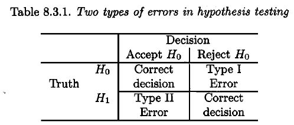
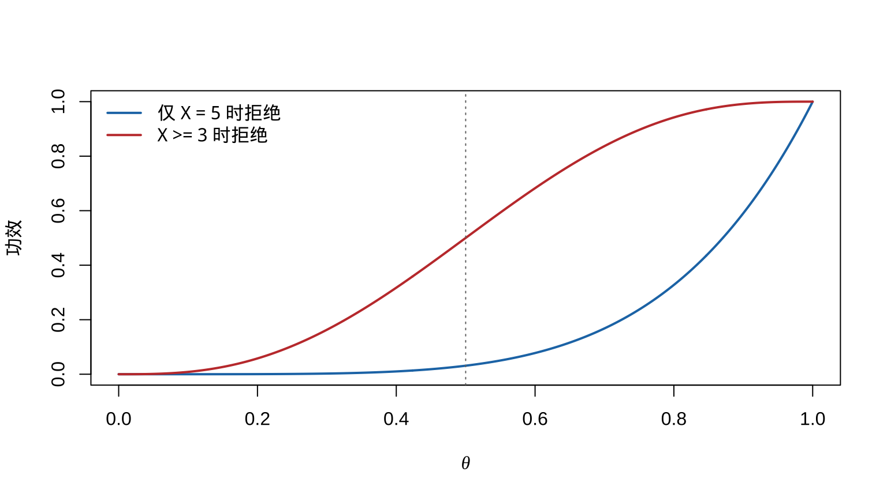
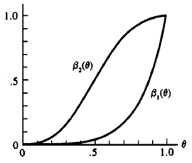
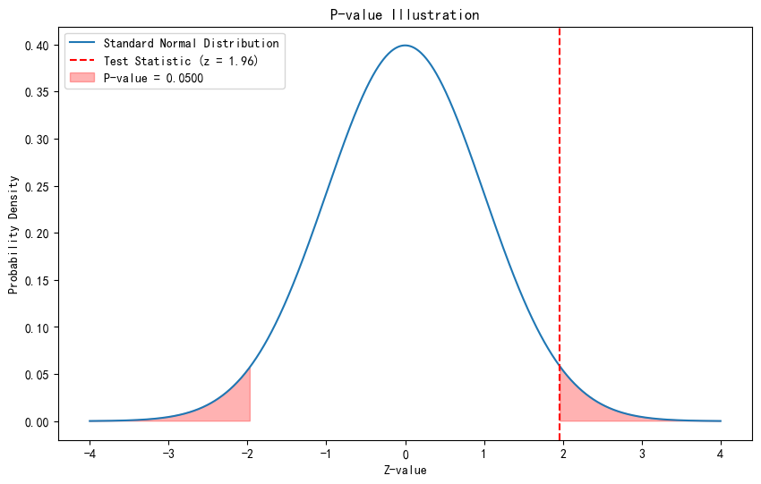

# 假设检验 {#hypothesis-testing}

本章对应 *chap-8.tex* 及三个 LaTeX 子文件，讨论假设、似然比检验、Bayes 检验、两类错误与功效函数，以及 Neyman--Pearson 引理、单调似然比、UMP 与无偏检验。原课件图形和数学推导均保留，并增加一个可执行的功效函数示例。

## 假设、原假设与拒绝域 {#hypotheses-rejection-region}

::: {.definition}
**假设**是关于总体参数的陈述。主要假设称为**原假设**，记为 $H_0$；其补集称为**备择假设**，记为 $H_1$。若 $\Theta_0\subset\Theta$，则

$$H_0:\theta\in\Theta_0,\qquad H_1:\theta\in\Theta_0^c.$$
:::

检验程序把样本空间分为接受域与拒绝域 $R$：当 $\mathbf x\in R$ 时拒绝 $H_0$，否则不拒绝 $H_0$。样本证据不足并不等同于原假设已经得到证明。

## 似然比检验 {#likelihood-ratio-tests}

对随机样本 $X_1,\ldots,X_n$，似然为

$$L(\theta\mid\mathbf x)=f(\mathbf x\mid\theta)=\prod_{i=1}^nf(x_i\mid\theta).$$

::: {.definition}
检验 $H_0:\theta\in\Theta_0$ 对 $H_1:\theta\in\Theta_0^c$ 的似然比统计量为

$$
\lambda(\mathbf x)=
\frac{\sup_{\theta\in\Theta_0}L(\theta\mid\mathbf x)}
{\sup_{\theta\in\Theta}L(\theta\mid\mathbf x)}
=\frac{L(\hat\theta_0\mid\mathbf x)}{L(\hat\theta\mid\mathbf x)}.
$$

其中 $\hat\theta_0$ 是受限 MLE，$\hat\theta$ 是无约束 MLE。LRT 的拒绝域形如 $\{\mathbf x:\lambda(\mathbf x)\le c\}$，$0\le c\le1$。
:::

::: {.example}
若 $X_i\overset{\mathrm{iid}}\sim N(\theta,1)$，检验 $H_0:\theta=\theta_0$ 对 $H_1:\theta\ne\theta_0$，则

$$
\begin{aligned}
\lambda(\mathbf x)
&=\exp\left\{\frac{-\sum_i(x_i-\theta_0)^2+\sum_i(x_i-\bar x)^2}{2}\right\}\\
&=\exp\{-n(\bar x-\theta_0)^2/2\},
\end{aligned}
$$

其中使用了 $\sum_i(x_i-\theta_0)^2=\sum_i(x_i-\bar x)^2+n(\bar x-\theta_0)^2$。拒绝域等价于

$$\left\{\mathbf x:|\bar x-\theta_0|\ge\sqrt{-2\log(c)/n}\right\}.$$
:::

::: {.theorem}
若 $T(\mathbf X)$ 是关于 $\theta$ 的充分统计量，分别用 $T$ 与完整样本构造的似然比统计量为 $\lambda^*(t)$ 与 $\lambda(\mathbf x)$，则
$\lambda^*\{T(\mathbf x)\}=\lambda(\mathbf x)$。
:::

## 指数位置族与含干扰参数的 LRT {#lrt-examples}

::: {.example}
设 $X_i$ 来自移位指数密度

$$f(x\mid\theta)=e^{-(x-\theta)}I(x\ge\theta),\qquad -\infty<\theta<\infty.$$

检验 $H_0:\theta\le\theta_0$ 对 $H_1:\theta>\theta_0$。似然

$$L(\theta\mid\mathbf x)=e^{-\sum x_i+n\theta}I(\theta\le x_{(1)})$$

在可行域内随 $\theta$ 增加，故

$$
\lambda(\mathbf x)=
\begin{cases}
1,&x_{(1)}\le\theta_0,\\
e^{-n(x_{(1)}-\theta_0)},&x_{(1)}>\theta_0.
\end{cases}
$$

拒绝域可写为 $\{\mathbf x:x_{(1)}\ge\theta_0-\log(c)/n\}$。
:::

若 $X_i\sim N(\mu,\sigma^2)$ 且检验 $H_0:\mu\le\mu_0$ 对 $H_1:\mu>\mu_0$，$\sigma^2$ 是干扰参数。无约束 MLE 为
$\hat\mu=\bar x$、$\hat\sigma^2=n^{-1}\sum_i(x_i-\bar x)^2$；当 $\bar x>\mu_0$ 时，受限最大值在 $\mu_0$ 处取得，并令
$\hat\sigma_0^2=n^{-1}\sum_i(x_i-\mu_0)^2$。化简后，拒绝域等价于

$$\left\{\mathbf x:\bar x>\mu_0+b\sqrt{S^2/n}\right\},$$

常数 $b$ 由检验水平决定，即得到单侧 $t$ 检验的形式。

## Bayes 检验 {#bayesian-tests}

给定后验分布 $\pi(\theta\mid\mathbf x)$，可比较
$P(\theta\in\Theta_0\mid\mathbf x)$ 与
$P(\theta\in\Theta_0^c\mid\mathbf x)$。在两种误判损失相同的 0--1 损失下，当后者大于 $1/2$ 时拒绝 $H_0$；拒绝域为

$$\left\{\mathbf x:P(\theta\in\Theta_0^c\mid\mathbf x)>\frac12\right\}.$$

::: {.example}
若 $X_i\overset{\mathrm{iid}}\sim N(\theta,\sigma^2)$，先验 $\theta\sim N(\mu,\tau^2)$，检验 $H_0:\theta\le\theta_0$ 对 $H_1:\theta>\theta_0$，则后验均值与方差为

$$m_n=\frac{n\tau^2\bar x+\sigma^2\mu}{n\tau^2+\sigma^2},\qquad
v_n=\frac{\sigma^2\tau^2}{n\tau^2+\sigma^2}.$$

后验分布对称，故 $P(\theta\le\theta_0\mid\mathbf x)\ge1/2$ 等价于 $m_n\le\theta_0$。于是当

$$\bar X\le\theta_0+\frac{\sigma^2(\theta_0-\mu)}{n\tau^2}$$

时不拒绝 $H_0$，否则选择 $H_1$。
:::

## 两类错误与功效函数 {#errors-power-function}

<div class="figure" style="text-align: center">

<p class="caption">(\#fig:chap08-source-errors)原课件中的假设检验决策与两类错误示意</p>
</div>

::: {.definition}
对拒绝域 $R$，第一类错误概率为 $P_\theta(\mathbf X\in R)$（$\theta\in\Theta_0$），第二类错误概率为 $P_\theta(\mathbf X\in R^c)$（$\theta\in\Theta_0^c$）。检验的**功效函数**为

$$\beta(\theta)=P_\theta(\mathbf X\in R).$$
:::

::: {.example}
设 $X\sim\operatorname{Bin}(5,\theta)$，检验 $H_0:\theta\le1/2$ 对 $H_1:\theta>1/2$。若仅在 $X=5$ 时拒绝，则 $\beta_1(\theta)=\theta^5$；若在 $X\in\{3,4,5\}$ 时拒绝，则

$$\beta_2(\theta)=10\theta^3(1-\theta)^2+5\theta^4(1-\theta)+\theta^5.$$
:::


``` r
theta <- seq(0, 1, length.out = 301)
power_1 <- theta^5
power_2 <- pbinom(2, size = 5, prob = theta, lower.tail = FALSE)
matplot(theta, cbind(power_1, power_2), type = "l", lty = 1,
        lwd = 2, col = c("#1F77B4", "#C43C39"),
        xlab = expression(theta), ylab = "功效")
abline(v = 0.5, lty = 3, col = "grey45")
legend("topleft", c("仅 X = 5 时拒绝", "X >= 3 时拒绝"),
       col = c("#1F77B4", "#C43C39"), lty = 1, lwd = 2, bty = "n")
```

<div class="figure" style="text-align: center">

<p class="caption">(\#fig:chap08-binomial-power)两个二项检验的功效函数</p>
</div>

<div class="figure" style="text-align: center">

<p class="caption">(\#fig:chap08-source-binomial-power)原课件中的二项功效函数图</p>
</div>

::: {.definition}
若 $\sup_{\theta\in\Theta_0}\beta(\theta)=\alpha$，称检验具有**大小** $\alpha$；若该上确界不超过 $\alpha$，称为**水平** $\alpha$ 检验。
:::

对正态均值双侧 LRT，选择临界值使检验大小为 $\alpha$，得到
$|\bar X-\theta_0|\ge z_{\alpha/2}/\sqrt n$，相应的似然比临界值为 $c=\exp(-z_{\alpha/2}^2/2)$。

## 最强检验与 Neyman--Pearson 引理 {#most-powerful-tests}

::: {.definition}
在检验类 $\mathcal C$ 中，若某检验的功效 $\beta(\theta)$ 对每个 $\theta\in\Theta_0^c$ 都不小于类中任何其他检验的功效，则称其为该类中的**一致最强**（UMP）检验。本节的 $\mathcal C$ 为所有水平 $\alpha$ 检验。
:::

<div class="figure" style="text-align: center">

<p class="caption">(\#fig:chap08-source-ump)原课件中的 UMP 概念示意</p>
</div>

::: {.theorem}
**Neyman--Pearson 引理。** 对简单假设 $H_0:\theta=\theta_0$ 与 $H_1:\theta=\theta_1$，若拒绝域 $R$ 满足

$$
\mathbf x\in R\ \text{if }f(\mathbf x\mid\theta_1)>k f(\mathbf x\mid\theta_0),\qquad
\mathbf x\in R^c\ \text{if }f(\mathbf x\mid\theta_1)<k f(\mathbf x\mid\theta_0),
$$

且 $P_{\theta_0}(\mathbf X\in R)=\alpha$，则该检验是水平 $\alpha$ 的最强检验。若存在 $k>0$ 的此类检验，则任何水平 $\alpha$ 最强检验除零概率集合外都必须采用同样的似然比排序，并且实际大小为 $\alpha$。
:::

若 $T$ 是充分统计量，以上条件可在 $T$ 的分布 $g(t\mid\theta_i)$ 上检验：当 $g(t\mid\theta_1)>kg(t\mid\theta_0)$ 时拒绝。

::: {.example}
若 $X_i\sim N(\theta,\sigma^2)$，$\sigma^2$ 已知，检验 $H_0:\theta=\theta_0$ 对 $H_1:\theta=\theta_1$，其中 $\theta_1<\theta_0$。似然比排序等价于 $\bar x<c$，故水平 $\alpha$ 最强检验在

$$\bar X<\theta_0-\frac{\sigma z_\alpha}{\sqrt n}$$

时拒绝 $H_0$。
:::

## 单调似然比与 Karlin--Rubin 定理 {#monotone-likelihood-ratio}

::: {.definition}
若对每个 $\theta_2>\theta_1$，比值 $g(t\mid\theta_2)/g(t\mid\theta_1)$ 在共同支撑上关于 $t$ 单调，则称族 $\{g(t\mid\theta):\theta\in\Theta\}$ 具有**单调似然比**（MLR）。正态未知均值（方差已知）、Poisson 和 Binomial 族均是典型例子。
:::

::: {.theorem}
**Karlin--Rubin 定理。** 检验 $H_0:\theta\le\theta_0$ 对 $H_1:\theta>\theta_0$。若充分统计量 $T$ 的分布族具有递增 MLR，则拒绝规则 $T>t_0$ 是水平 $\alpha$ 的 UMP 检验，其中 $\alpha=P_{\theta_0}(T>t_0)$。递减方向的情形相应反向。
:::

因此对已知方差正态均值检验 $H_0:\theta\ge\theta_0$ 对 $H_1:\theta<\theta_0$，在 $\bar X<\theta_0-\sigma z_\alpha/\sqrt n$ 时拒绝。其功效随 $\theta$ 递减，最大第一类错误发生在边界 $\theta_0$。

## UMP 的不存在、无偏检验与 p 值 {#unbiased-tests-p-values}

对双侧正态检验 $H_0:\theta=\theta_0$ 对 $H_1:\theta\ne\theta_0$，左侧最强检验偏向 $\theta<\theta_0$，右侧最强检验偏向 $\theta>\theta_0$；两者在另一侧的功效排序反转，因此全体水平 $\alpha$ 检验中不存在 UMP 检验。

限制到无偏检验可得到双侧规则

$$
\bar X<\theta_0-\frac{\sigma z_{\alpha/2}}{\sqrt n}
\quad\text{或}\quad
\bar X>\theta_0+\frac{\sigma z_{\alpha/2}}{\sqrt n},
$$

它是该问题的 UMP 无偏水平 $\alpha$ 检验。

::: {.theorem}
若统计量 $W(\mathbf X)$ 越大越支持 $H_1$，则

$$p(\mathbf x)=\sup_{\theta\in\Theta_0}P_\theta\{W(\mathbf X)\ge W(\mathbf x)\}$$

是有效的 p 值；对每个 $0\le u\le1$，原假设下均有 $P_\theta\{p(\mathbf X)\le u\}\le u$。
:::

<div class="figure" style="text-align: center">

<p class="caption">(\#fig:chap08-source-pvalue)原课件中的 p 值尾概率示意</p>
</div>

## 本章小结 {#hypothesis-testing-summary}

LRT 提供通用构造法；Neyman--Pearson 与 Karlin--Rubin 给出最强性结论；Bayes 检验在先验和损失下比较后验风险。对双侧问题，通常需要在全局最强性与无偏性之间作出明确选择。
