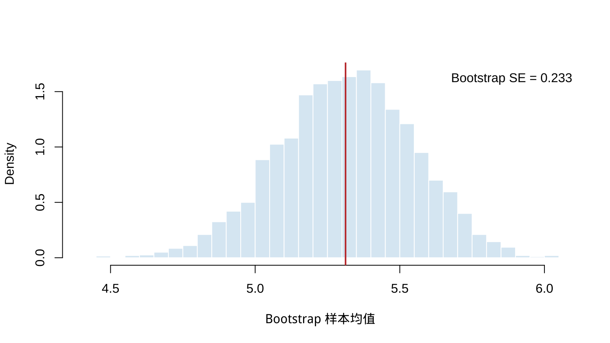
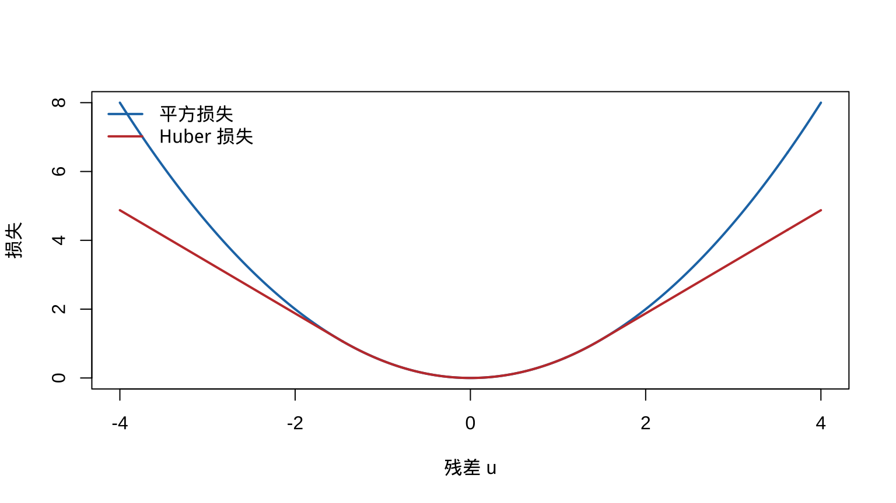

# 渐近理论与近似方法 {#asymptotic-evaluations}

本章对应 *chap-10.tex* 及四个 LaTeX 子文件，讨论相合性、渐近方差与效率、相对效率、Bootstrap 标准误、Huber M 估计、LRT 渐近分布和近似最大似然区间。原课件没有外部图形或 R 文件；本章增加两个基础 R 示例以呈现 Bootstrap 与稳健损失的计算含义。

## 相合估计量 {#consistent-estimators}

渐近性质针对一列估计量 $W_n=W_n(X_1,\ldots,X_n)$。相合性要求样本量增大时估计量集中到正确参数。

::: {.definition}
若对每个 $\epsilon>0$ 与 $\theta\in\Theta$，
$$\lim_{n\to\infty}P_\theta(|W_n-\theta|<\epsilon)=1,$$
则称 $W_n$ 是 $\theta$ 的相合估计量序列，即 $W_n\overset p\to\theta$。
:::

::: {.example .source-numbered}
**例 10.1.2（样本均值的相合性）** 若 $X_i\overset{\mathrm{iid}}\sim N(\theta,1)$，证明 $\bar X_n$ 是 $\theta$ 的相合估计量。
:::

<details class="course-details solution-details">
<summary><strong>查看详细解答</strong></summary>

因为 $\bar X_n\sim N(\theta,1/n)$，所以
$$
\begin{aligned}
P_\theta(|\bar X_n-\theta|<\epsilon)
&=\int_{-\epsilon\sqrt n}^{\epsilon\sqrt n}\frac1{\sqrt{2\pi}}e^{-t^2/2}\,dt\\
&=P(-\epsilon\sqrt n<Z<\epsilon\sqrt n)\longrightarrow1.
\end{aligned}
$$
故 $\bar X_n$ 相合。

</details>

## MLE 的正则条件与相合性 {#mle-regularity-consistency}

原课件列出一组常用充分条件：

1. $X_1,\ldots,X_n$ iid，密度为 $f(x\mid\theta)$；
2. 模型可识别：$\theta\ne\theta'$ 时 $f(\cdot\mid\theta)\ne f(\cdot\mid\theta')$；
3. 各密度有共同支撑，且关于 $\theta$ 可微；
4. 真参数 $\theta_0$ 位于参数空间某个开集的内部；
5. $f(x\mid\theta)$ 关于 $\theta$ 三次可微，并允许在积分号下三次求导；
6. 在 $\theta_0$ 邻域内，$|\partial^3\log f(x\mid\theta)/\partial\theta^3|\le M(x)$，且 $E_{\theta_0}M(X)<\infty$。

前四项用于相合性的课件版本，后两项再用于渐近正态与效率。现代定理可采用不同的更弱条件；这里保留原课程条件集。

::: {.theorem .source-numbered}
**定理 10.1.6（MLE 的相合性）** 在上述相合性正则条件下，若 $\hat\theta$ 是 MLE，$\tau(\theta)$ 连续，则
$$\lim_{n\to\infty}P_\theta\{|\tau(\hat\theta)-\tau(\theta)|\ge\epsilon\}=0.$$
因此 $\tau(\hat\theta)$ 相合。
:::

<details class="course-details proof-details">
<summary><strong>查看推导过程</strong></summary>

教材在此仅给证明纲要。对每个固定 $\vartheta$，强大数定律给出

$$
\frac1n\log L(\vartheta\mid\mathbf X)
=\frac1n\sum_{i=1}^n\log f(X_i\mid\vartheta)
\longrightarrow E_\theta\{\log f(X\mid\vartheta)\}
$$

几乎处处成立。由 Kullback--Leibler 不等式与模型可识别性，右端作为 $\vartheta$ 的函数在真参数 $\theta$ 处唯一最大。在教材所引用的附加一致收敛和紧性条件下，样本平均对数似然的最大点 $\hat\theta$ 因而依概率趋于 $\theta$。最后由连续映射定理，
$\tau(\hat\theta)\overset p\to\tau(\theta)$。

一般情形需要教材 Miscellanea 10.6.2 所述技术条件；当前资料没有给出这些条件下的完整严格证明，因此这里保留教材的证明纲要。

</details>

## 极限方差与渐近方差 {#limiting-asymptotic-variance}

相合性关心是否趋向目标；效率关心趋近速度和归一化后的波动。若 $\operatorname{Var}(T_n)\to0$，可寻找 $k_n$ 使 $k_n\operatorname{Var}(T_n)$ 有非零极限。

::: {.definition}
若 $k_n\operatorname{Var}(T_n)\to\tau^2<\infty$，则 $\tau^2$ 称为**方差的极限**。若
$$a_n\{T_n-\tau(\theta)\}\overset d\longrightarrow N(0,\sigma^2),$$
则 $\sigma^2$ 称为相应归一化下的**渐近方差**。
:::

例如 $n\operatorname{Var}(\bar X_n)=\sigma^2$。但 $1/\bar X_n$ 在正态模型下可能没有有限的精确方差；Delta 方法仍给出
$$E(1/\bar X_n)\approx1/\mu,\qquad
\operatorname{Var}(1/\bar X_n)\approx\frac{\sigma^2}{n\mu^4},$$
说明“方差极限”和“极限分布的方差”不可混为一谈。

## 渐近效率与 MLE {#asymptotic-efficiency}

::: {.definition}
若
$$\sqrt n\{W_n-\tau(\theta)\}\overset d\longrightarrow N\{0,v(\theta)\},$$
且
$$v(\theta)=\frac{[\tau'(\theta)]^2}{I_1(\theta)},\qquad
I_1(\theta)=E_\theta\left[\left\{\frac\partial{\partial\theta}\log f(X\mid\theta)\right\}^2\right],$$
则称 $W_n$ 渐近有效。
:::

::: {.theorem .source-numbered}
**定理 10.1.12（MLE 的渐近有效性）** 在前述正则条件下，若 $\hat\theta$ 是 MLE，$\tau$ 连续且在所需点可微，则
$$\sqrt n\{\tau(\hat\theta)-\tau(\theta)\}\overset d\longrightarrow N\{0,v(\theta)\},$$
其中 $v(\theta)$ 为 Cramér--Rao 下界。因此 $\tau(\hat\theta)$ 相合且渐近有效。
:::

<details class="course-details proof-details">
<summary><strong>查看推导过程</strong></summary>

教材先证明 $\hat\theta$ 本身的结论。记
$\ell_n(\theta)=\sum_{i=1}^n\log f(X_i\mid\theta)$。在真参数 $\theta_0$ 附近对得分作 Taylor 展开，并忽略由正则条件控制的高阶余项：

$$0=\ell_n'(\hat\theta)
=\ell_n'(\theta_0)+(\hat\theta-\theta_0)\ell_n''(\theta_0)+o_p(\sqrt n\,|\hat\theta-\theta_0|).$$

整理得到

$$
\sqrt n(\hat\theta-\theta_0)
=\frac{n^{-1/2}\ell_n'(\theta_0)}{-n^{-1}\ell_n''(\theta_0)}+o_p(1).
$$

由中心极限定理和弱大数定律，

$$n^{-1/2}\ell_n'(\theta_0)\Rightarrow N\{0,I_1(\theta_0)\},
\qquad -n^{-1}\ell_n''(\theta_0)\overset p\longrightarrow I_1(\theta_0).$$

Slutsky 定理于是给出

$$\sqrt n(\hat\theta-\theta_0)
\Rightarrow N\left\{0,\frac1{I_1(\theta_0)}\right\}.$$

再对 $\tau$ 使用 Delta 方法，渐近方差成为
$[\tau'(\theta_0)]^2/I_1(\theta_0)$，即 Cramér--Rao 下界。教材把从 $\hat\theta$ 推广到 $\tau(\hat\theta)$ 的步骤留作练习 10.7；这里仅按 Delta 方法说明该连接。

</details>

## 渐近相对效率 {#asymptotic-relative-efficiency}

::: {.definition}
若
$$\sqrt n\{W_n-\tau(\theta)\}\Rightarrow N(0,\sigma_W^2),\qquad
\sqrt n\{V_n-\tau(\theta)\}\Rightarrow N(0,\sigma_V^2),$$
则 $V_n$ 相对于 $W_n$ 的渐近相对效率为
$$\operatorname{ARE}(V_n,W_n)=\frac{\sigma_W^2}{\sigma_V^2}.$$
ARE 大于 1 表示在此约定下 $V_n$ 的渐近方差更小。
:::

## Bootstrap 标准误 {#bootstrap-standard-errors}

对样本 $\mathbf x$ 及估计量 $\hat\theta$，从经验分布有放回抽取大小为 $n$ 的 Bootstrap 样本。若枚举全部 $n^n$ 个重抽样，
$$\operatorname{Var}^*(\hat\theta)=\frac1{n^n-1}\sum_{i=1}^{n^n}(\hat\theta_i^*-\bar{\hat\theta}^*)^2.$$
实际使用 $B$ 个重抽样：
$$\operatorname{Var}_B^*(\hat\theta)=\frac1{B-1}\sum_{i=1}^B(\hat\theta_i^*-\bar{\hat\theta}^*)^2.$$

理论上需区分固定样本时 $B\to\infty$ 的 Monte Carlo 收敛，以及 $n\to\infty$ 时 Bootstrap 分布对真实抽样分布的一致性。


``` r
set.seed(1001)
x <- c(4.1, 5.3, 4.8, 6.2, 5.7, 4.9, 5.5, 6.0)
B <- 4000
boot_mean <- replicate(B, mean(sample(x, replace = TRUE)))
hist(boot_mean, breaks = 32, probability = TRUE,
     col = "#DCEAF4", border = "white",
     xlab = "Bootstrap 样本均值", main = "")
abline(v = mean(x), col = "#C43C39", lwd = 2)
legend("topright", sprintf("Bootstrap SE = %.3f", sd(boot_mean)), bty = "n")
```

<div class="figure" style="text-align: center">

<p class="caption">(\#fig:chap10-bootstrap-se)样本均值 Bootstrap 分布与标准误</p>
</div>

## Huber 损失与 M 估计 {#huber-m-estimators}

Huber 损失在中心使用平方损失、在尾部使用线性损失：
$$
\rho_k(u)=
\begin{cases}u^2/2,&|u|\le k,\\ k|u|-k^2/2,&|u|>k.
\end{cases}
$$
M 估计量最小化 $\sum_i\rho_k(x_i-a)$。令 $\psi=\rho'$，一阶条件为
$$\sum_{i=1}^n\psi(x_i-\hat\theta)=0.$$
若 $E_{\theta_0}\psi(X-\theta_0)=0$，则
$$-\frac1{\sqrt n}\sum_{i=1}^n\psi(X_i-\theta_0)
\Rightarrow N\left(0,E_{\theta_0}[\psi(X-\theta_0)^2]\right),$$
再结合估计方程局部线性化可得到 $\hat\theta$ 的渐近正态性。


``` r
u <- seq(-4, 4, length.out = 401)
k <- 1.5
huber <- ifelse(abs(u) <= k, u^2 / 2, k * abs(u) - k^2 / 2)
plot(u, u^2 / 2, type = "l", lwd = 2, col = "#1F77B4",
     xlab = "残差 u", ylab = "损失")
lines(u, huber, lwd = 2, col = "#C43C39")
legend("topleft", c("平方损失", "Huber 损失"),
       col = c("#1F77B4", "#C43C39"), lty = 1, lwd = 2, bty = "n")
```

<div class="figure" style="text-align: center">

<p class="caption">(\#fig:chap10-huber-loss)平方损失与 Huber 损失</p>
</div>

## LRT 的渐近分布 {#asymptotic-lrt-distribution}

::: {.theorem .source-numbered}
**定理 10.3.1（简单原假设下 LRT 的渐近分布）** 检验 $H_0:\theta=\theta_0$ 对 $H_1:\theta\ne\theta_0$。若 $X_i$ iid、$\hat\theta$ 是 MLE 且模型满足正则条件，则在 $H_0$ 下
$$-2\log\lambda(\mathbf X)\overset d\longrightarrow\chi_1^2.$$
:::

<details class="course-details proof-details">
<summary><strong>展开证明</strong></summary>

令 $\ell_n(\theta)=\log L(\theta\mid\mathbf X)$。在 $\hat\theta$ 附近对 $\ell_n(\theta_0)$ 作二阶 Taylor 展开：

$$
\ell_n(\theta_0)
=\ell_n(\hat\theta)+\ell_n'(\hat\theta)(\theta_0-\hat\theta)
+\frac12\ell_n''(\tilde\theta)(\theta_0-\hat\theta)^2,
$$

其中 $\tilde\theta$ 位于 $\theta_0$ 与 $\hat\theta$ 之间。由于内部 MLE 满足 $\ell_n'(\hat\theta)=0$，

$$
-2\log\lambda(\mathbf X)
=-\ell_n''(\tilde\theta)(\hat\theta-\theta_0)^2
=\left\{\frac{-\ell_n''(\tilde\theta)}n\right\}
\{\sqrt n(\hat\theta-\theta_0)\}^2.
$$

在 $H_0$ 和正则条件下，第一因子依概率趋于 $I_1(\theta_0)$，而定理 10.1.12 给出
$\sqrt n(\hat\theta-\theta_0)\Rightarrow N\{0,1/I_1(\theta_0)\}$。由 Slutsky 定理，乘积趋于标准正态变量的平方，即 $\chi_1^2$。

</details>

更一般地，若无约束维数为 $p$，原假设下自由维数为 $q$，则在光滑、内部点等正则条件下
$$-2\log\lambda(\mathbf X)\Rightarrow\chi^2_{p-q}.$$
近似水平 $\alpha$ 检验在 $-2\log\lambda(\mathbf X)\ge\chi^2_{p-q,1-\alpha}$ 时拒绝。边界参数、不可识别或参数相关支撑等非正则问题可能不服从该极限。

## 近似最大似然区间 {#approximate-ml-intervals}

若 $\hat\theta$ 是 MLE，则观测信息给出
$$
\widehat{\operatorname{Var}}\{h(\hat\theta)\}
\approx\frac{[h'(\hat\theta)]^2}
{-\left.\dfrac{\partial^2}{\partial\theta^2}\log L(\theta\mid\mathbf x)\right|_{\theta=\hat\theta}}.
$$
由 MLE 渐近正态性与 Slutsky 定理，Wald 型近似区间为
$$h(\hat\theta)\pm z_{\alpha/2}
\sqrt{\widehat{\operatorname{Var}}\{h(\hat\theta)\}}.$$

## LRT 区间 {#lrt-intervals}

反演似然比检验得到近似 $1-\alpha$ 置信集
$$\left\{\theta:-2\log\frac{L(\theta\mid\mathbf x)}{L(\hat\theta\mid\mathbf x)}
\le\chi^2_{1,1-\alpha}\right\}.$$

::: {.example .source-numbered}
**例 10.4.3（二项 LRT 区间）** 若 $Y=\sum_iX_i$ 且 $X_i\sim\operatorname{Bernoulli}(p)$，通过反演渐近 LRT 构造 $p$ 的置信集。
:::

<details class="course-details solution-details">
<summary><strong>查看详细解答</strong></summary>

无约束 MLE 为 $\hat p=y/n$，因此似然比为
$$\left\{p:-2\log\left[
\frac{p^y(1-p)^{n-y}}{\hat p^y(1-\hat p)^{n-y}}
\right]\le\chi^2_{1,1-\alpha}\right\}$$
是二项 LRT 区间，通常以一维求根取得端点。

在 $0<y<n$ 时，对数似然是严格凹函数，置信集通常是包含 $\hat p$ 的单一区间；分别在 $\hat p$ 左右求解等号即可得到两个端点。边界样本 $y=0$ 或 $y=n$ 需要采用相应的单侧边界处理。

</details>

## 本章小结 {#asymptotic-evaluations-summary}

相合性、渐近正态性和效率描述大样本准确性与波动；Bootstrap 用经验分布近似抽样变异；M 估计限制异常残差影响；Wilks 型卡方近似连接 LRT、检验和区间，但必须检查正则条件。
