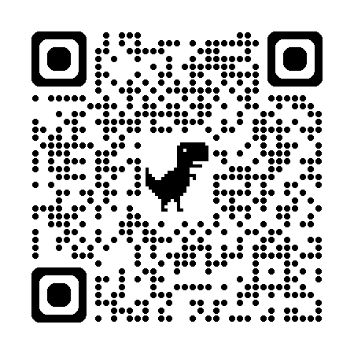

# Course Introduction {#course-introduction .unnumbered}

This chapter is a source-complete reorganization of the original Beamer file `课程课件B/chap-0.tex`. Presentation controls have been removed, while the course information, objectives, syllabus, teaching format, and assessment requirements have been retained.

## Instructor and Course Positioning {#course-instructor}

**Course:** Advanced Statistics (高等统计学)  
**Instructor:** Associate Professor Zhihao Wang  
**Affiliation:** Department of Statistics, School of Statistics and Data Science, Xinjiang University of Finance and Economics  
**Email:** <zhwang@xjufe.edu.cn>

The course centers on the foundations of modern mathematical statistics, methods of statistical inference, and their application to data analysis. See the [author biography](author-bio.html) for a fuller account of the instructor’s education and research.

## Selected Publications {#course-instructor-publications}

The original slides list the following representative works:

1. **Wang Zhihao**, Yu K, Ma S, Tian M. Sparse smoothed quantile estimation for partially linear functional additive models. *Science China Mathematics*, 2025+.
2. Liu Y, **Wang Zhihao**, Härdle W K, Tian M. Estimation and Model Selection Procedures in Generalized Functional Partially Additive Hybrid Model with Diverging Number of Covariates. *Statistica Sinica*, 2025+.
3. Ma S, Tang M, Yu K, Härdle W K, **Wang Zhihao** et al. A censored quantile transformation model for Alzheimer’s Disease data with multiple functional covariates. *Journal of the Royal Statistical Society Series A*, 2025, 188(2): 515–538.
4. Liu Y, **Zhihao Wang**, Yu K, Tian M. Estimation and variable selection for generalized functional partially varying coefficient hybrid models. *Statistical Papers*, 2024, 65(1): 93–119.
5. **Wang Zhihao**, Bai Y, Härdle W K, et al. Smoothed quantile regression for partially functional linear models in high dimensions. *Biometrical Journal*, 2023, 65(7): 2200060.

## Personal Information Link {#course-personal-info}

The personal-information QR code from the source slides is retained below. For an accessible text version of the instructor profile, use the [author biography](author-bio.html).

```{r chap00-personal-info-qr-en, echo=FALSE, out.width='28%', fig.align='center', fig.cap='Personal-information QR code retained from the source slides'}

```

## Course Information {#course-basic-info}

| Item | Details |
|:--|:--|
| Course code | SX31031 |
| Chinese title | 高等统计学 |
| English title | Advanced Statistics |
| Course type | Major course |
| Intended program | Statistics |
| Contact hours | 48 |
| Credits | 3 |
| Prerequisites | Probability theory and mathematical statistics |

## Course Description {#course-description}

Advanced Statistics develops the ability to turn data arising across society and industry into well-defined objects of statistical analysis and to investigate them with suitable statistical models and methods.

The course presents the core concepts and theory of statistics, with emphasis on statistical models and properties of statistics, parametric and nonparametric estimation, hypothesis testing, Bayesian analysis, and statistical decision models. Large-sample methods are also introduced. By the end of the course, students should have both a rigorous theoretical foundation and the ability to apply statistical reasoning to practical problems.

## Recommended Textbooks {#course-textbooks}

1. Casella, G., & Berger, R. L. (2002). *Statistical Inference*. Duxbury.
2. Boos, D. D., & Stefanski, L. A. (2013). *Essential Statistical Inference: Theory and Methods*. Springer.

## Reference Books {#course-reference-books}

1. Mao, S., Wang, J., & Pu, X. (2006). *Advanced Mathematical Statistics* [in Chinese]. Higher Education Press.
2. Chen, X. (1999). *Advanced Mathematical Statistics* [in Chinese]. University of Science and Technology of China Press.
3. Shao, J. (2018). *Mathematical Statistics* [in Chinese]. Higher Education Press.
4. Hogg, R. V., McKean, J., & Craig, A. T. (2019). *Introduction to Mathematical Statistics* (8th ed.). Pearson.
5. Moore, D. S., McCabe, G. P., & Craig, B. A. (2017). *Introduction to the Practice of Statistics*. W. H. Freeman.
6. Efron, B., & Hastie, T. (2016). *Computer Age Statistical Inference: Algorithms, Evidence, and Data Science*. Cambridge University Press.

## Main Course Task {#course-main-task}

The central task is to help students master the foundations and methods of modern mathematical statistics, understand the principles of parametric and nonparametric inference, and use common statistical methods confidently in real data problems.

The course especially develops statistical thinking: students learn to formulate useful models for concrete data problems, select appropriate analytical methods, adapt statistical theory to changing data environments, and use statistical software for analysis and decision-making.

## Learning Objectives {#course-objectives}

- **Theory:** Master the foundations and methods of modern mathematical statistics, understand parametric and nonparametric inference, and develop rigorous statistical reasoning.
- **Application:** Select and apply suitable statistical methods to concrete problems and understand how related theory may be developed.
- **Social responsibility:** Use cases, discussion, and practice to understand the role of inference in science, surveys, and decision-making, while developing innovation, responsibility, adaptability, and problem-solving skills.

## Syllabus I: Foundations of Inference {#course-content-foundations}

- **Statistical foundations:** Sample spaces, sampling distributions, statistics, exponential families, and location-scale families; the definition, verification, and meaning of sufficiency; an overview of large-sample theory and the Delta method.
- **Estimation:** Point and interval estimation; uniformly minimum-variance unbiased estimation and the Cramér–Rao lower bound; maximum likelihood estimation and its desirable properties; pivotal construction of one-parameter confidence intervals.
- **Hypothesis testing:** Type I and Type II error probabilities, test functions, rejection regions, and $p$-values; uniformly most powerful tests, uniformly most powerful unbiased tests, likelihood-ratio, Wald, and Score tests.

## Syllabus II: Modern Statistical Methods {#course-content-modern}

- **Nonparametric inference:** Kernel density estimation; nonparametric regression, including local polynomials and splines; nonparametric tests and goodness-of-fit tests.
- **Resampling:** Bootstrap methods, variance estimation, and confidence interval construction.
- **Bayesian inference:** Bayesian principles, Bayesian estimation, and Bayesian testing.
- **Model selection:** AIC, BIC and their extensions, and cross-validation, with emphasis on the principles and criteria of variable selection.

## Teaching and Assessment {#course-teaching-assessment}

**Teaching format.** Lectures are combined with discussion and practice. Students participate in group discussions and case studies and use statistical software for data analysis.

**Assessment.**

- Coursework: 30% (assignments 20%, class participation 10%);
- Final examination: 70%.

## Summary and Study Guidance {#course-introduction-summary}

The course begins with probability foundations and proceeds through transformations of random variables, distribution families, random samples, data reduction, point estimation, hypothesis testing, interval estimation, and asymptotic theory. At every stage, attend to four questions: under what conditions does a method apply, what does it conclude, how is it carried out, and how should the result be interpreted? Complete the assigned exercises promptly.

> **Study note:** Mathematical derivations clarify why a method works and when it is valid; R code checks understanding and builds data-analysis intuition. Use the two together.
