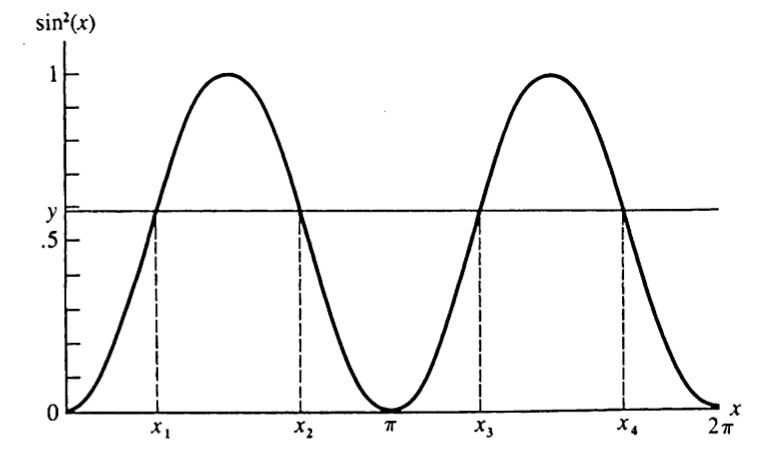

# Transformations and Expectations {#transformations-expectations}

This chapter corresponds to *chap-2.tex* and its four input files. It covers distributions of functions of random variables, expected values, moments and moment generating functions, and differentiation under the integral sign. Clear formula and typographical errors in the source are corrected here and documented in migration_notes.md.

## Distributions of Functions of Random Variables {#distribution-functions-rv}

Let $X$ have CDF $F_X$, let $g:\mathbb R\to\mathbb R$ be Borel measurable, and set $Y=g(X)$. For every Borel set $A$,

$$
P(Y\in A)=P\{g(X)\in A\}=P\{X\in g^{-1}(A)\},
$$

where $g^{-1}(A)=\{x:g(x)\in A\}$. In particular,

$$
F_Y(y)=P(Y\le y)=P\{X\in g^{-1}((-\infty,y])\}.
$$

If $X$ has density $f_X$, then $F_Y(y)=\int_{\{x:g(x)\le y\}}f_X(x)\,dx$. If $X$ is discrete,

$$
p_Y(y)=\sum_{x\in g^{-1}(\{y\})}p_X(x),\qquad y\in\mathcal Y,
$$

and $p_Y(y)=0$ outside $\mathcal Y$.

## Example 2.1.2: A Sine-Squared Transformation {#sin-square-transformation}

Let $X\sim U(0,2\pi)$, so $f_X(x)=1/(2\pi)$ for $0<x<2\pi$, and define $Y=\sin^2X$. Its support is $[0,1]$. For $0<y<1$, the intervals satisfying $\sin^2x\le y$ have total length $4\arcsin\sqrt y$ over one period. Hence

$$
F_Y(y)=\frac{2}{\pi}\arcsin\sqrt y,\qquad
f_Y(y)=\frac{1}{\pi\sqrt{y(1-y)}}.
$$

<details class="course-details solution-details">
<summary><strong>View detailed solution</strong></summary>

For $0<y<1$, put $a=\arcsin\sqrt y$. Over $(0,2\pi)$, the set on which $\sin^2x\le y$ is

$$
(0,a]\cup[\pi-a,\pi+a]\cup[2\pi-a,2\pi),
$$

with total length $4a$. Uniformity gives $F_Y(y)=2\arcsin(\sqrt y)/\pi$, and the chain rule gives the displayed density. The CDF is 0 for $y\le0$ and 1 for $y\ge1$.

</details>

```{r en-chap02-sine-square-source-figure, echo=FALSE, out.width='58%', fig.align='center', fig.cap='Source-slide illustration of the multiple branches of the sine-squared transformation'}

```

The following R simulation checks the theoretical density.

```{r en-chap02-sine-square-simulation, fig.width=7.2, fig.height=4.2, fig.cap='Simulated and theoretical distributions of Y=sin²(X)', fig.align='center'}
set.seed(202509)
x <- runif(50000, 0, 2 * pi)
y <- sin(x)^2
hist(y, probability = TRUE, breaks = 50,
     col = "#D9EAF7", border = "white",
     main = "Sine-squared transformation", xlab = "y")
curve(1 / (pi * sqrt(x * (1 - x))),
      from = 0.002, to = 0.998, add = TRUE,
      col = "#A51C30", lwd = 2)
```

## Support Sets and Monotone Transformations {#support-monotone-transform}

::: {.definition}
The support of $X$ and the range induced by the transformation are

$$
\mathcal X=\{x:f_X(x)>0\},\qquad
\mathcal Y=\{y:y=g(x)\text{ for some }x\in\mathcal X\}.
$$
:::

If $g$ is strictly increasing, $F_Y(y)=F_X\{g^{-1}(y)\}$. If $g$ is strictly decreasing and $X$ is continuous, $F_Y(y)=1-F_X\{g^{-1}(y)\}$.

::: {.theorem}
**Theorem 2.1.5 (monotone transformation formula).** Suppose $X$ has continuous density $f_X$, $Y=g(X)$, $g$ is monotone, and $g^{-1}$ is continuously differentiable on $\mathcal Y$. Then

$$
f_Y(y)=
\begin{cases}
f_X\{g^{-1}(y)\}\left|\dfrac{d}{dy}g^{-1}(y)\right|,&y\in\mathcal Y,\\
0,&\text{otherwise}.
\end{cases}
$$
:::

The absolute value keeps the transformed density nonnegative for both increasing and decreasing transformations.

<details class="course-details proof-details">
<summary><strong>Show proof</strong></summary>

If $g$ is increasing, $F_Y(y)=F_X\{g^{-1}(y)\}$; differentiating gives $f_X\{g^{-1}(y)\}(g^{-1})'(y)$. If $g$ is decreasing, continuity gives $F_Y(y)=1-F_X\{g^{-1}(y)\}$, and differentiation gives the negative of that expression. The inverse derivative is positive in the first case and negative in the second, so the two cases combine into the absolute-value formula.

</details>

## Example 2.1.6: A Reciprocal Gamma Transformation {#inverse-gamma-example}

Suppose

$$
f_X(x)=\frac{x^{n-1}e^{-x/\beta}}{(n-1)!\beta^n},\qquad x>0,
$$

and let $Y=1/X$. The resulting density is

$$
\begin{aligned}
f_Y(y)
&=f_X(1/y)\frac1{y^2}\\
&=\frac{1}{(n-1)!\beta^n}
\left(\frac1y\right)^{n+1}
\exp\left(-\frac1{\beta y}\right),\qquad y>0.
\end{aligned}
$$

This is a special case of an inverse-gamma density; the density is zero for $y\le0$.

<details class="course-details solution-details">
<summary><strong>View detailed solution</strong></summary>

The map $g(x)=1/x$ decreases from $(0,\infty)$ onto itself. Solving $y=1/x$ gives $g^{-1}(y)=1/y$ and $|(g^{-1})'(y)|=1/y^2$. Substitution into Theorem 2.1.5 gives the displayed density; it is zero for $y\le0$.

</details>

## Example 2.1.7: The Square of a Standard Normal {#normal-square-example}

Let $X\sim N(0,1)$ and $Y=X^2$. The resulting density is

$$
f_Y(y)=\frac{\phi(\sqrt y)}{\sqrt y}
=\frac{1}{\sqrt{2\pi y}}e^{-y/2},\qquad y>0,
$$

so $Y\sim\chi_1^2$. The source slides use the normal CDF $\Phi$ where the normal density $\phi$ is required; that error is corrected here.

<details class="course-details solution-details">
<summary><strong>View detailed solution</strong></summary>

For $y>0$, $X^2\le y$ is equivalent to $-\sqrt y\le X\le\sqrt y$. Differentiating $\Phi(\sqrt y)-\Phi(-\sqrt y)$ gives one contribution from each inverse branch. Since $\phi$ is even, they sum to $\phi(\sqrt y)/\sqrt y$.

</details>

## Piecewise Monotone Transformations {#piecewise-monotone-transform}

::: {.theorem}
**Theorem 2.1.8.** Suppose $P(X\in A_0)=0$, $P(X\in\bigcup_{i=1}^kA_i)=1$, $f_X$ is continuous on each $A_i$, and the restriction of $g$ to each $A_i$ is monotone. Let $g_i^{-1}$ denote the corresponding inverse branch. If each branch is continuously differentiable on $\mathcal Y$, then

$$
f_Y(y)=
\begin{cases}
\displaystyle\sum_{i=1}^k f_X\{g_i^{-1}(y)\}
\left|\dfrac{d}{dy}g_i^{-1}(y)\right|,&y\in\mathcal Y,\\
0,&\text{otherwise}.
\end{cases}
$$
:::

Thus all inverse branches must be added for transformations such as $Y=\sin^2X$ and $Y=X^2$.

<details class="course-details proof-details">
<summary><strong>View derivation</strong></summary>

On each branch $A_i$, apply Theorem 2.1.5 to the one-to-one map $g_i$. The branches are disjoint, so their density contributions add. The exceptional set $A_0$ has probability zero. The textbook gives this branch-summing explanation but no separate formal proof.

</details>

## The Probability Integral Transform {#probability-integral-transform}

::: {.theorem}
**Theorem 2.1.10.** If $X$ has continuous CDF $F_X$, then $Y=F_X(X)\sim U(0,1)$.
:::

<details class="course-details proof-details">
<summary><strong>Show proof</strong></summary>

When $F_X$ is strictly increasing, for $0<y<1$,

$$
\begin{aligned}
P(Y\le y)
&=P\{F_X(X)\le y\}\\
&=P\{X\le F_X^{-1}(y)\}\\
&=F_X\{F_X^{-1}(y)\}=y.
\end{aligned}
$$

For a general continuous CDF define $F_X^{-1}(y)=\inf\{x:F_X(x)\ge y\}$. Flat portions carry zero probability, so the event equality remains valid in probability, and continuity gives $F_X\{F_X^{-1}(y)\}=y$. The endpoints complete the uniform CDF.

</details>

This transform underlies random-number generation and many goodness-of-fit procedures.

## Definition and Computation of Expectation {#expected-value-definition}

::: {.definition}
**Definition 2.2.1.** On a probability space $(\mathcal S,\mathcal B,P)$, if $\int_{\mathcal S}|X|\,dP<\infty$, define

$$
E(X)=\int_{\mathcal S}X\,dP.
$$
:::

If $E|g(X)|<\infty$, the continuous and discrete cases give

$$
E\{g(X)\}=\int_{-\infty}^{\infty}g(x)f_X(x)\,dx,
\qquad
E\{g(X)\}=\sum_xg(x)p_X(x).
$$

This is often called the law of the unconscious statistician (LOTUS). One may instead derive the distribution of $Y=g(X)$ and calculate $E(Y)=\int yf_Y(y)\,dy$, but the direct route is usually shorter.

## Examples and Properties of Expectation {#expectation-examples-properties}

- **Example 2.2.2:** If $f_X(x)=\lambda^{-1}e^{-x/\lambda}$ for $x>0$, then $E(X)=\lambda$; here $\lambda$ is the scale.

<details class="course-details solution-details">
<summary><strong>View detailed solution</strong></summary>

Integration by parts gives

$$
E(X)=\int_0^\infty x\lambda^{-1}e^{-x/\lambda}\,dx
=\left[-xe^{-x/\lambda}\right]_0^\infty
+\int_0^\infty e^{-x/\lambda}\,dx=\lambda.
$$

</details>

- **Example 2.2.3:** If $X\sim\operatorname{Binomial}(n,p)$, then $E(X)=np$.

<details class="course-details solution-details">
<summary><strong>View detailed solution</strong></summary>

Using $x\binom nx=n\binom{n-1}{x-1}$,

$$
E(X)=np\sum_{y=0}^{n-1}\binom{n-1}{y}p^y(1-p)^{n-1-y}=np,
$$

because the sum is the total mass of a $\operatorname{Binomial}(n-1,p)$ distribution.

</details>

- **Example 2.2.4:** For a standard Cauchy random variable, $E|X|=\infty$, so $E(X)$ does not exist. Symmetry cannot cancel two divergent integrals.

<details class="course-details solution-details">
<summary><strong>View detailed solution</strong></summary>

With $f_X(x)=1/\{\pi(1+x^2)\}$,

$$
E|X|=\frac2\pi\int_0^\infty\frac{x}{1+x^2}\,dx
=\frac1\pi\lim_{M\to\infty}\log(1+M^2)=\infty.
$$

The two one-sided integrals diverge, so formal cancellation by symmetry is invalid.

</details>

::: {.theorem}
**Theorem 2.2.5.** Whenever the relevant expectations exist:

1. $E\{ag_1(X)+bg_2(X)+c\}=aE\{g_1(X)\}+bE\{g_2(X)\}+c$;
2. if $g_1\ge0$, then $E\{g_1(X)\}\ge0$;
3. if $g_1\ge g_2$, then $E\{g_1(X)\}\ge E\{g_2(X)\}$;
4. if $a\le g_1\le b$, then $a\le E\{g_1(X)\}\le b$.
:::

<details class="course-details proof-details">
<summary><strong>Show proof</strong></summary>

For the continuous case, linearity of integration and $\int f_X=1$ prove part 1 directly. If $g_1\ge0$, then $g_1f_X\ge0$, proving part 2. Apply part 2 to $g_1-g_2$ and use linearity to obtain part 3. Applying monotonicity to the constant bounds $a\le g_1\le b$ proves part 4. The discrete proof replaces integrals with sums.

</details>

When the second moment exists, the mean is the best constant center under squared loss:

$$
\arg\min_cE(X-c)^2=E(X),\qquad
\min_cE(X-c)^2=\operatorname{Var}(X).
$$

<details class="course-details solution-details">
<summary><strong>View derivation</strong></summary>

Expanding around the mean gives

$$
E(X-c)^2=E\{(X-E X)+(E X-c)\}^2
=\operatorname{Var}(X)+(E X-c)^2,
$$

because $E(X-E X)=0$. The second term is minimized at $c=E(X)$.

</details>

## Moments, Central Moments, and MGFs {#moments-mgf}

::: {.definition}
**Definition 2.3.1.** The $n$th raw and central moments are

$$
\mu_n'=E(X^n),\qquad
\mu_n=E\{(X-\mu)^n\},\quad\mu=E(X).
$$

In particular, $\operatorname{Var}(X)=\mu_2$ and the standard deviation is $\sqrt{\operatorname{Var}(X)}$.
:::

If the variance is finite, $\operatorname{Var}(aX+b)=a^2\operatorname{Var}(X)$.

::: {.definition}
**Definition 2.3.6.** If it is finite in a neighborhood of $t=0$,

$$
M_X(t)=E(e^{tX})
$$

is the moment generating function (MGF) of $X$.
:::

::: {.theorem}
**Theorem 2.3.7.** If $M_X$ exists in a neighborhood of zero, then $E(X^n)=M_X^{(n)}(0)$.
:::

When differentiation and integration may be interchanged, $M_X^{(n)}(t)=E(X^ne^{tX})$; setting $t=0$ proves the result.

<details class="course-details proof-details">
<summary><strong>Show proof</strong></summary>

For a continuous variable, differentiate $M_X(t)=\int e^{tx}f_X(x)\,dx$ under the integral sign. Repeated differentiation gives

$$
M_X^{(n)}(t)=\int x^ne^{tx}f_X(x)\,dx=E(X^ne^{tX}).
$$

Setting $t=0$ yields $M_X^{(n)}(0)=E(X^n)$. Section 2.4 supplies sufficient conditions for the interchange.

</details>

## Equal Moments Need Not Determine a Distribution {#same-moments-example}

**Example 2.3.10.** Consider

$$
f_1(x)=\frac{1}{\sqrt{2\pi}x}
\exp\left\{-\frac{(\log x)^2}{2}\right\},\qquad x>0,
$$

and $f_2(x)=f_1(x)\{1+\sin(2\pi\log x)\}$. If $X_1\sim f_1$, then $E(X_1^r)=e^{r^2/2}$ for integer $r\ge0$. For $X_2\sim f_2$,

$$
E(X_2^r)=E(X_1^r)+
\int_0^\infty x^rf_1(x)\sin(2\pi\log x)\,dx.
$$

After the substitution $y=\log x-r$, the extra term vanishes by oddness together with $\sin(2\pi r)=0$. Thus two different distributions have the same moments of every nonnegative integer order.

<details class="course-details solution-details">
<summary><strong>View detailed solution</strong></summary>

Put $z=\log x$, so $f_1(x)dx=\phi(z)dz$. The extra term is

$$
I_r=\int_{-\infty}^{\infty}e^{rz}\phi(z)\sin(2\pi z)\,dz.
$$

Complete the square and let $y=z-r$:

$$
I_r=e^{r^2/2}\int_{-\infty}^{\infty}\phi(y)
\sin\{2\pi(y+r)\}\,dy.
$$

For integer $r$, the sine factor becomes $\sin(2\pi y)$, an odd function, while $\phi$ is even. Hence $I_r=0$.

</details>

::: {.theorem}
**Theorem 2.3.11.** Suppose all moments of $F_X$ and $F_Y$ exist.

1. If both supports are bounded, then $F_X=F_Y$ if and only if $E(X^r)=E(Y^r)$ for every nonnegative integer $r$.
2. If their MGFs exist and agree in a neighborhood of zero, then $F_X=F_Y$.
:::

The textbook explicitly omits the technical proof, which depends on uniqueness of Laplace transforms. No unsupported replacement proof is added here.

## MGF Convergence and Two Classical MGFs {#mgf-convergence-examples}

::: {.theorem}
**Theorem 2.3.12.** If there is a $\delta>0$ such that $M_{X_i}(t)\to M_X(t)$ for $t\in[-\delta,\delta]$, and $M_X$ is an MGF, then $F_{X_i}(x)\to F_X(x)$ at every continuity point of $F_X$.
:::

The textbook also explicitly omits the technical proof of Theorem 2.3.12; moment convergence is not substituted for MGF convergence.

This result supports distributional convergence arguments such as proofs of the central limit theorem. For the binomial and Poisson distributions,

$$
M_{\operatorname{Bin}(n,p)}(t)=\{pe^t+(1-p)\}^n,
$$

$$
M_{\operatorname{Poi}(\lambda)}(t)
=\sum_{x=0}^{\infty}e^{tx}\frac{e^{-\lambda}\lambda^x}{x!}
=\exp\{\lambda(e^t-1)\}.
$$

```{r en-chap02-mgf-moments, echo=TRUE}
n <- 12
p <- 0.3
mgf_binom <- function(t) (1 - p + p * exp(t))^n
h <- 1e-5
c(numerical_derivative =
    (mgf_binom(h) - mgf_binom(-h)) / (2 * h),
  theoretical_mean = n * p)
```

## Example 2.3.13: The Poisson Approximation {#poisson-approximation}

Let $X_n\sim\operatorname{Binomial}(n,p_n)$ and suppose $np_n\to\lambda$. Then

<details class="course-details solution-details">
<summary><strong>View detailed solution</strong></summary>

$$
\begin{aligned}
M_{X_n}(t)
&=\{1+p_n(e^t-1)\}^n\\
&=\left\{1+\frac{(e^t-1)(np_n)}n\right\}^n\\
&\longrightarrow\exp\{\lambda(e^t-1)\}.
\end{aligned}
$$

The limit is the MGF of $\operatorname{Poisson}(\lambda)$, so $X_n$ converges in distribution to that Poisson law. For large $n$, small $p$, and moderate $np$, binomial probabilities may therefore be approximated by Poisson probabilities. The source states equality; it is corrected here to an approximation or limiting statement.

</details>

## Leibniz's Rule and Dominated Convergence {#leibniz-dominated}

::: {.theorem}
**Theorem 2.4.1 (Leibniz's rule).** Under suitable continuity and integrable-dominance conditions,

$$
\begin{aligned}
\frac{d}{d\theta}\int_{a(\theta)}^{b(\theta)}f(x,\theta)\,dx
={}&f\{b(\theta),\theta\}b'(\theta)
-f\{a(\theta),\theta\}a'(\theta)\\
&+\int_{a(\theta)}^{b(\theta)}
\frac{\partial}{\partial\theta}f(x,\theta)\,dx.
\end{aligned}
$$
:::

For constant limits, only the integral term remains.

<details class="course-details proof-details">
<summary><strong>View derivation</strong></summary>

Write the integral as $F\{b(\theta),\theta\}-F\{a(\theta),\theta\}$, where $\partial F/\partial x=f$. The multivariable chain rule produces the two endpoint terms, while the explicit $\theta$-dependence produces the integral of $\partial f/\partial\theta$. The textbook presents this as an application of the fundamental theorem of calculus and the chain rule rather than a separate proof.

</details>

::: {.theorem}
**Theorem 2.4.2.** If $h(x,y)\to h(x,y_0)$ and an integrable function $g$ satisfies $|h(x,y)|\le g(x)$ in a neighborhood of $y_0$, then

$$
\lim_{y\to y_0}\int h(x,y)\,dx
=\int\lim_{y\to y_0}h(x,y)\,dx.
$$
:::

The essential condition is an integrable bound independent of $y$.

The textbook treats Theorem 2.4.2 as a corollary of dominated convergence and does not develop the measure-theoretic proof; no unsupported proof is supplied here.

## Differentiation Under the Integral Sign {#differentiate-under-integral}

::: {.theorem}
**Theorem 2.4.3.** Suppose $f(x,\theta)$ is differentiable at $\theta_0$. If there are $\delta>0$ and an integrable $g(x,\theta_0)$ such that, for $|\Delta|\le\delta$,

$$
\left|\frac{f(x,\theta_0+\Delta)-f(x,\theta_0)}{\Delta}\right|
\le g(x,\theta_0),
$$

then

$$
\left.\frac{d}{d\theta}\int f(x,\theta)\,dx\right|_{\theta=\theta_0}
=\int\left.\frac{\partial}{\partial\theta}f(x,\theta)
\right|_{\theta=\theta_0}\,dx.
$$
:::

A common corollary applies when $|\partial f/\partial\theta|$ is uniformly bounded by an integrable function near $\theta_0$.

<details class="course-details proof-details">
<summary><strong>View derivation</strong></summary>

The derivative is the limit of the difference quotient. The theorem's bound dominates every nearby quotient by one integrable function. Theorem 2.4.2 therefore permits the limit to pass through the integral, leaving the integral of the pointwise derivative.

</details>

**Example 2.4.6.** If $X\sim N(\mu,1)$, then $M_X(t)=\exp(\mu t+t^2/2)$ and $M_X'(0)=\mu$. Interchanging differentiation and integration is not automatic and must be justified.

<details class="course-details solution-details">
<summary><strong>View detailed solution</strong></summary>

Complete the exponent as

$$
tx-\frac{(x-\mu)^2}{2}
=-\frac{\{x-(\mu+t)\}^2}{2}+\mu t+\frac{t^2}{2}.
$$

The remaining integral is the total mass of an $N(\mu+t,1)$ density, so $M_X(t)=e^{\mu t+t^2/2}$. Differentiation gives $M_X'(t)=(\mu+t)e^{\mu t+t^2/2}$ and $M_X'(0)=\mu$. The source additionally constructs an integrable bound to justify differentiation under the integral sign.

</details>

## Interchanging Series with Differentiation and Integration {#series-interchange}

::: {.theorem}
**Theorem 2.4.8.** If $\sum_{x=0}^{\infty}h(\theta,x)$ converges on $(a,b)$, each partial derivative is continuous, and the derivative series converges uniformly on every closed bounded subinterval, then

$$
\frac{d}{d\theta}\sum_{x=0}^{\infty}h(\theta,x)
=\sum_{x=0}^{\infty}\frac{\partial}{\partial\theta}h(\theta,x).
$$
:::

The textbook states this general theorem and illustrates its uniform-convergence check with a geometric example, but does not provide a general proof.

::: {.theorem}
**Theorem 2.4.10.** If $\sum_{x=0}^{\infty}h(\theta,x)$ converges uniformly on $[a,b]$ and every term is continuous, then

$$
\int_a^b\sum_{x=0}^{\infty}h(\theta,x)\,d\theta
=\sum_{x=0}^{\infty}\int_a^b h(\theta,x)\,d\theta.
$$
:::

The textbook states Theorem 2.4.10 without a general proof; no unsupported proof is added.

## Chapter Summary {#transformations-expectations-summary}

First identify the transformed support, then derive the distribution by the CDF method, a Jacobian formula, or a sum over inverse branches. Prefer LOTUS for expectations when possible. MGFs connect moments and distributions. Before interchanging limits, derivatives, integrals, or sums, verify domination or uniform convergence.

> **Exercise prompt:** Re-derive the supports and densities for $Y=X^2$, $Y=1/X$, and $Y=\sin^2X$, and compare the CDF method with the transformation formula.
