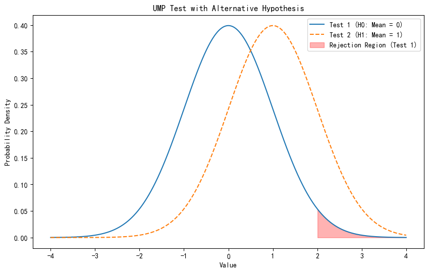

# Hypothesis Testing {#hypothesis-testing}

This chapter corresponds to *chap-8.tex* and its three LaTeX fragments. It covers hypotheses, likelihood-ratio and Bayesian tests, errors and power, Neyman--Pearson, monotone likelihood ratios, UMP and unbiased tests, and p-values. Source figures and derivations are retained, with one executable power example added.

## Hypotheses, null hypotheses, and rejection regions {#hypotheses-rejection-region}

::: {.definition}
A **hypothesis** is a statement about a population parameter. The principal statement is the **null hypothesis** $H_0$ and its complement is the **alternative hypothesis** $H_1$. For $\Theta_0\subset\Theta$,
$$H_0:\theta\in\Theta_0,\qquad H_1:\theta\in\Theta_0^c.$$
:::

A test divides the sample space into an acceptance region and a rejection region $R$. We reject $H_0$ when $\mathbf x\in R$ and otherwise fail to reject it; insufficient evidence does not prove $H_0$.

## Likelihood-ratio tests {#likelihood-ratio-tests}

For a random sample, $L(\theta\mid\mathbf x)=\prod_{i=1}^nf(x_i\mid\theta)$.

::: {.definition}
For $H_0:\theta\in\Theta_0$ against $H_1:\theta\in\Theta_0^c$,
$$
\lambda(\mathbf x)=\frac{\sup_{\theta\in\Theta_0}L(\theta\mid\mathbf x)}
{\sup_{\theta\in\Theta}L(\theta\mid\mathbf x)}
=\frac{L(\hat\theta_0\mid\mathbf x)}{L(\hat\theta\mid\mathbf x)}.
$$
Here $\hat\theta_0$ is the restricted MLE and $\hat\theta$ the unrestricted MLE. An LRT rejects on $\{\mathbf x:\lambda(\mathbf x)\le c\}$, $0\le c\le1$.
:::

::: {.example}
If $X_i\overset{\mathrm{iid}}\sim N(\theta,1)$ and $H_0:\theta=\theta_0$ is tested against $H_1:\theta\ne\theta_0$, then
$$
\lambda(\mathbf x)=\exp\left\{\frac{-\sum_i(x_i-\theta_0)^2+\sum_i(x_i-\bar x)^2}{2}\right\}
=\exp\{-n(\bar x-\theta_0)^2/2\},
$$
because $\sum_i(x_i-\theta_0)^2=\sum_i(x_i-\bar x)^2+n(\bar x-\theta_0)^2$. Thus rejection is equivalent to
$$\left\{\mathbf x:|\bar x-\theta_0|\ge\sqrt{-2\log(c)/n}\right\}.$$
:::

::: {.theorem}
If $T(\mathbf X)$ is sufficient for $\theta$, the LR statistics based on $T$ and the full sample satisfy $\lambda^*\{T(\mathbf x)\}=\lambda(\mathbf x)$.
:::

## Shifted exponential and nuisance-parameter LRTs {#lrt-examples}

::: {.example}
Let $f(x\mid\theta)=e^{-(x-\theta)}I(x\ge\theta)$ and test $H_0:\theta\le\theta_0$ against $H_1:\theta>\theta_0$. Since
$L(\theta\mid\mathbf x)=e^{-\sum x_i+n\theta}I(\theta\le x_{(1)})$ increases on its feasible range,
$$
\lambda(\mathbf x)=
\begin{cases}1,&x_{(1)}\le\theta_0,\\ e^{-n(x_{(1)}-\theta_0)},&x_{(1)}>\theta_0.
\end{cases}
$$
The rejection region is $\{\mathbf x:x_{(1)}\ge\theta_0-\log(c)/n\}$.
:::

For $X_i\sim N(\mu,\sigma^2)$ and $H_0:\mu\le\mu_0$ against $H_1:\mu>\mu_0$, $\sigma^2$ is nuisance. The unrestricted MLEs are $\hat\mu=\bar x$ and $\hat\sigma^2=n^{-1}\sum_i(x_i-\bar x)^2$. When $\bar x>\mu_0$, the restricted maximum occurs at $\mu_0$, with $\hat\sigma_0^2=n^{-1}\sum_i(x_i-\mu_0)^2$. The rejection region becomes
$$\left\{\mathbf x:\bar x>\mu_0+b\sqrt{S^2/n}\right\},$$
where $b$ is fixed by the level, giving the one-sided $t$-test form.

## Bayesian tests {#bayesian-tests}

Given $\pi(\theta\mid\mathbf x)$, compare $P(\theta\in\Theta_0\mid\mathbf x)$ and $P(\theta\in\Theta_0^c\mid\mathbf x)$. Under symmetric 0--1 loss, reject when the latter exceeds $1/2$.

::: {.example}
Let $X_i\sim N(\theta,\sigma^2)$, $\theta\sim N(\mu,\tau^2)$, and test $H_0:\theta\le\theta_0$ against $H_1:\theta>\theta_0$. The posterior has
$$m_n=\frac{n\tau^2\bar x+\sigma^2\mu}{n\tau^2+\sigma^2},\qquad
v_n=\frac{\sigma^2\tau^2}{n\tau^2+\sigma^2}.$$
By symmetry, fail to reject precisely when
$$\bar X\le\theta_0+\frac{\sigma^2(\theta_0-\mu)}{n\tau^2}.$$
:::

## Errors and the power function {#errors-power-function}

```{r en-chap08-source-errors, echo=FALSE, out.width='64%', fig.cap='Source diagram of testing decisions and the two error types'}
knitr::include_graphics("../images/ch08/501007.png")
```

::: {.definition}
For rejection region $R$, Type I error is $P_\theta(\mathbf X\in R)$ for $\theta\in\Theta_0$, Type II error is $P_\theta(\mathbf X\in R^c)$ for $\theta\in\Theta_0^c$, and the **power function** is
$$\beta(\theta)=P_\theta(\mathbf X\in R).$$
:::

::: {.example}
If $X\sim\operatorname{Bin}(5,\theta)$ and $H_0:\theta\le1/2$ is tested against $H_1:\theta>1/2$, rejecting only at $X=5$ gives $\beta_1(\theta)=\theta^5$, while rejecting at $X\in\{3,4,5\}$ gives
$$\beta_2(\theta)=10\theta^3(1-\theta)^2+5\theta^4(1-\theta)+\theta^5.$$
:::

```{r en-chap08-binomial-power, fig.cap='Power functions of two binomial tests', fig.width=8, fig.height=4.5}
theta <- seq(0, 1, length.out = 301)
power_1 <- theta^5
power_2 <- pbinom(2, size = 5, prob = theta, lower.tail = FALSE)
matplot(theta, cbind(power_1, power_2), type = "l", lty = 1,
        lwd = 2, col = c("#1F77B4", "#C43C39"),
        xlab = expression(theta), ylab = "Power")
abline(v = 0.5, lty = 3, col = "grey45")
legend("topleft", c("Reject only at X = 5", "Reject when X >= 3"),
       col = c("#1F77B4", "#C43C39"), lty = 1, lwd = 2, bty = "n")
```

```{r en-chap08-source-binomial-power, echo=FALSE, out.width='62%', fig.cap='Source power-function plot for the binomial example'}
knitr::include_graphics("../images/ch08/501009.png")
```

::: {.definition}
A test has **size** $\alpha$ if $\sup_{\theta\in\Theta_0}\beta(\theta)=\alpha$, and is **level** $\alpha$ if the supremum is at most $\alpha$.
:::

For the two-sided normal LRT, size $\alpha$ yields $|\bar X-\theta_0|\ge z_{\alpha/2}/\sqrt n$, corresponding to $c=\exp(-z_{\alpha/2}^2/2)$.

## Most powerful tests and Neyman--Pearson {#most-powerful-tests}

::: {.definition}
A test is **uniformly most powerful** (UMP) in a class $\mathcal C$ if its power is at least that of every other test in $\mathcal C$ for every $\theta\in\Theta_0^c$. Here $\mathcal C$ is the class of level $\alpha$ tests.
:::

```{r en-chap08-source-ump, echo=FALSE, out.width='42%', fig.cap='Source illustration of the UMP concept'}

```

::: {.theorem}
**Neyman--Pearson lemma.** For $H_0:\theta=\theta_0$ against $H_1:\theta=\theta_1$, suppose
$$\mathbf x\in R\text{ if }f(\mathbf x\mid\theta_1)>kf(\mathbf x\mid\theta_0),\qquad
\mathbf x\in R^c\text{ if }f(\mathbf x\mid\theta_1)<kf(\mathbf x\mid\theta_0),$$
and $P_{\theta_0}(\mathbf X\in R)=\alpha$. Then the test is most powerful of level $\alpha$. If such a rule exists with $k>0$, every most powerful level $\alpha$ rule has size $\alpha$ and follows the same ordering except on null sets.
:::

The result may be applied to a sufficient statistic $T$ by comparing $g(t\mid\theta_1)$ and $kg(t\mid\theta_0)$.

::: {.example}
For $X_i\sim N(\theta,\sigma^2)$ with known $\sigma^2$ and $\theta_1<\theta_0$, the most powerful level $\alpha$ test of $H_0:\theta=\theta_0$ against $H_1:\theta=\theta_1$ rejects when
$$\bar X<\theta_0-\frac{\sigma z_\alpha}{\sqrt n}.$$
:::

## Monotone likelihood ratio and Karlin--Rubin {#monotone-likelihood-ratio}

::: {.definition}
A family has a **monotone likelihood ratio** (MLR) if, for every $\theta_2>\theta_1$, $g(t\mid\theta_2)/g(t\mid\theta_1)$ is monotone in $t$ on the common support. Normal mean, Poisson, and binomial families are standard examples.
:::

::: {.theorem}
**Karlin--Rubin theorem.** For $H_0:\theta\le\theta_0$ against $H_1:\theta>\theta_0$, if sufficient $T$ has an increasing MLR family, rejecting exactly when $T>t_0$ is UMP of level $\alpha=P_{\theta_0}(T>t_0)$. Reverse the direction for decreasing MLR.
:::

Thus the known-variance normal test $H_0:\theta\ge\theta_0$ against $H_1:\theta<\theta_0$ rejects when $\bar X<\theta_0-\sigma z_\alpha/\sqrt n$. Its maximum Type I error occurs at $\theta_0$.

## Nonexistence of UMP, unbiased tests, and p-values {#unbiased-tests-p-values}

For $H_0:\theta=\theta_0$ against $H_1:\theta\ne\theta_0$, left- and right-tail most powerful normal tests reverse their power ordering, so no UMP test exists among all level $\alpha$ tests. Restricting to unbiased tests gives
$$\bar X<\theta_0-\frac{\sigma z_{\alpha/2}}{\sqrt n}
\quad\text{or}\quad
\bar X>\theta_0+\frac{\sigma z_{\alpha/2}}{\sqrt n},$$
which is UMP unbiased of level $\alpha$.

::: {.theorem}
If larger $W(\mathbf X)$ favors $H_1$, then
$$p(\mathbf x)=\sup_{\theta\in\Theta_0}P_\theta\{W(\mathbf X)\ge W(\mathbf x)\}$$
is a valid p-value: $P_\theta\{p(\mathbf X)\le u\}\le u$ under the null.
:::

```{r en-chap08-source-pvalue, echo=FALSE, out.width='42%', fig.cap='Source illustration of a p-value as a tail probability'}
knitr::include_graphics("../images/ch08/pvalue.jpg")
```

## Chapter summary {#hypothesis-testing-summary}

LRTs provide a general construction; Neyman--Pearson and Karlin--Rubin establish optimality; Bayesian tests compare posterior risks. Two-sided problems generally require a restriction such as unbiasedness rather than unrestricted UMP optimality.
