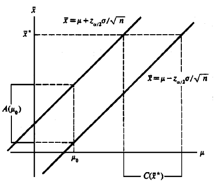
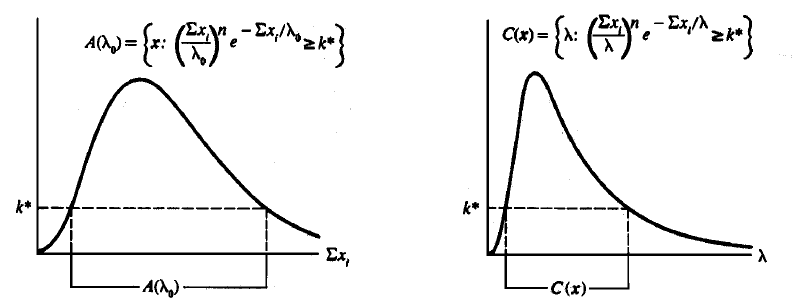
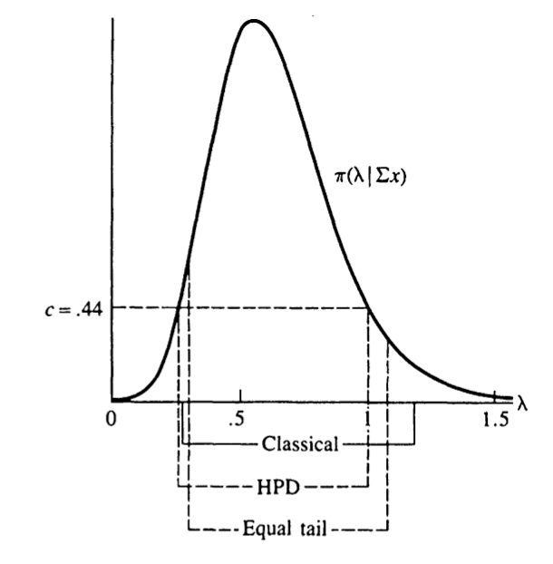

# Interval Estimation {#interval-estimation}

This chapter corresponds to *chap-9.tex*, its three LaTeX fragments, and `HPD_case.R`. It covers confidence intervals, test inversion, pivots, Bayesian credible sets, interval length and coverage, and highest-posterior-density regions. All source figures are retained; the HPD code is made reproducible without an additional MCMC package.

## Interval estimators, coverage, and confidence coefficient {#interval-estimator-definitions}

::: {.definition}
An **interval estimator** of a real parameter $\theta$ is a pair of sample functions $L(\mathbf X),U(\mathbf X)$ with $L(\mathbf x)\le U(\mathbf x)$. After observing $\mathbf x$, report $[L(\mathbf x),U(\mathbf x)]$.
:::

::: {.definition}
The **coverage probability** is
$$P_\theta\{L(\mathbf X)\le\theta\le U(\mathbf X)\},$$
usually a function of $\theta$. The **confidence coefficient** is its infimum over $\Theta$.
:::

## Inverting hypothesis tests {#inverting-tests}

::: {.theorem}
For each $\theta_0$, let $A(\theta_0)$ be the acceptance region of a level $\alpha$ test of $H_0:\theta=\theta_0$. Then
$$\mathcal C(\mathbf x)=\{\theta_0:\mathbf x\in A(\theta_0)\}$$
is a confidence set with coverage at least $1-\alpha$. Conversely, a confidence set defines level $\alpha$ acceptance regions by $A(\theta_0)=\{\mathbf x:\theta_0\in\mathcal C(\mathbf x)\}$.
:::

::: {.example}
If $X_i\sim N(\mu,\sigma^2)$ with known $\sigma$, the two-sided level $\alpha$ test accepts $H_0:\mu=\mu_0$ when
$$|\bar X-\mu_0|\le z_{\alpha/2}\frac{\sigma}{\sqrt n}.$$
Inverting in $\mu_0$ gives
$$\left[\bar X-z_{\alpha/2}\frac{\sigma}{\sqrt n},
\bar X+z_{\alpha/2}\frac{\sigma}{\sqrt n}\right].$$
:::

```{r en-chap09-source-test-inversion, echo=FALSE, out.width='58%', fig.cap='Source diagram relating acceptance regions and confidence intervals'}

```

## Inverting an exponential-mean LRT {#inverting-exponential-lrt}

For exponential observations with mean (scale) $\lambda$, the LR statistic for $H_0:\lambda=\lambda_0$ is
$$
\lambda_{\mathrm{LR}}(\mathbf x)=
\frac{\lambda_0^{-n}e^{-\sum x_i/\lambda_0}}{(\sum x_i/n)^{-n}e^{-n}}
=\left(\frac{\sum x_i}{n\lambda_0}\right)^ne^ne^{-\sum x_i/\lambda_0}.
$$
Inversion gives an interval $[L(T),U(T)]$, $T=\sum x_i$, whose endpoints satisfy
$$\left(\frac{T}{L(T)}\right)^ne^{-T/L(T)}=
\left(\frac{T}{U(T)}\right)^ne^{-T/U(T)}.$$
Writing $T/L=a$, $T/U=b$, $a>b$, gives $a^ne^{-a}=b^ne^{-b}$. Since $T/\lambda\sim\operatorname{Gamma}(n,1)$, choose $a,b$ so that $P\{b\le T/\lambda\le a\}=1-\alpha$.

```{r en-chap09-source-lrt-inversion, echo=FALSE, out.width='72%', fig.cap='Source diagram for inversion of the exponential-model LRT'}

```

## Pivotal quantities and location--scale examples {#pivotal-quantities}

::: {.definition}
A **pivotal quantity** $Q(\mathbf X,\theta)$ has a sampling distribution free of all unknown parameters. If
$P\{a\le Q(\mathbf X,\theta)\le b\}=1-\alpha$, inversion gives
$\mathcal C(\mathbf x)=\{\theta:a\le Q(\mathbf x,\theta)\le b\}$.
:::

For a location family, $\bar X-\mu$ is pivotal; for a scale family, $\bar X/\sigma$ is pivotal; and for a location--scale family, $(\bar X-\mu)/\sigma$ is distribution-free, although with two unknown parameters one must specify the target and nuisance treatment.

::: {.example}
If exponential observations have scale $\lambda$, then $T=\sum_iX_i\sim\operatorname{Gamma}(n,\lambda)$ and
$$\frac{2T}{\lambda}\sim\chi^2_{2n}.$$
With $a=\chi^2_{2n,\alpha/2}$ and $b=\chi^2_{2n,1-\alpha/2}$,
$$P_\lambda\left\{\frac{2T}{b}\le\lambda\le\frac{2T}{a}\right\}=1-\alpha.$$
The source's specific 95% example uses 9.59 and 34.17, giving $[2T/34.17,2T/9.59]$.
:::

## Bayesian credible sets {#bayesian-credible-sets}

Frequentist probability comes from repeated sampling, so a random interval covers a fixed parameter. In Bayesian analysis $\theta$ is random under the posterior, and
$$P(\theta\in A\mid\mathbf x)=\int_A\pi(\theta\mid\mathbf x)\,d\theta$$
is the posterior probability that the parameter lies in credible set $A$.

::: {.example}
If $X_i\sim\operatorname{Poisson}(\lambda)$ and the shape--scale prior is $\lambda\sim\operatorname{Gamma}(a,b)$, then
$$\lambda\mid\textstyle\sum X_i=\sum x_i
\sim\operatorname{Gamma}\left(a+\sum x_i,[n+1/b]^{-1}\right).$$
An equal-tail interval uses posterior quantiles $\alpha/2$ and $1-\alpha/2$. For $a=b=1,n=10,\sum x_i=6$, the source gives the 90% interval $[0.299,1.077]$.
:::

::: {.example}
For $X_i\sim N(\theta,\sigma^2)$ and $\theta\sim N(\mu,\tau^2)$,
$$\delta^B(\bar x)=\frac{\sigma^2\mu+n\tau^2\bar x}{\sigma^2+n\tau^2},\qquad
\operatorname{Var}(\theta\mid\bar x)=\frac{\sigma^2\tau^2}{\sigma^2+n\tau^2}.$$
The $1-\alpha$ credible interval is
$\delta^B(\bar x)\pm z_{\alpha/2}\sqrt{\operatorname{Var}(\theta\mid\bar x)}$.
:::

## Credible probability versus frequentist coverage {#credible-versus-coverage}

Let $\gamma=\sigma^2/(n\tau^2)$. The frequentist coverage of the normal Bayesian interval is
$$P\left\{-\sqrt{1+\gamma}z_{\alpha/2}+
\frac{\gamma(\theta-\mu)}{\sigma/\sqrt n}\le Z\le
\sqrt{1+\gamma}z_{\alpha/2}+
\frac{\gamma(\theta-\mu)}{\sigma/\sqrt n}\right\},$$
$Z\sim N(0,1)$. It generally depends on $\theta$, so a $1-\alpha$ credible interval is not automatically a $1-\alpha$ confidence interval.

Conversely, the posterior probability of the usual confidence interval $|\theta-\bar x|\le z_{\alpha/2}\sigma/\sqrt n$ equals
$$P\left\{-\sqrt{1+\gamma}z_{\alpha/2}+
\frac{\gamma(\bar x-\mu)}{\sqrt{1+\gamma}\sigma/\sqrt n}\le Z\le
\sqrt{1+\gamma}z_{\alpha/2}+
\frac{\gamma(\bar x-\mu)}{\sqrt{1+\gamma}\sigma/\sqrt n}\right\},$$
which depends on the prior location.

## Evaluating interval length and coverage {#interval-size-coverage}

Good intervals combine high coverage with small size. Coverage may be summarized by the confidence coefficient or average coverage; size is length in one dimension and often volume in higher dimensions.

::: {.theorem}
For a unimodal density $f$, if $[a,b]$ contains a mode and satisfies
$\int_a^bf(x)dx=1-\alpha$ and $f(a)=f(b)>0$, then it is shortest among intervals with probability $1-\alpha$.
:::

For a standard normal pivot, the source compares 90% intervals $(-1.34,2.33)$, $(-1.44,1.96)$, and $(-1.65,1.65)$, with lengths 3.67, 3.40, and 3.30. Equal tails are optimal. For the unknown-variance normal $t$ interval, length is $(b-a)S/\sqrt n$ and expected length is $(b-a)c(n)\sigma/\sqrt n$, so symmetric endpoints remain optimal.

## Shortest pivotal intervals {#shortest-pivotal-interval}

If $X\sim\operatorname{Gamma}(k,\beta)$, then $Y=X/\beta\sim\operatorname{Gamma}(k,1)$. From $P(a\le Y\le b)=1-\alpha$,
$$\frac{x}{b}\le\beta\le\frac{x}{a}.$$
Its length is proportional to $1/a-1/b$, not $b-a$, so $f_Y(a)=f_Y(b)$ is not directly optimal. With $b=b(a)$, solve
$$\min_a\left\{\frac1a-\frac1{b(a)}\right\},\qquad
\int_a^{b(a)}f_Y(y)dy=1-\alpha.$$

## Highest-posterior-density regions {#highest-posterior-density}

::: {.definition}
An HPD region minimizes volume among sets of posterior probability at least $1-\alpha$. For a unimodal posterior, it is
$$\{\theta:\pi(\theta\mid\mathbf x)\ge k\},\qquad
\int_{\{\theta:\pi(\theta\mid\mathbf x)\ge k\}}
\pi(\theta\mid\mathbf x)d\theta=1-\alpha,$$
so its endpoints have equal posterior density.
:::

For the Poisson--Gamma example with $a=b=1,n=10,\sum x_i=6$, the source gives the 90% HPD interval $[0.253,1.005]$.

```{r en-chap09-hpd-gamma, fig.cap='A 95% gamma-posterior HPD interval using the source data, prior, and posterior sampling', fig.width=8, fig.height=4.5}
observed_data <- c(3, 2, 4, 1, 5)
prior_shape <- 2
prior_rate <- 1
post_shape <- prior_shape + sum(observed_data)
post_rate <- prior_rate + length(observed_data)
cred_mass <- 0.95
set.seed(123)
posterior_samples <- sort(rgamma(100000, shape = post_shape, rate = post_rate))
window_size <- floor(cred_mass * length(posterior_samples))
widths <- posterior_samples[(window_size + 1):length(posterior_samples)] -
  posterior_samples[1:(length(posterior_samples) - window_size)]
lower_index <- which.min(widths)
hpd <- posterior_samples[c(lower_index, lower_index + window_size)]
x_grid <- seq(0, qgamma(0.999, post_shape, rate = post_rate), length.out = 500)
plot(x_grid, dgamma(x_grid, post_shape, rate = post_rate), type = "l", lwd = 2,
     xlab = expression(lambda), ylab = "Posterior density")
abline(v = hpd, col = "#C43C39", lty = 2, lwd = 2)
abline(v = mean(posterior_samples), col = "#1F77B4", lwd = 2)
legend("topright", c(sprintf("95%% HPD [%.2f, %.2f]", hpd[1], hpd[2]), "Posterior mean"),
       col = c("#C43C39", "#1F77B4"), lty = c(2, 1), lwd = 2, bty = "n")
```

```{r en-chap09-source-hpd, echo=FALSE, out.width='50%', fig.cap='Source comparison of three interval estimators'}

```

## Chapter summary {#interval-estimation-summary}

Confidence intervals arise by test inversion or pivots and make repeated-sampling statements; credible intervals concern the posterior after observing data. Evaluation must balance coverage and size, and shortest-interval conditions must be derived for the final parameter-scale length.
